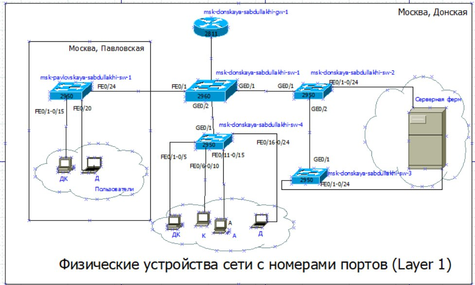
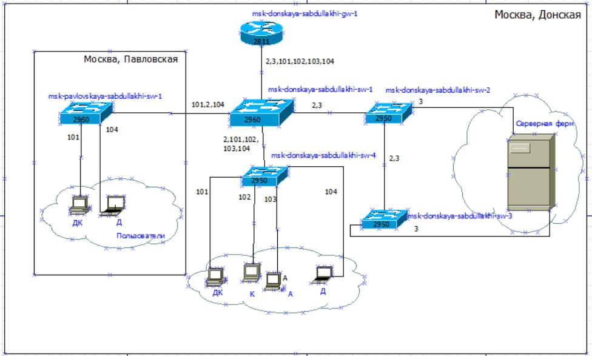
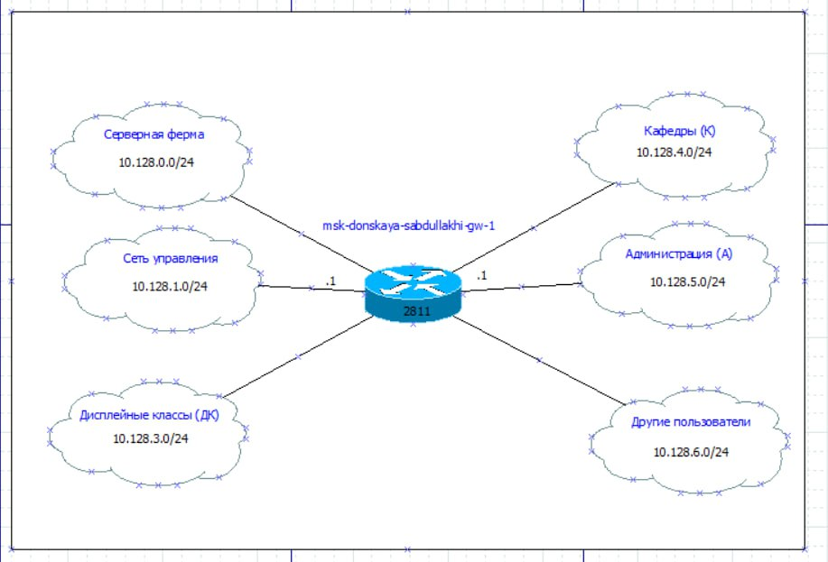
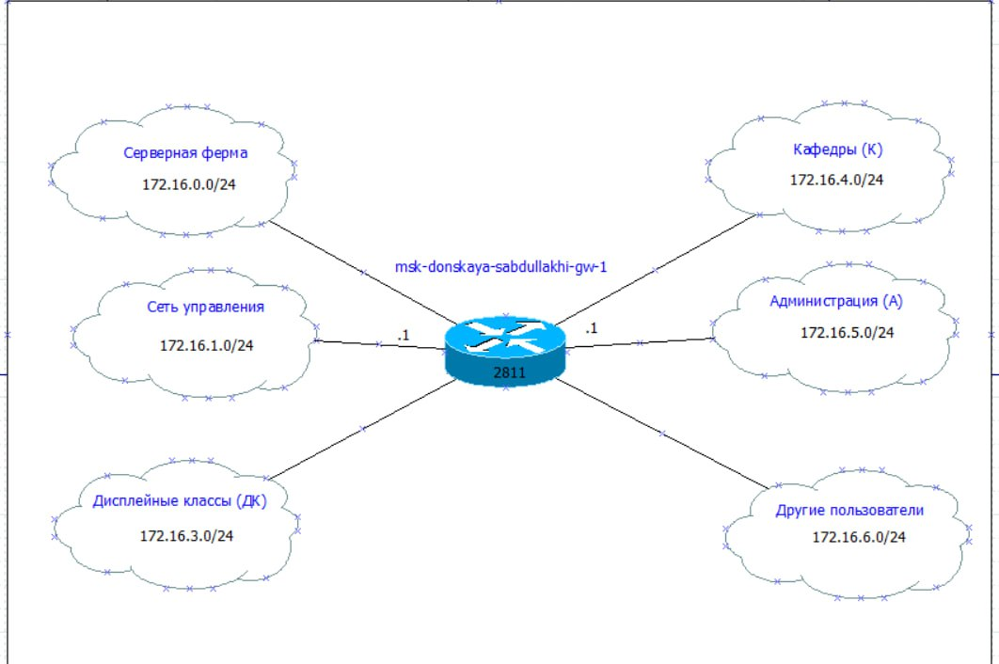
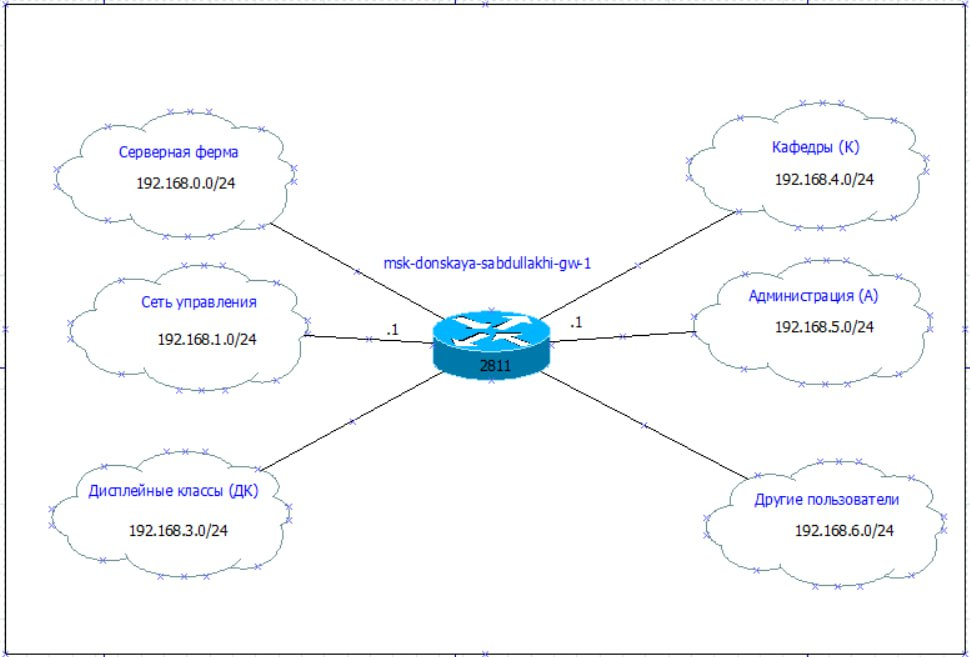

---
## Front matter
lang: ru-RU
title: Администрирование локальных сетей
subtitle: Лабораторная работа № 3. Планирование локальной сети организации
author:
  - Абдуллахи Шугофа
institute:
  - Российский университет дружбы народов, Москва, Россия
date: 27 февраля 2026

## i18n babel
babel-lang: russian
babel-otherlangs: english

## Formatting pdf
toc: false
toc-title: Содержание
slide_level: 2
aspectratio: 169
section-titles: true
theme: metropolis
pdf-engine: xelatex

header-includes: |
  \metroset{progressbar=frametitle,sectionpage=progressbar,numbering=fraction}
  \usepackage{fontspec}
  \setmainfont{DejaVu Serif}
  \setsansfont{DejaVu Sans}
  \setmonofont{DejaVu Sans Mono}
---

## Цель работы
Нужно было разобраться, как проектируется локальная сеть с нуля. Не про-
сто нарисовать картинку, а продумать всё до мелочей: как соединять устройства,
как разделять трафик между отделами и как назначать IP адреса, чтобы в сети не
было хаоса и её было легко обслуживать.

## Построение схем L1, L2, L3

нарисовано схемы в графическом редактор для адресов:
 - 10.128.0.0/16
 - 172.16.0.0/12
 - 192.168.0.0/16
 
и построена таблицы:
 - Таблица VLAN
 - Таблица IP адресов
 - Таблица портов подключения оборудования
 - Регламент выделения IP-адресов внутри подсети /24
 
## Схема L1 — физическая топология

## Схема L2 — распределение VLAN

## Схема L3 — IP план сети

## Схема IP-адресов для 172.16.0.0/12

## схема IP-адресов для 192.168.0.0/16

## Вывод
В ходе работы я научилась проектировать локальную сеть. Главное, что я поняла
Я разобралась, как разделять физическую инфраструктуру и логическую, как
использовать VLAN для изоляции трафика, как разрабатывать IP план и состав-
лять документацию в виде таблиц. Ещё я убедилась, что порядок в распределении
адресов очень помогает — добавлять новые устройства в сеть становится просто
и без ошибок.

# Спасибо за внимание 
