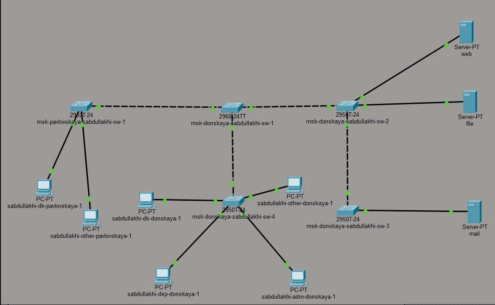
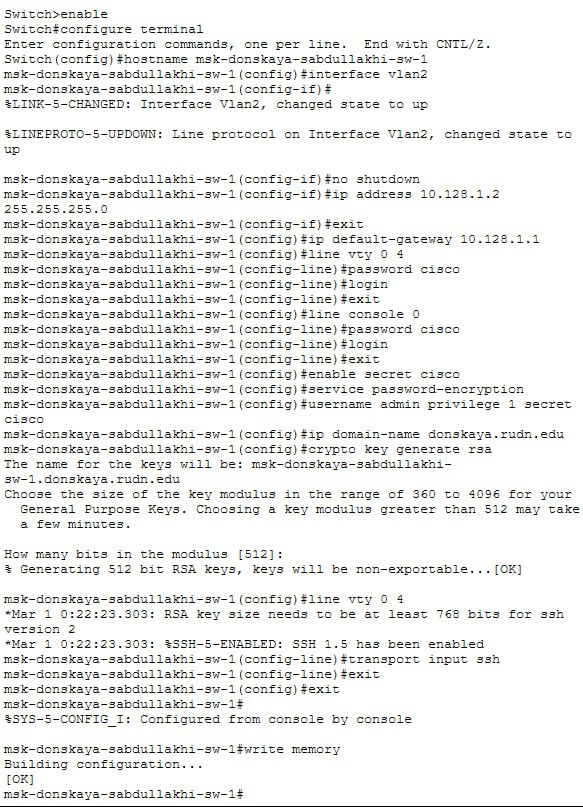
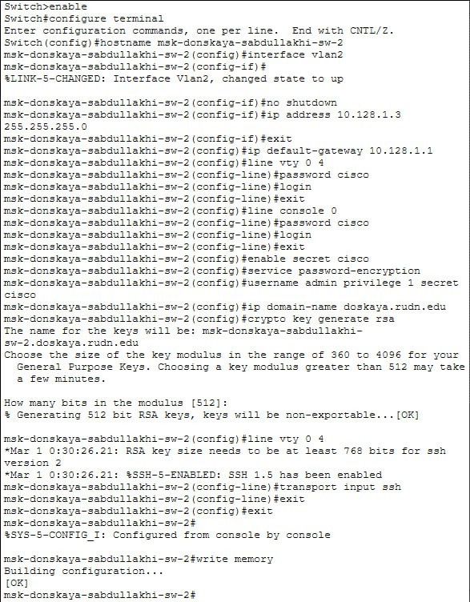
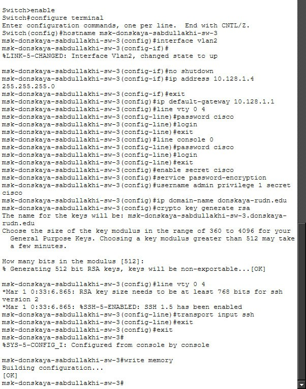
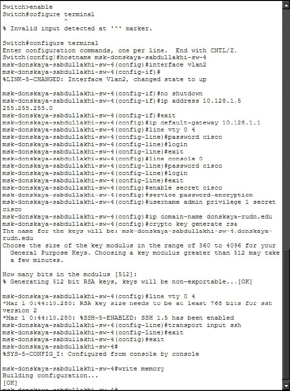
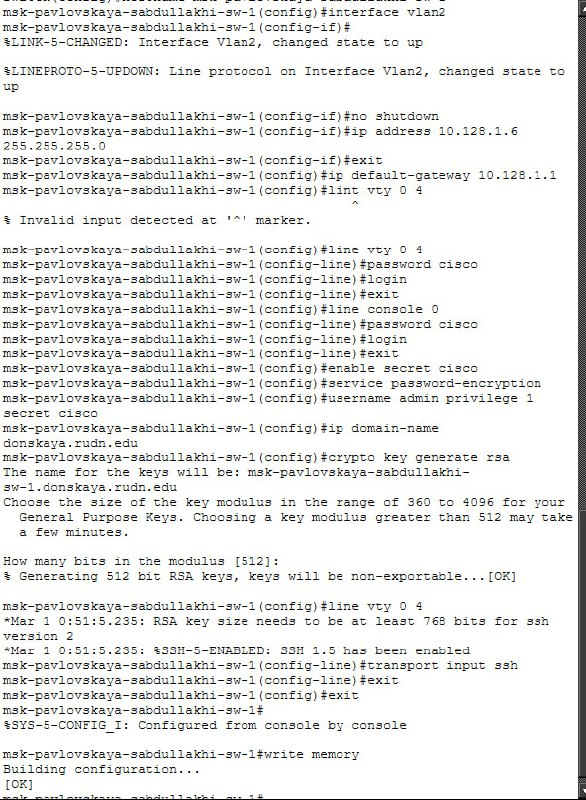

---
## Front matter
title: Отчёт по лабораторной работе №4
sub-title: Первоначальное конфигурирование сети
author: "Абдуллахи Шугофа"
## Generic otions
lang: ru-RU
toc-title: "Содержание"

## Bibliography
bibliography: bib/cite.bib
csl: pandoc/csl/gost-r-7-0-5-2008-numeric.csl

## Pdf output format
toc: true # Table of contents
toc-depth: 2
fontsize: 12pt
linestretch: 1.5
papersize: a
documentclass: scrreprt
## I18n polyglossia
polyglossia-lang:
  name: russian
  options:
	- spelling=modern
	- babelshorthands=true
polyglossia-otherlangs:
  name: english
## I18n babel
babel-lang: russian
babel-otherlangs: english
## Fonts
mainfont: IBM Plex Serif
romanfont: IBM Plex Serif
sansfont: IBM Plex Sans
monofont: IBM Plex Mono
mathfont: STIX Two Math
mainfontoptions: Ligatures=Common,Ligatures=TeX,Scale=0.94
romanfontoptions: Ligatures=Common,Ligatures=TeX,Scale=0.94
sansfontoptions: Ligatures=Common,Ligatures=TeX,Scale=MatchLowercase,Scale=0.94
monofontoptions: Scale=MatchLowercase,Scale=0.94,FakeStretch=0.9
mathfontoptions:
## Biblatex
biblatex: true
biblio-style: "gost-numeric"
biblatexoptions:
  - parentracker=true
  - backend=biber
  - hyperref=auto
  - language=auto
  - autolang=other*
  - citestyle=gost-numeric
## Pandoc-crossref LaTeX customization
figureTitle: "Рис."
tableTitle: "Таблица"
listingTitle: "Листинг"
lofTitle: "Список иллюстраций"
lotTitle: "Список таблиц"
lolTitle: "Листинги"
## Misc options
indent: true
header-includes:
  - \usepackage{indentfirst}
  - \usepackage{float} # keep figures where there are in the text
  - \floatplacement{figure}{H} # keep figures where there are in the text
---

## Цель работы
Целью данной лабораторной работы является выполнение первоначальной настройки сетевых коммутаторов в соответствии с заданной топологией L1. Под первоначальной настройкой понимается:

   присвоение устройству уникального имени;
   назначение IP  адреса для управления устройством;
   настройка шлюза по умолчанию;
   конфигурирование парольной защиты на консольном порту и виртуальных терминалах (VTY);
   настройка защищенного удаленного доступа по протоколу SSH.

## 4. Выполнение лабораторной работы
### 4.1. Построение топологии сети
В среде Cisco Packet Tracer была создана логическая рабочая область, в которой размещены все необходимые устройства согласно схеме сети L1.

Использованные коммутаторы:

 - msk  pavlovskaya  sabdullakhi  sw  1
 - msk  donskaya  sabdullakhi  sw  1
 - msk  donskaya  sabdullakhi  sw  2
 - msk  donskaya  sabdullakhi  sw  3
 - msk  donskaya  sabdullakhi  sw  4
 
 
 
 Оконечные устройства:

   Рабочие станции: dk (департамент кадров), dep (департамент), adm (администрация), other (прочие)
   Серверы: web  сервер, file  сервер, mail  сервер

Все соединения выполнены с использованием интерфейсов FastEthernet в соответствии с топологией, представленной на рисунке 3.1 из методического пособия.

## 4.2. Общая методология настройки коммутаторов
Настройка всех коммутаторов выполнялась по единому алгоритму, описанному в примере 4.1 методического пособия. Для управления коммутаторами была выделена подсеть       10.128.1.0/24       с шлюзом по умолчанию       10.128.1.1      .

Типовая последовательность команд для настройки коммутатора: 
```
Switch>enable
Switch configure terminal

! Присвоение имени устройству
Switch(config) hostname [имя_устройства]

! Настройка управляющего интерфейса VLAN 2
[имя_устройства](config) interface vlan 2
[имя_устройства](config  if) no shutdown
[имя_устройства](config  if) ip address [IP  адрес] 255.255.255.0
[имя_устройства](config  if) exit

! Настройка шлюза по умолчанию
[имя_устройства](config) ip default  gateway 10.128.1.1

! Настройка пароля на консольный порт
[имя_устройства](config) line console 0
[имя_устройства](config  line) password cisco
[имя_устройства](config  line) login
[имя_устройства](config  line) exit

! Настройка пароля на виртуальные терминалы (VTY)
[имя_устройства](config) line vty 0 4
[имя_устройства](config  line) password cisco
[имя_устройства](config  line) login
[имя_устройства](config  line) exit

! Настройка привилегированного режима
[имя_устройства](config) enable secret cisco
[имя_устройства](config) service password  encryption

! Создание локального пользователя
[имя_устройства](config) username admin privilege 1 secret cisco

! Настройка SSH
[имя_устройства](config) ip domain  name donskaya.rudn.edu
[имя_устройства](config) crypto key generate rsa
! При генерации ключей рекомендуется использовать длину модуля 1024 бита
! Ограничение доступа к VTY только по SSH
[имя_устройства](config) line vty 0 4
[имя_устройства](config  line) transport input ssh
[имя_устройства](config  line) exit

! Сохранение конфигурации
[имя_устройства](config) exit
[имя_устройства] write memory
```

## 4.3. Настройка msk  donskaya  sabdullakhi  sw  1
Данный коммутатор расположен в здании на Донской улице и является первым коммутатором в данной локации. Ему назначен IP  адрес       10.128.1.2/24      .

Процесс настройки:

1. Вход в привилегированный режим и режим глобальной конфигурации.
2. Присвоение имени `msk  donskaya  sabdullakhi  sw  1`.
3. Активация интерфейса VLAN 2 и назначение IP  адреса 10.128.1.2 с маской 255.255.255.0.
4. Настройка шлюза по умолчанию 10.128.1.1.
5. Установка паролей на линии console и vty.
6. Настройка привилегированного режима с паролем `cisco`.
7. Создание пользователя `admin` с паролем `cisco`.
8. Генерация RSA  ключей для SSH.
9. Ограничение доступа к VTY только по протоколу SSH.
      


##  4.4.Настройка msk  donskaya  sabdullakhi  sw  2
Второй коммутатор в здании на Донской улице. Ему назначен IP  адрес 10.128.1.3/24      .

Настройка выполнена аналогично первому коммутатору с изменением только имени устройства и IP  адреса. Все параметры безопасности идентичны для обеспечения единообразия конфигураций.



## 4.5. Настройка msk  donskaya  sabdullakhi  sw  3

Третий коммутатор в здании на Донской улице. Ему назначен IP  адрес 10.128.1.4/24      .

При настройке данного коммутатора особое внимание уделено корректной генерации RSA  ключей и проверке доступности устройства после сохранения конфигурации.



## 4.6. Настройка msk  donskaya  sabdullakhi  sw  4

Четвертый коммутатор в здании на Донской улице. Ему назначен IP  адрес 10.128.1.5/24      .

После завершения настройки выполнена проверка работоспособности SSH  доступа и сохранение конфигурации в энергонезависимую память командой `write memory`.



## 5.7. Настройка msk  pavlovskaya  sabdullakhi  sw  1

Данный коммутатор расположен в здании на Павловской улице. Ему назначен IP  адрес 10.128.1.6/24      .

Настройка выполнена по аналогичной схеме с остальными коммутаторами, что обеспечивает единообразие управления всей сетью.



## Заключение и выводы
В результате выполнения лабораторной работы были достигнуты следующие результаты:

1. Построена топология сети L1 в среде Cisco Packet Tracer с размещением пяти коммутаторов и оконечных устройств согласно заданной схеме.

2. Выполнена первоначальная настройка всех коммутаторов:
- Каждому устройству присвоено уникальное имя в соответствии с соглашением об именовании.
- Назначены IP  адреса управления из подсети 10.128.1.0/24.
- Настроен шлюз по умолчанию для обеспечения связи с другими сетями.

3. Реализована система защиты доступа:
- Установлены пароли на консольный порт и виртуальные терминалы.
- Настроен привилегированный режим с шифрованием паролей.
- Создана локальная учетная запись для административного доступа.

4. Настроен защищенный удаленный доступ:
- Сгенерированы RSA  ключи.
- Ограничен доступ к VTY только по протоколу SSH.
- Настроено доменное имя для корректной работы SSH.

5.Все конфигурации сохранены в энергонезависимую память коммутаторов.

Итог:Все коммутаторы готовы к удаленному администрированию по протоколу SSH в пределах сети управления 10.128.1.0/24. Созданная конфигурация обеспечивает базовый уровень безопасности и позволяет осуществлять дальнейшую настройку сетевых сервисов.


## Ответы на контрольные вопросы

**Вопрос 1. При помощи каких команд можно посмотреть конфигурацию сетевого оборудования?**

**Ответ:** Для просмотра конфигурации сетевого оборудования используются следующие команды:

| Команда | Назначение |
|---------|------------|
| `show running-config` | Отображение текущей активной конфигурации, находящейся в оперативной памяти (RAM) |
| `show run` | Сокращенный вариант предыдущей команды |
| `show startup-config` | Отображение конфигурации, сохраненной в NVRAM (загружается при перезагрузке) |
| `show ip interface brief` | Краткая информация о состоянии интерфейсов и назначенных IP-адресах |
| `show interfaces` | Детальная информация о всех интерфейсах устройства |
| `show version` | Информация о версии IOS и аппаратных параметрах устройства |

---

**Вопрос 2. При помощи каких команд можно посмотреть стартовый конфигурационный файл оборудования?**

**Ответ:** Стартовая конфигурация хранится в энергонезависимой памяти (NVRAM) и загружается при включении или перезагрузке устройства. Для её просмотра используются:

* `show startup-config` — основная команда для отображения сохраненной конфигурации
* `show start` — сокращенный вариант команды

Эта конфигурация остается неизменной после перезагрузки, в отличие от running-config, которая может быть изменена в процессе работы.

---

**Вопрос 3. При помощи каких команд можно экспортировать конфигурационный файл оборудования?**

**Ответ:** Экспорт конфигурации выполняется путем копирования файла на внешний сервер. Поддерживаются различные протоколы:

| Команда | Описание |
|---------|----------|
| `copy running-config tftp:` | Экспорт текущей конфигурации на TFTP-сервер |
| `copy startup-config tftp:` | Экспорт стартовой конфигурации на TFTP-сервер |
| `copy running-config ftp:` | Передача файла на FTP-сервер |
| `copy running-config scp:` | Копирование по защищенному протоколу SCP |
| `copy running-config flash:` | Сохранение конфигурации во флеш-память устройства |

При использовании данных команд система запросит IP-адрес сервера и имя файла для сохранения.

---

**Вопрос 4. При помощи каких команд можно импортировать конфигурационный файл оборудования?**

**Ответ:** Импорт конфигурации является обратной операцией экспорту и выполняется следующими командами:

| Команда | Описание |
|---------|----------|
| `copy tftp: running-config` | Загрузка конфигурации с TFTP-сервера в текущую конфигурацию |
| `copy tftp: startup-config` | Загрузка файла непосредственно в NVRAM |
| `copy ftp: running-config` | Импорт с FTP-сервера |
| `copy scp: startup-config` | Загрузка конфигурации по защищенному протоколу SCP |

После импорта конфигурации в running-config необходимо выполнить сохранение командой `copy running-config startup-config` или `write memory`, чтобы изменения сохранились после перезагрузки устройства.
```

