---
## Front matter
title: Отчёт по лабораторной работе №5
sub-title: Конфигурирование VLAN
author: "Абдуллахи Шугофа"
## Generic otions
lang: ru-RU
toc-title: "Содержание"

## Bibliography
bibliography: bib/cite.bib
csl: pandoc/csl/gost-r-7-0-5-2008-numeric.csl

## Pdf output format
toc: true # Table of contents
toc-depth: 2
fontsize: 12pt
linestretch: 1.5
papersize: a
documentclass: scrreprt
## I18n polyglossia
polyglossia-lang:
  name: russian
  options:
	- spelling=modern
	- babelshorthands=true
polyglossia-otherlangs:
  name: english
## I18n babel
babel-lang: russian
babel-otherlangs: english
## Fonts
mainfont: IBM Plex Serif
romanfont: IBM Plex Serif
sansfont: IBM Plex Sans
monofont: IBM Plex Mono
mathfont: STIX Two Math
mainfontoptions: Ligatures=Common,Ligatures=TeX,Scale=0.94
romanfontoptions: Ligatures=Common,Ligatures=TeX,Scale=0.94
sansfontoptions: Ligatures=Common,Ligatures=TeX,Scale=MatchLowercase,Scale=0.94
monofontoptions: Scale=MatchLowercase,Scale=0.94,FakeStretch=0.9
mathfontoptions:
## Biblatex
biblatex: true
biblio-style: "gost-numeric"
biblatexoptions:
  - parentracker=true
  - backend=biber
  - hyperref=auto
  - language=auto
  - autolang=other*
  - citestyle=gost-numeric
## Pandoc-crossref LaTeX customization
figureTitle: "Рис."
tableTitle: "Таблица"
listingTitle: "Листинг"
lofTitle: "Список иллюстраций"
lotTitle: "Список таблиц"
lolTitle: "Листинги"
## Misc options
indent: true
header-includes:
  - \usepackage{indentfirst}
  - \usepackage{float} # keep figures where there are in the text
  - \floatplacement{figure}{H} # keep figures where there are in the text
---

## Цель работы
Целью лабораторной работы является получение практических навыков по настройке виртуальных локальных сетей VLAN на сетевых коммутаторах.
В ходе выполнения лабораторной работы необходимо изучить принципы сегментации сети и научиться разделять одну физическую сеть на несколько логических сетей. Использование VLAN позволяет повысить безопасность сети, уменьшить широковещательный трафик и упростить администрирование сети.
Также в ходе выполнения работы необходимо научиться использовать протокол VTP для централизованного управления VLAN в сети, а также настроить взаимодействие между коммутаторами при помощи trunk-соединений.
Выполнение лабораторной работы позволяет лучше понять принципы построения современных корпоративных сетей и получить навыки конфигурирования сетевого оборудования.

## 2. Выполнение лабораторной работы
### 2.1 Построение топологии сети
На первом этапе выполнения лабораторной работы в программе Cisco Packet Tracer была создана сетевая топология.
В сети использовались следующие устройства:
- коммутаторы Cisco 2960
-  персональные компьютеры
-  серверы
-  соединительные кабели
Топология сети была построена таким образом, чтобы обеспечить взаимодействие между несколькими VLAN и проверить работу протокола VTP.
Каждое устройство было подключено к соответствующему коммутатору. Между коммутаторами были настроены trunk-соединения для передачи трафика различных VLAN.
После построения топологии была выполнена проверка правильности соединения устройств.

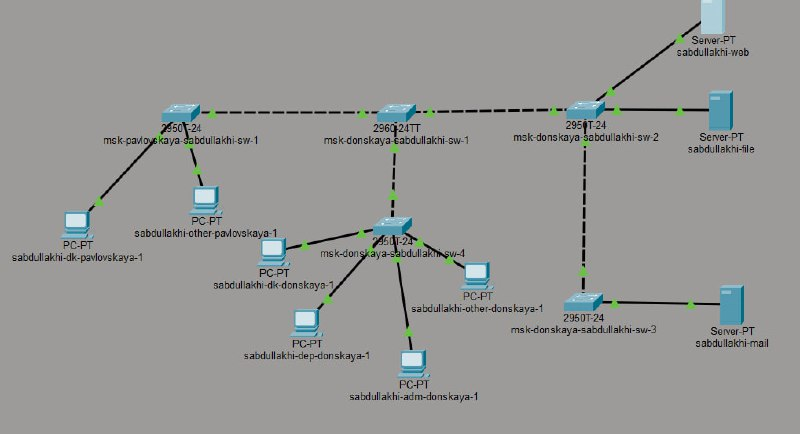
 
### 2.2 Настройка VTP-сервера и создание VLAN
После создания топологии сети был настроен основной коммутатор, который выполняет роль VTP-сервера.
VTP-сервер отвечает за хранение информации о VLAN и распространение этой информации на другие коммутаторы сети.
Для настройки VTP-сервера были выполнены следующие действия:
- вход в режим конфигурации
- настройка VTP-домена
- установка режима VTP server
- создание VLAN
Были созданы следующие VLAN:
VLAN 2 — management
VLAN 3 — servers
VLAN 101 — dk
VLAN 102 — departments
VLAN 103 — administration
VLAN 104 — other
Каждый VLAN предназначен для определённой группы пользователей или устройств сети.

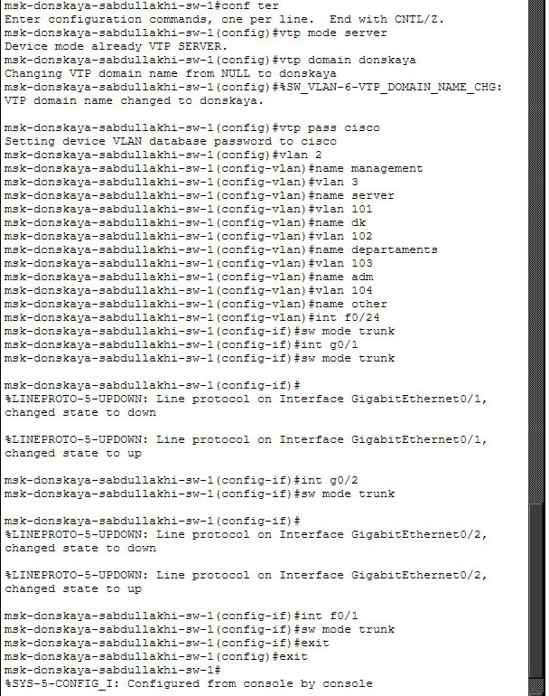

### 2.3 Настройка коммутатора SW-2
Следующим этапом была настройка второго коммутатора сети.
Коммутатор SW-2 был настроен как VTP-клиент. Это означает, что он получает информацию о VLAN от VTP-сервера автоматически.
Также на данном коммутаторе были настроены trunk-порты для передачи трафика между коммутаторами.
Trunk-соединение позволяет передавать трафик сразу нескольких VLAN по одному физическому каналу.
После настройки коммутатора была выполнена проверка правильности конфигурации.

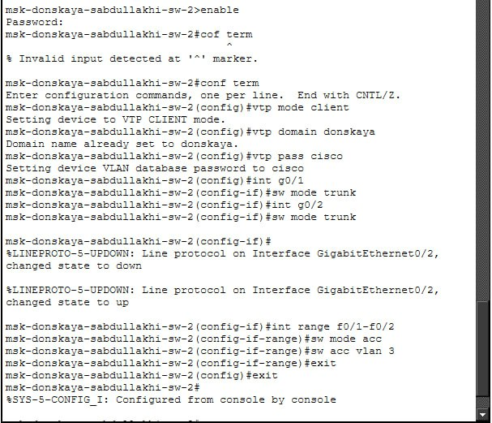

### 2.4 Настройка коммутатора SW-3
Коммутатор SW-3 также был настроен как VTP-клиент.
После подключения к сети он автоматически получил список VLANот VTP-сервера.
Далее на коммутаторе были настроены access-порты для подключения пользовательских устройств.
Каждый порт был назначен определённому VLAN.
Это позволяет разделить устройства сети на отдельные логические сегменты.

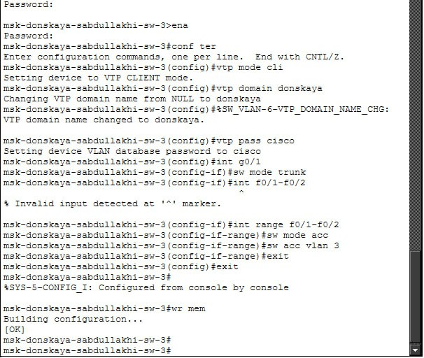

### 2.5 Настройка коммутатора SW-4
Коммутатор SW-4 выполняет аналогичную функцию в сети.
На данном коммутаторе также были настроены:
- режим VTP client
- trunk-порты
- access-порты
После настройки коммутатор получил список VLAN от VTP-сервера.
Это подтверждает корректную работу протокола VTP.

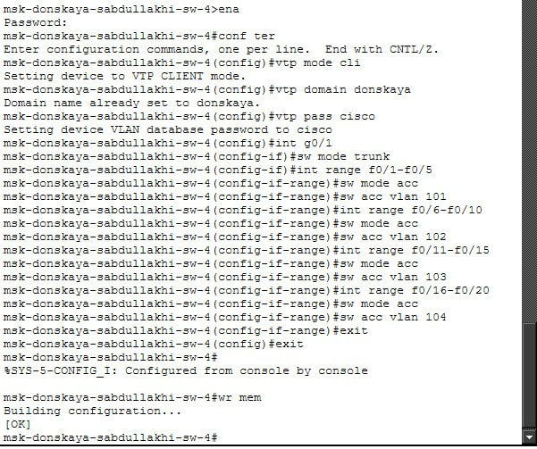

### 2.6 Настройка коммутатора Pavlovskaya-SW-1
Коммутатор Pavlovskaya-SW-1 используется для подключения устройств второго сегмента сети.
На данном коммутаторе были выполнены следующие действия:
- настройка trunk-порта
- получение VLAN от VTP-сервера
- назначение портовсоответствующим VLAN
После завершения настройки коммутатор начал корректно передавать трафик между устройствами сети.

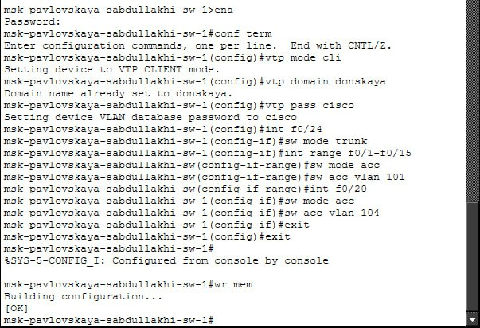

### 2.7 Настройка IP-адреса Web-сервера
После настройки коммутаторов были настроены IP-адреса серверов.
На Web-сервере был задан статический IP-адрес, маска подсети и шлюз по умолчанию.
Это необходимо для корректной работы сетевых служб и доступа к серверу из других устройств сети.

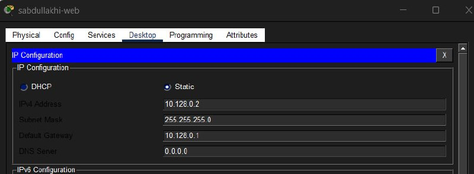

### 2.8 Настройка IP-адреса File-сервера
Аналогично была выполнена настройка IP-адреса файлового сервера.
Файловый сервер используется для хранения данных и обеспечения доступа пользователей к файлам.
 

### 2.9 Настройка IP-адреса Mail-сервера
Mail-сервер предназначен для организации электронной почты в сети.
На нём также был настроен IP-адрес, маска подсети и шлюз.
 
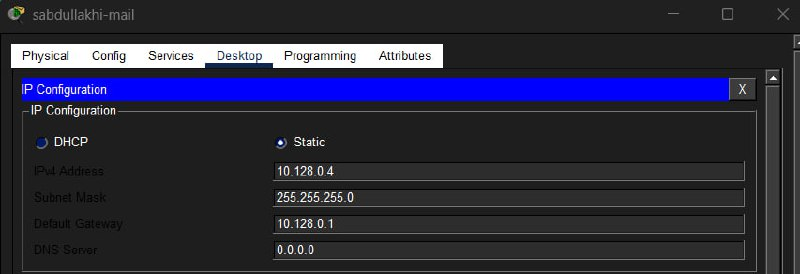

### 2.10–2.15 Настройка IP-адресов рабочих станций
Далее были настроены IP-адреса всех рабочих станций сети.
Каждому компьютеру был назначен:
- уникальный IP-адрес
- маска подсети
- шлюз
Это необходимо для обеспечения связи между устройствами сети.

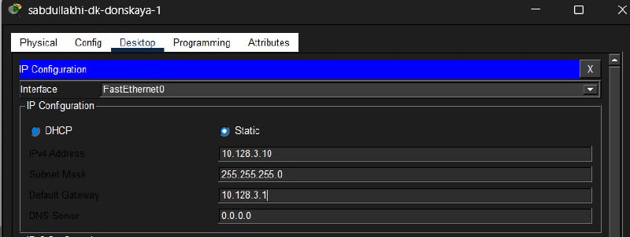

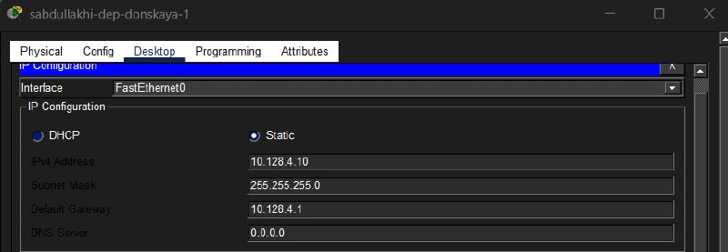

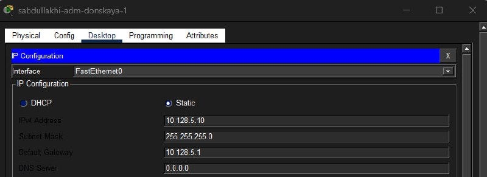

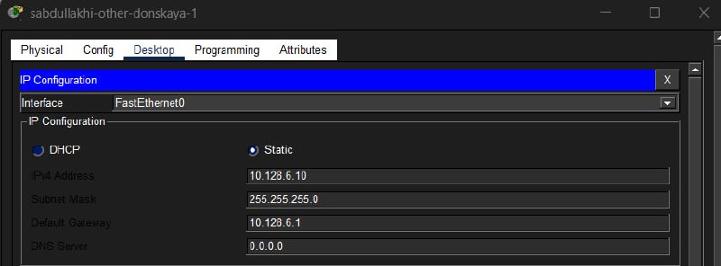

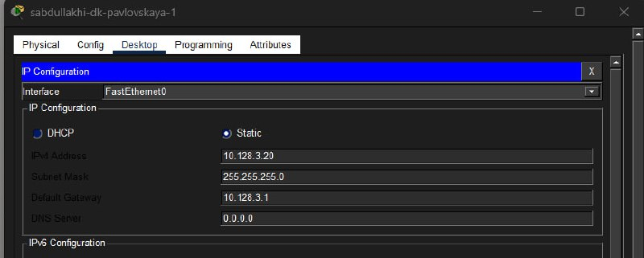

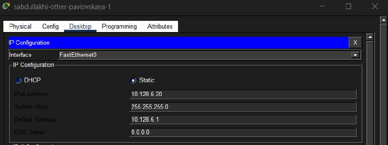

### 2.16 Проверка доступности серверов
После завершения конфигурации была выполнена проверка доступности серверов.
Для этого использовалась команда ping.
Результаты проверки показали, что устройства сети могут успешно обмениваться пакетами.
 
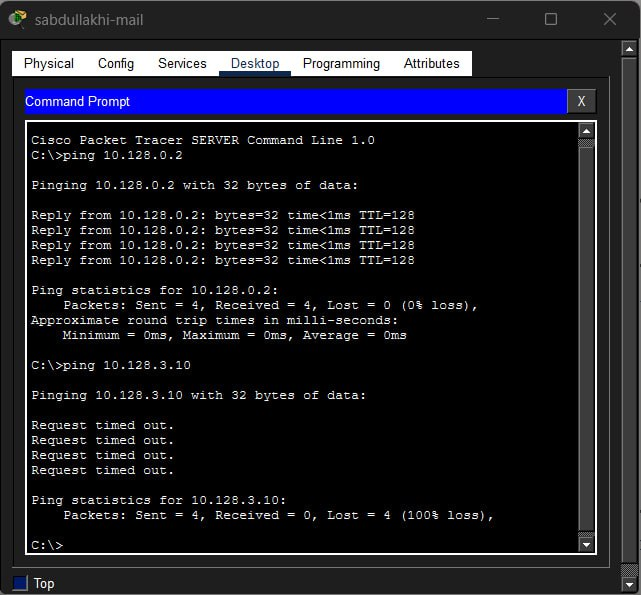

### 2.17 Проверка связи внутри VLAN
Далее была проверена связь между устройствами, которые находятся внутри одного VLAN.
Устройства успешно обменивались пакетами, что подтверждает правильность настройки VLAN.
 

### 2.18 Проверка связи VLAN other
Затем была выполнена проверка работы VLAN other.
Устройства данного VLAN также успешно обменивались пакетами.

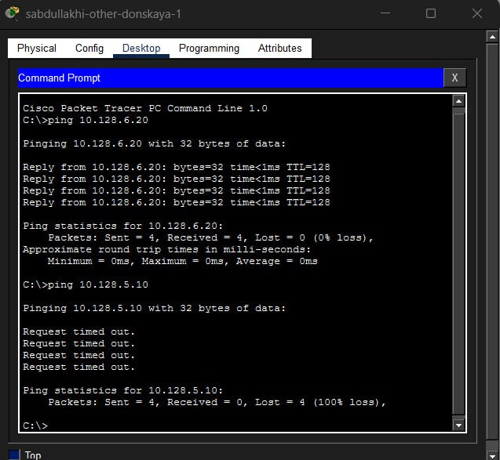

### 2.19 Режим симуляции передачи пакета
Для анализа сетевого взаимодействия был использован режим Simulation в Cisco Packet Tracer.
Этот режим позволяет наблюдать процесс передачи пакета между устройствами сети.

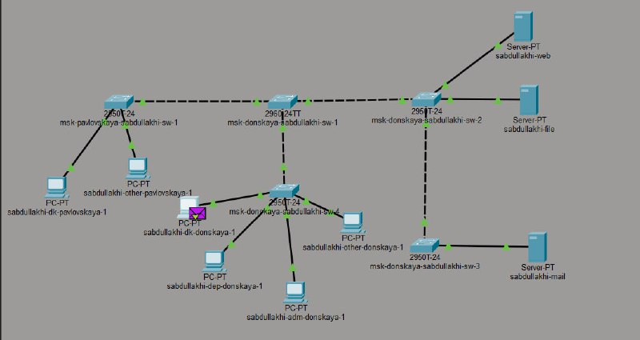

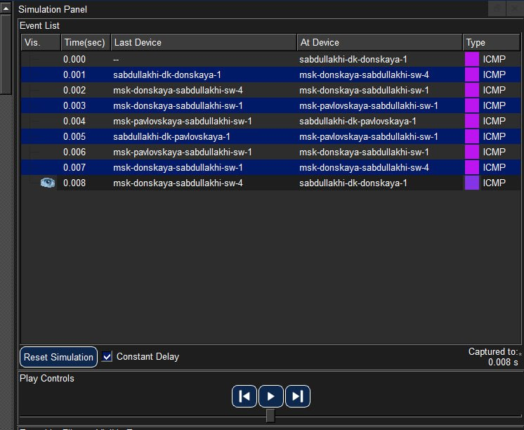

### 2.20 Анализ ICMP-пакета
В режиме симуляции была изучена структура ICMP-пакета.
Было рассмотрено:
- IP-адрес отправителя
- IP-адрес получателя
- MAC-адреса устройств
- тип ICMP-сообщения

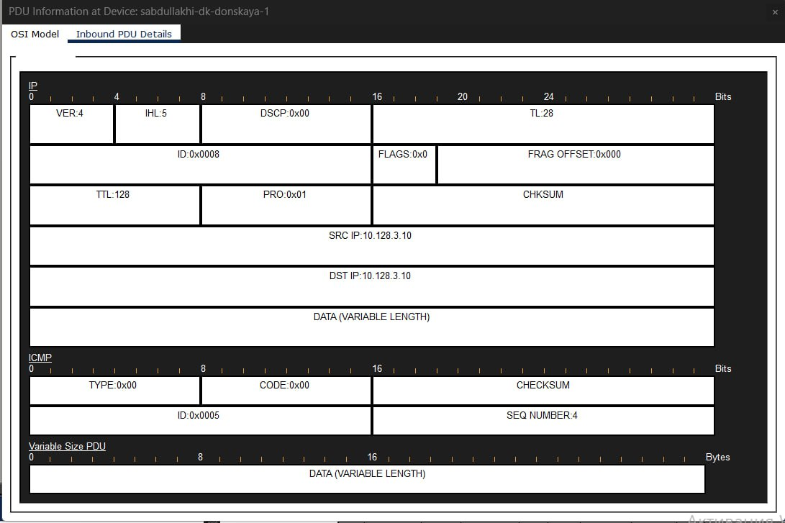

## 3. Вывод
В ходе выполнения лабораторной работы была изучена технология VLAN и получены практические навыки по настройке виртуальных локальных сетей.
Были выполнены следующиедействия:
• построена топология сети
• настроен VTP-сервер
• настроены VTP-клиенты
• созданы VLAN
• настроены IP-адреса устройств
• выполнена проверка сетевойсвязности
Полученные результаты подтвердили корректную работу сети и правильность выполненной конфигурации.
Использование VLAN позволяет значительно повысить эффективность управления сетью, улучшить безопасность и снизить нагрузку на сеть.
 
## 4.Ответы на контрольныевопросы
**1. Какая команда используется для просмотра списка VLAN?**
Команда:
show vlan brief
Она выводит список всех VLAN, их номера и назначенные порты.

 
**2. Что такое VTP?**
VTP (VLAN Trunking Protocol) — это протокол Cisco, который используется для централизованного управления VLAN в сети.
Основные команды настройки:
vtp mode server
vtp mode client
vtp domain
vtp password
show vtp status

 
**3. Что такое ICMP?**
ICMP (Internet Control MessageProtocol) — это сетевой протокол, используемый для диагностики сети.
Он применяется для:
• проверки доступности устройств
• передачи сообщений об ошибках
• диагностики сетевых проблем.
Команда ping использует протокол ICMP.

 
**4. Что такое ARP?**
ARP (Address Resolution Protocol) используется для определения MAC-адреса устройства по его IP-адресу.
Он работает следующим образом:
1. устройство отправляет ARP-запрос;
2. получатель отвечает своим MAC-адресом;
3. после этого устанавливаетсясоединение.

 
**5. Что такое MAC-адрес?**
MAC-адрес — это уникальный аппаратный адрес сетевого интерфейса.
Он состоит из 48 бит и записывается в шестнадцатеричном виде.
Пример MAC-адреса:
00:1A:2B:3C:4D:5E
Первые три байта обозначают производителя устройства.
 
