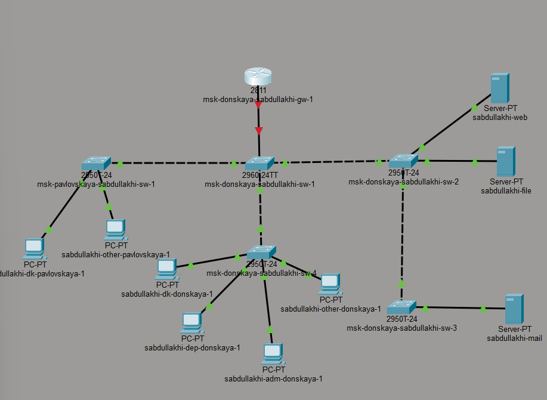
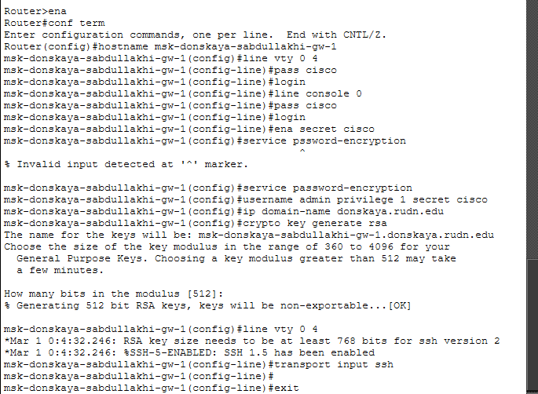
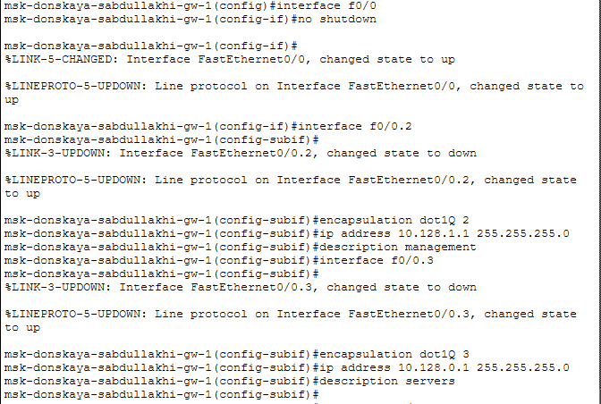
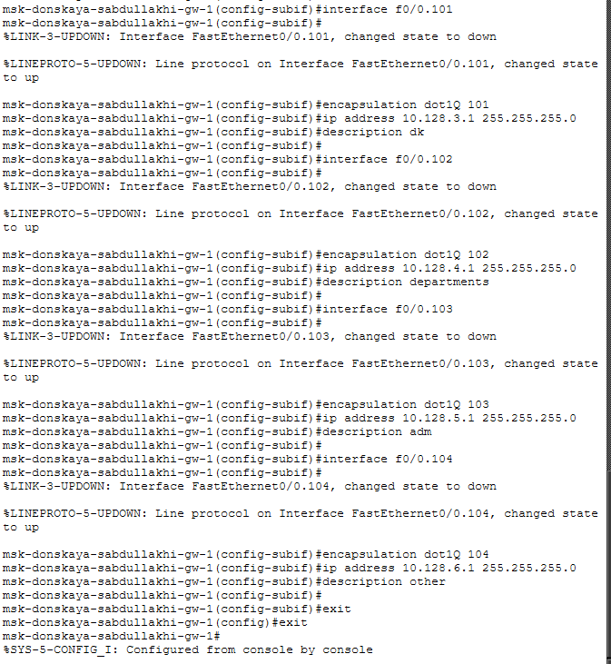
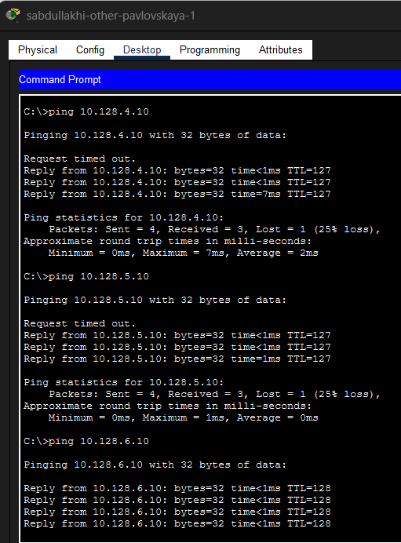
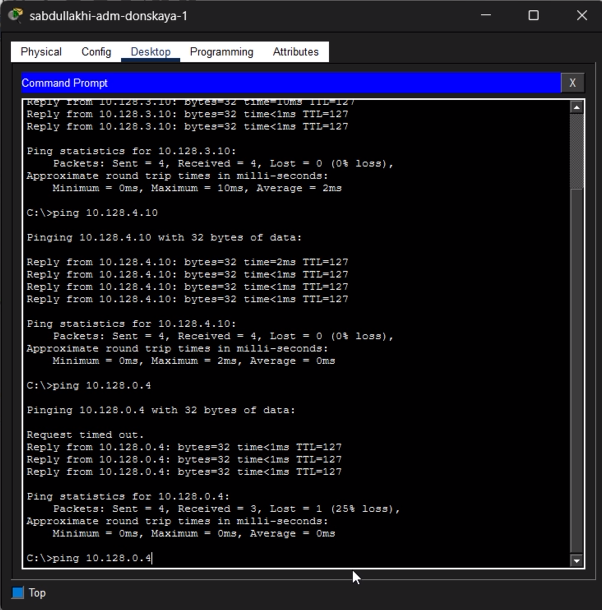
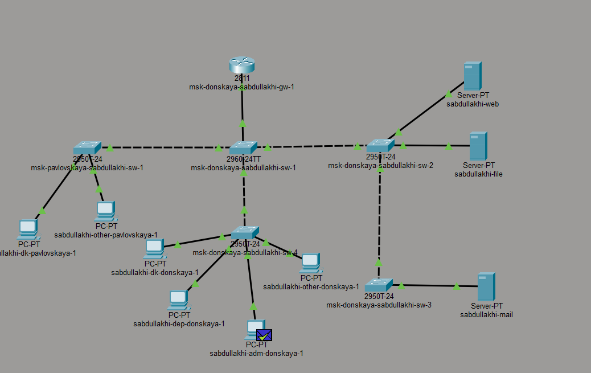
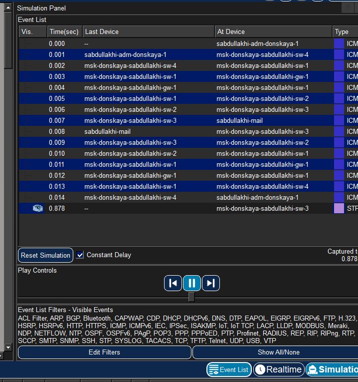
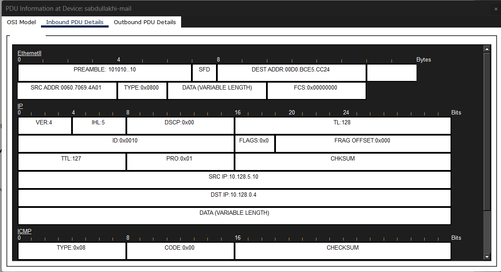

---
## Front matter
title: Отчёт по лабораторной работе №6
sub-title: Статическая маршрутизация VLAN 
author: "Абдуллахи Шугофа"
## Generic otions
lang: ru-RU
toc-title: "Содержание"

## Bibliography
bibliography: bib/cite.bib
csl: pandoc/csl/gost-r-7-0-5-2008-numeric.csl

## Pdf output format
toc: true # Table of contents
toc-depth: 2
fontsize: 12pt
linestretch: 1.5
papersize: a
documentclass: scrreprt
## I18n polyglossia
polyglossia-lang:
  name: russian
  options:
	- spelling=modern
	- babelshorthands=true
polyglossia-otherlangs:
  name: english
## I18n babel
babel-lang: russian
babel-otherlangs: english
## Fonts
mainfont: IBM Plex Serif
romanfont: IBM Plex Serif
sansfont: IBM Plex Sans
monofont: IBM Plex Mono
mathfont: STIX Two Math
mainfontoptions: Ligatures=Common,Ligatures=TeX,Scale=0.94
romanfontoptions: Ligatures=Common,Ligatures=TeX,Scale=0.94
sansfontoptions: Ligatures=Common,Ligatures=TeX,Scale=MatchLowercase,Scale=0.94
monofontoptions: Scale=MatchLowercase,Scale=0.94,FakeStretch=0.9
mathfontoptions:
## Biblatex
biblatex: true
biblio-style: "gost-numeric"
biblatexoptions:
  - parentracker=true
  - backend=biber
  - hyperref=auto
  - language=auto
  - autolang=other*
  - citestyle=gost-numeric
## Pandoc-crossref LaTeX customization
figureTitle: "Рис."
tableTitle: "Таблица"
listingTitle: "Листинг"
lofTitle: "Список иллюстраций"
lotTitle: "Список таблиц"
lolTitle: "Листинги"
## Misc options
indent: true
header-includes:
  - \usepackage{indentfirst}
  - \usepackage{float} # keep figures where there are in the text
  - \floatplacement{figure}{H} # keep figures where there are in the text
---

## 1.Цель работы
Настроить статическую маршрутизацию между виртуальными локальными сетями (VLAN) в среде Cisco Packet Tracer с использованием технологии RouteronaStick и провести анализ передачи данных между различными VLAN.

##  2. Выполнение лабораторной работы
### 2.1. Построение топологии сети

В логической рабочей области Cisco Packet Tracer была построена сеть, включающая:

 - маршрутизатор Cisco 2811 с именем устройства `msk-donskaya-sabdullakhi-gw-1`;
 - коммутаторы Cisco 2960;
 - оконечные устройства: персональные компьютеры (PC) и серверы (web, file, mail).
Маршрутизатор подключён к коммутатору `msk-donskaya-sabdullakhi-sw-1` через интерфейс
FastEthernet0/0, соединённый с портом 24 коммутатора. Данный канал используется для передачи трафика нескольких VLAN (trunk).

Остальные коммутаторы соединяют различные сегменты сети, к которым подключены рабочие станции подразделений и серверы.

*Рис. 1. Схема топологии сети*

###  2.2. Первичная настройка маршрутизатора

Через интерфейс командной строки (CLI) выполнена начальная настройка маршрутизатора:

 задано имя устройства: `msk-donskaya-sabdullakhi-gw-1`;
 настроен пароль для доступа через консоль;
 настроены линии VTY для удалённого подключения;
 установлен пароль `enable secret`;
 включено шифрование паролей;
 создан локальный пользователь `admin`;
 задано доменное имя: `donskaya.rudn.edu`;
 сгенерированы RSAключи;
 разрешён доступ по протоколу SSH.
 
 
 
       *Рис. 2. Настройка имени устройства и паролей*
 
 
 
      *Рис. 3. Настройка SSH и генерация ключей*
  
###  2.3. Настройка межсетевой маршрутизации VLAN (RouteronaStick)

На интерфейсе FastEthernet0/0 маршрутизатора включён порт, после чего созданы виртуальные подинтерфейсы для каждой VLAN. Для каждого подинтерфейса указана инкапсуляция IEEE 802.1Q и назначен IPадрес, выполняющий роль шлюза по умолчанию для соответствующей подсети.

Настроены следующие подинтерфейсы:

 - f0/0.101 – VLAN 101, сеть 10.128.3.0/24, назначение dk;
 - f0/0.102 – VLAN 102, сеть 10.128.4.0/24, назначение departments;
 - f0/0.103 – VLAN 103, сеть 10.128.5.0/24, назначение adm;
 - f0/0.104 – VLAN 104, сеть 10.128.6.0/24, назначение other.

Таким образом, маршрутизатор выполняет функции маршрутизации между различными VLAN сети.

 
 
    *Рис. 4. Создание подинтерфейсов для VLAN*
 
###  2.4. Настройка trunkпорта на коммутаторе

На коммутаторе `msk-donskaya-sabdullakhi-sw-1` порт FastEthernet0/24 настроен как trunkпорт, что позволило передавать трафик нескольких VLAN между коммутатором и маршрутизатором по одному физическому соединению с использованием тегирования 802.1Q.

### 2.5. Проверка доступности устройств (ping)

После завершения настройки выполнена проверка доступности устройств из разных VLAN. С рабочих станций отправлены ICMPзапросы на устройства из других подсетей. Полученные ответы подтвердили корректную работу межсетевой маршрутизации.

 
 
 *Рис. 5. Успешный ping между разными VLAN*
 
Дополнительно выполнена проверка соединения с другого компьютера сети, что также подтвердило успешную передачу пакетов между различными VLAN.

 
 
 *Рис. 6. Проверка связности с другого устройства*
 
### 2.6. Анализ передачи данных в режиме Simulation

Для изучения процесса передачи данных использован режим Simulation в Cisco Packet Tracer. В данном режиме можно наблюдать движение пакета по сети и последовательность его обработки сетевыми устройствами.

В ходе анализа прослежено прохождение ICMPпакета от исходного компьютера через коммутаторы и маршрутизатор к конечному узлу.

 
 
 *Рис. 7. Движение пакета от отправителя к маршрутизатору*
 
 
 
 *Рис. 8. Движение пакета от маршрутизатора к получателю*
 
###  2.7. Анализ структуры передаваемого пакета

Изучено содержимое передаваемого пакета. В окне анализа PDU отображаются заголовки нескольких протоколов модели OSI:

 заголовок Ethernet 802.1Q, содержащий MACадреса источника и назначения, а также тег VLAN;
 заголовок IP, содержащий адрес источника (например, 10.128.5.10) и адрес назначения (10.128.0.4);
 заголовок ICMP, используемый для передачи echoзапроса (ping).

Анализ структуры пакета подтверждает корректную работу инкапсуляции 802.1Q и маршрутизации между VLAN.

 
 
 *Рис. 9. Детальный анализ PDU (ICMP-пакет с VLAN-тегом)*
 
##  3. Вывод

В ходе лабораторной работы в среде Cisco Packet Tracer была построена сеть, включающая маршрутизатор Cisco 2811, несколько коммутаторов Cisco 2960, серверы и персональные компьютеры. Маршрутизатор был подключён к коммутатору через trunkсоединение, что позволило передавать трафик нескольких VLAN по одному физическому каналу.

На маршрутизаторе выполнена первоначальная настройка: задано имя устройства, настроены пароли доступа, создан пользователь, включено шифрование паролей и настроено удалённое подключение по протоколу SSH. Далее на интерфейсе FastEthernet0/0 созданы виртуальные подинтерфейсы для VLAN и назначены соответствующие IPадреса, выполняющие роль шлюзов по умолчанию.
Проверка соединения между устройствами из различных VLAN с помощью команды ping показала успешную доставку пакетов, что подтверждает корректную работу межсетевой маршрутизации. В режиме Simulation изучен процесс прохождения ICMPпакета по сети, а также рассмотрена структура передаваемого кадра и заголовки протоколов Ethernet, IP и ICMP.

Таким образом, цель работы достигнута: статическая маршрутизация между VLAN успешно настроена и протестирована.

##  4. Контрольные вопросы

**1. Охарактеризуйте стандарт IEEE 802.1Q.**

Стандарт IEEE 802.1Q определяет метод тегирования кадров Ethernet для поддержки виртуальных локальных сетей (VLAN) в компьютерных сетях. Данный стандарт позволяет передавать трафик нескольких VLAN по одному физическому каналу связи.

При использовании 802.1Q в Ethernetкадр добавляется специальное поле — VLANтег, которое содержит идентификатор VLAN. Благодаря этому сетевые устройства могут определять, к какой виртуальной сети относится передаваемый кадр.

Стандарт применяется на trunkсоединениях между сетевыми устройствами, например между коммутаторами или между коммутатором и маршрутизатором. Использование IEEE 802.1Q позволяет логически разделять сеть на несколько изолированных сегментов без необходимости прокладки дополнительных физических линий связи.

**2. Опишите формат кадра IEEE 802.1Q.**

Кадр IEEE 802.1Q представляет собой обычный Ethernetкадр, в который добавляется специальное поле тегирования VLAN. Этот тег вставляется между полями MACадреса источника и типа протокола.

Формат кадра включает следующие основные поля:

 Destination MAC Address – MACадрес устройстваполучателя;
 Source MAC Address – MACадрес устройстваотправителя;
 TPID (Tag Protocol Identifier) – поле, указывающее, что кадр содержит тег VLAN (обычно значение 0x8100);
 TCI (Tag Control Information) – поле управления тегом, содержащее идентификатор VLAN (VLAN ID, 12 бит), приоритет (3 бита) и CFI (1 бит);
 Type / Length – поле, определяющее тип инкапсулированного протокола;
 Data – полезная нагрузка кадра;
 FCS (Frame Check Sequence) – контрольная сумма для проверки целостности кадра.

Данная структура позволяет сетевым устройствам корректно идентифицировать принадлежность кадра к определённой VLAN и обрабатывать его соответствующим образом.

