---
## Front matter
lang: ru-RU
title: Администрирование локальных сетей
subtitle: Отчёт по лабораторной работе №7. Учёт физических параметров сети
author:
  - Абдуллахи Шугофа
institute:
  - Российский университет дружбы народов, Москва, Россия
date: 26 марта 2026

## i18n babel
babel-lang: russian
babel-otherlangs: english

## Formatting pdf
toc: false
toc-title: Содержание
slide_level: 2
aspectratio: 169
section-titles: true
theme: metropolis
pdf-engine: xelatex

header-includes: |
  \metroset{progressbar=frametitle,sectionpage=progressbar,numbering=fraction}
  \usepackage{fontspec}
  \setmainfont{DejaVu Serif}
  \setsansfont{DejaVu Sans}
  \setmonofont{DejaVu Sans Mono}
---

## Цель работы
Целью лабораторной работы является получение практических навыков работы с физической рабочей областью симулятора Cisco Packet Tracer. В ходе работы необходимо научиться учитывать физические параметры сети, такие как тип среды передачи данных, длина кабеля, затухание сигнала, а также обоснованно применять сетевое оборудование (повторители, различные типы кабелей) для обеспечения работоспособности сети на больших расстояниях.

## Назначение имени городу Moscow

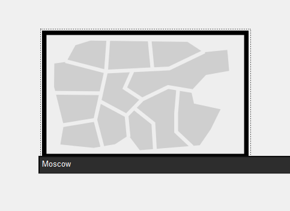

## Создание и размещение зданий Donskaya и Pavlovskaya

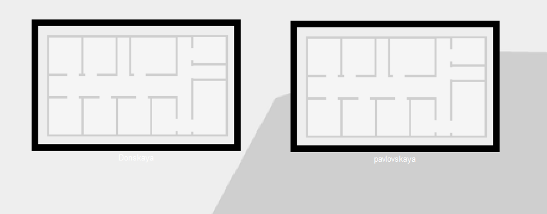

## Размещение серверной в здании Donskaya

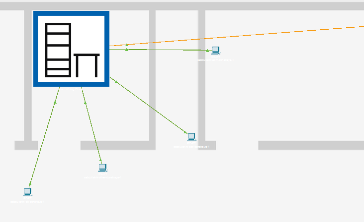

## Отображение серверных стоек и оборудования

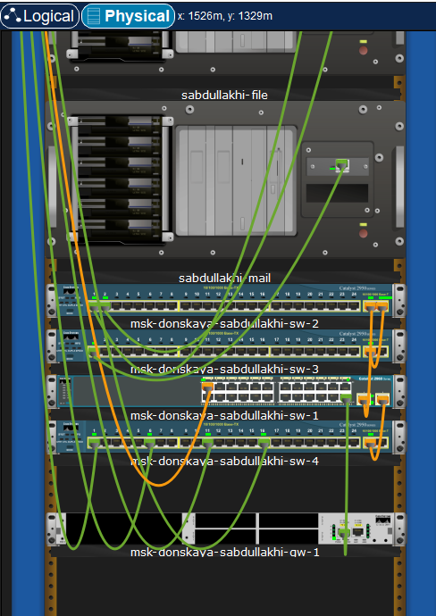

## Размещение устройств в здании Pavlovskaya

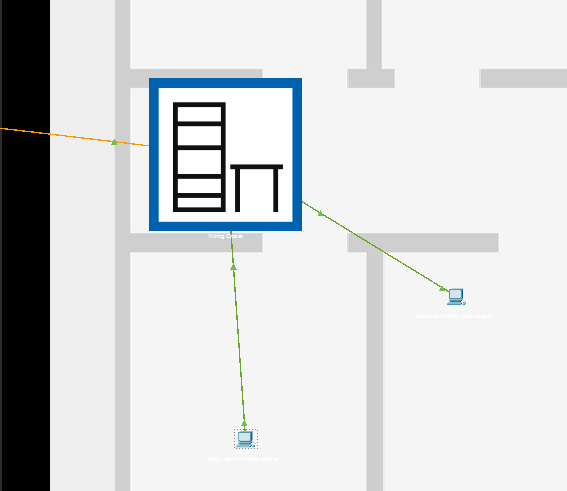

## Проверка соединения между коммутаторами 

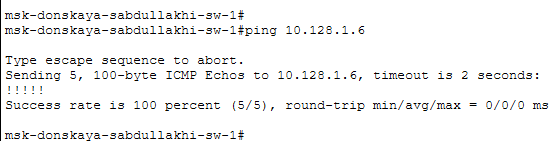

## Включение учёта длины кабеля

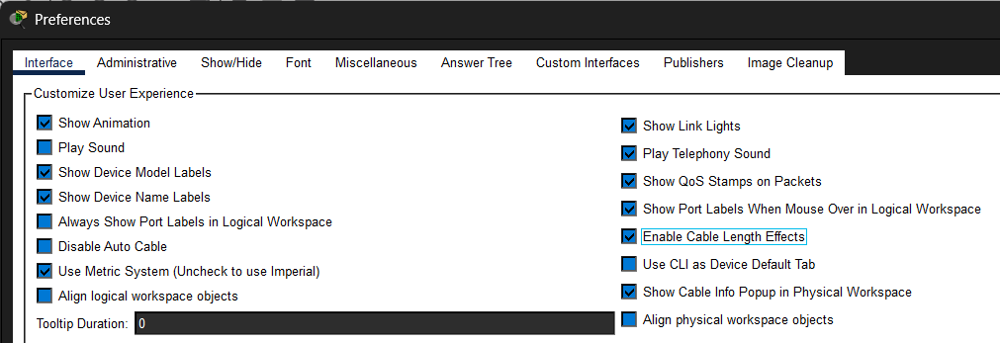

## Размещение территорий на большом расстоянии

## Отсутствие соединения между коммутаторами

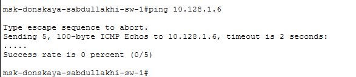{width=40%}

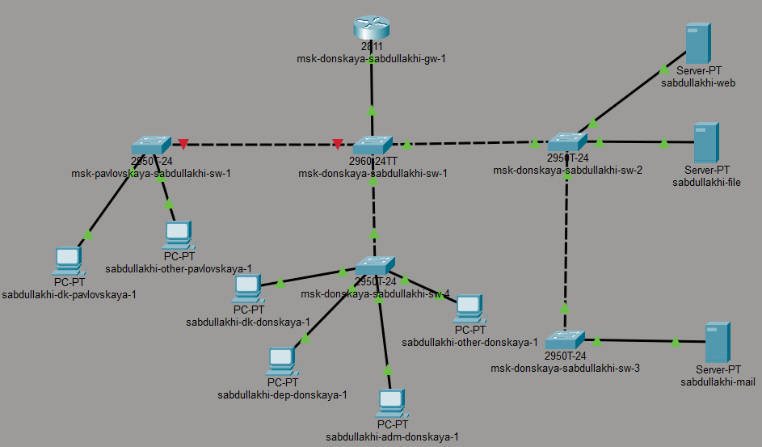{width=40%}

## Настройка повторителей и выбор модулей

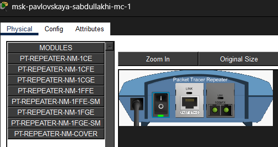{width=30%}

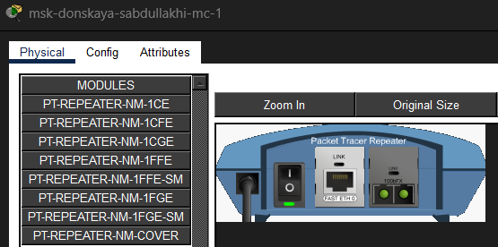{width=30%}

## Схема подключения с использованием повторителей

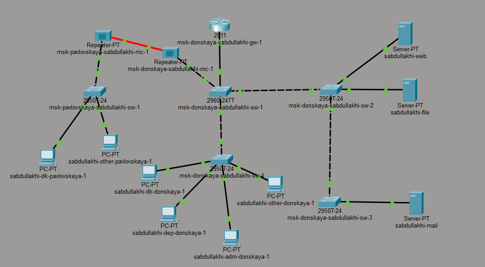

## Успешная проверка соединения после добавления повторителей

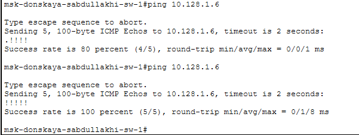

## 3. Вывод

В ходе лабораторной работы освоены навыки работы с физической рабочей областью Packet Tracer. Установлено, что превышение допустимой длины кабеля (более 100 м) приводит к потере связи. Для восстановления соединения использованы повторители и оптоволокно, что позволило обеспечить стабильную передачу данных на большом расстоянии.
# Спасибо за внимание 

