---
## Front matter
lang: ru-RU
title: Администрирование локальных сетей
subtitle: Отчёт по лабораторной работе 8. Настройка сетевых сервисов. DHCP
author:
  - Абдуллахи Шугофа
institute:
  - Российский университет дружбы народов, Москва, Россия
date: 6 April 2026

## i18n babel
babel-lang: russian
babel-otherlangs: english

## Formatting pdf
toc: false
toc-title: Содержание
slide_level: 2
aspectratio: 169
section-titles: true
theme: metropolis
pdf-engine: xelatex

header-includes: |
  \metroset{progressbar=frametitle,sectionpage=progressbar,numbering=fraction}
  \usepackage{fontspec}
  \setmainfont{DejaVu Serif}
  \setsansfont{DejaVu Sans}
  \setmonofont{DejaVu Sans Mono}
---

## Цель работы

Освоить на практике механизм динамического назначения IP-адресов через протокол DHCP (Dynamic Host Configuration Protocol) в локальной вычислительной сети, а также получить навыки настройки DNS-сервера и его взаимодействия с DHCP.

## Построение топологии сети

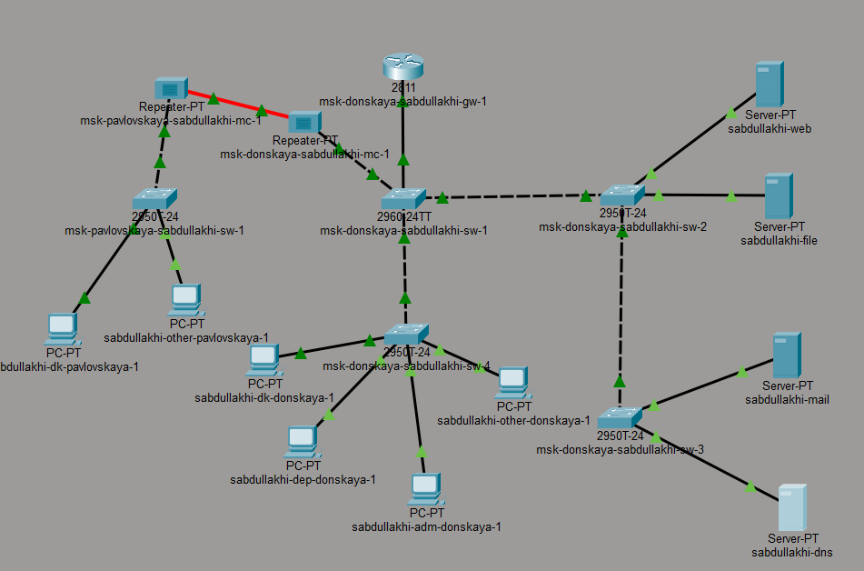

## Настройка IP-адреса на DNS-сервере вручную

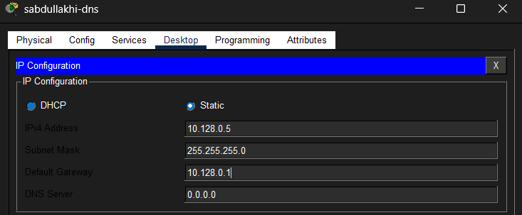

## Настройка DNS-службы на сервере

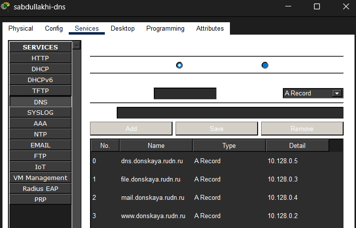

## Настройка DHCP на маршрутизаторе

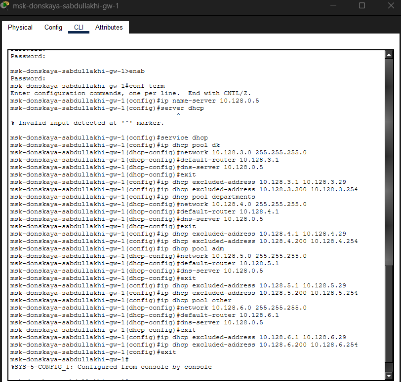

## Получение IP-адресов клиентами по DHCP

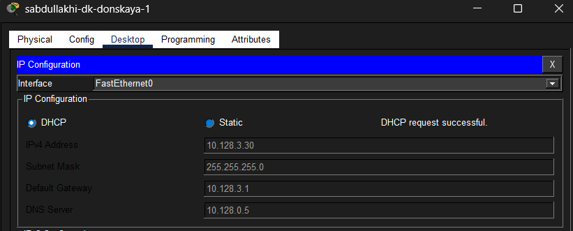

## Проверка сетевой доступности (связности)

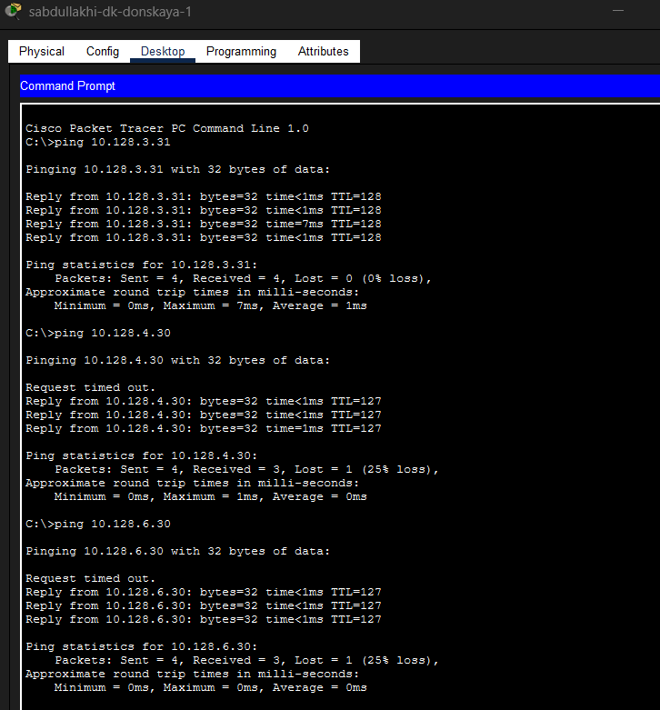

## Просмотр информации о пулах DHCP на маршрутизаторе

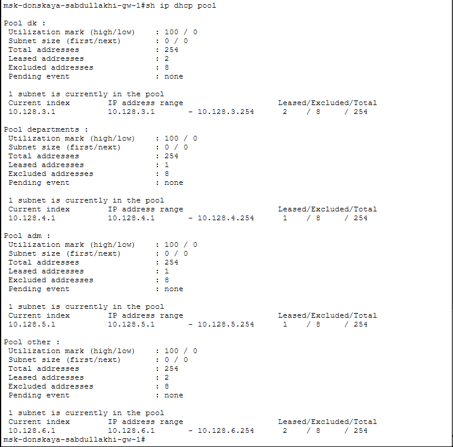

## Просмотр информации о пулах DHCP на маршрутизаторе

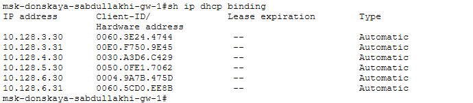

## Анализ процесса обмена DHCP-сообщениями в режиме симуляции
   
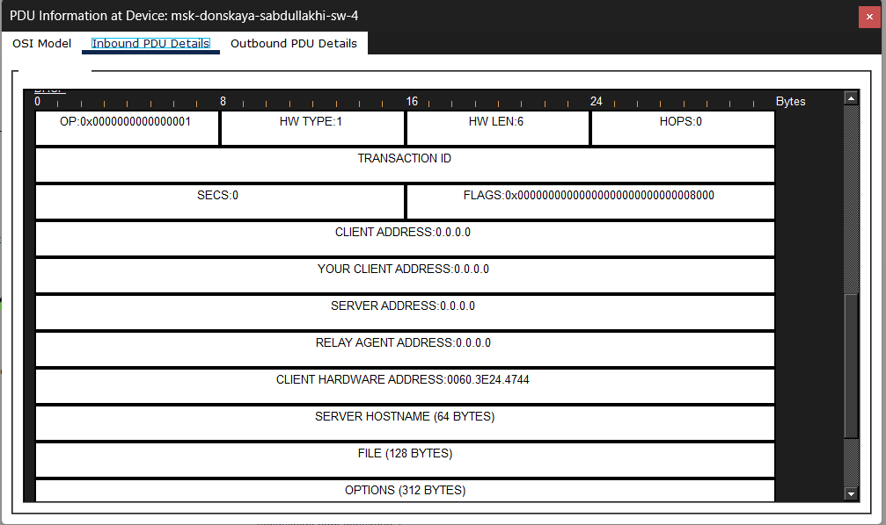

## DHCP Offer 

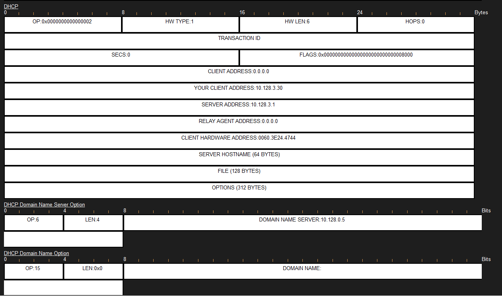

## DHCP Request 

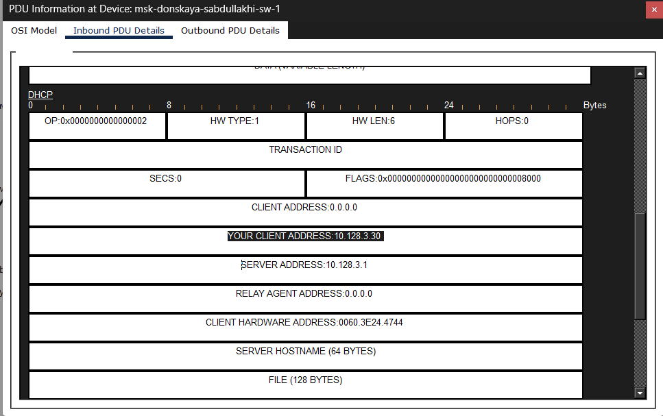

## DHCP Acknowledgment (ACK) 
   

## Процесс обмена DHCP-сообщениями в режиме симуляции

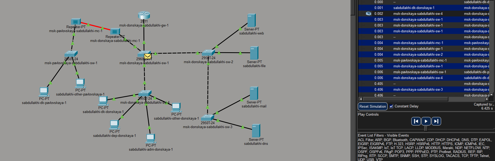

## Вывод

В ходе лабораторной работы был настроен DNS-сервер и созданы A-записи для четырёх доменных имён. На маршрутизаторе настроен DHCP-сервис с четырьмя пулами адресов для разных подсетей, клиенты успешно получили сетевые параметры автоматически. Проверка связности подтвердила корректную работу маршрутизации, а в режиме симуляции изучен полный процесс обмена DHCP-сообщениями (Discover, Offer, Request, ACK). Цель работы достигнута.

# Спасибо за внимание 
