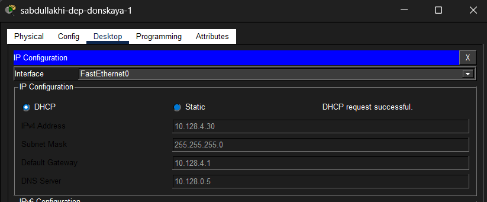
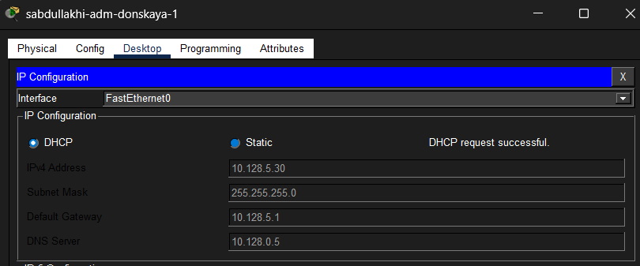
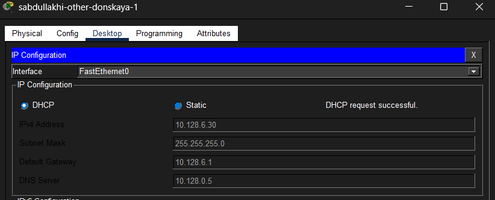
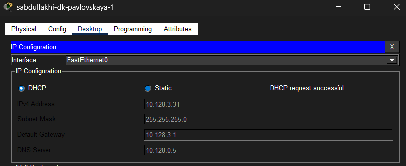
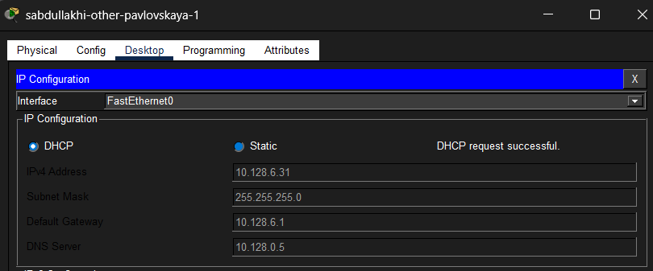

---
## Front matter
title: Отчёт по лабораторной работе №8
sub-title: Настройка сетевых сервисов. DHCP
author: "Абдуллахи Шугофа"
## Generic otions
lang: ru-RU
toc-title: "Содержание"

## Bibliography
bibliography: bib/cite.bib
csl: pandoc/csl/gost-r-7-0-5-2008-numeric.csl

## Pdf output format
toc: true # Table of contents
toc-depth: 2
fontsize: 12pt
linestretch: 1.5
papersize: a
documentclass: scrreprt
## I18n polyglossia
polyglossia-lang:
  name: russian
  options:
	- spelling=modern
	- babelshorthands=true
polyglossia-otherlangs:
  name: english
## I18n babel
babel-lang: russian
babel-otherlangs: english
## Fonts
mainfont: IBM Plex Serif
romanfont: IBM Plex Serif
sansfont: IBM Plex Sans
monofont: IBM Plex Mono
mathfont: STIX Two Math
mainfontoptions: Ligatures=Common,Ligatures=TeX,Scale=0.94
romanfontoptions: Ligatures=Common,Ligatures=TeX,Scale=0.94
sansfontoptions: Ligatures=Common,Ligatures=TeX,Scale=MatchLowercase,Scale=0.94
monofontoptions: Scale=MatchLowercase,Scale=0.94,FakeStretch=0.9
mathfontoptions:
## Biblatex
biblatex: true
biblio-style: "gost-numeric"
biblatexoptions:
  - parentracker=true
  - backend=biber
  - hyperref=auto
  - language=auto
  - autolang=other*
  - citestyle=gost-numeric
## Pandoc-crossref LaTeX customization
figureTitle: "Рис."
tableTitle: "Таблица"
listingTitle: "Листинг"
lofTitle: "Список иллюстраций"
lotTitle: "Список таблиц"
lolTitle: "Листинги"
## Misc options
indent: true
header-includes:
  - \usepackage{indentfirst}
  - \usepackage{float} # keep figures where there are in the text
  - \floatplacement{figure}{H} # keep figures where there are in the text
---

## 1.Цель работы

Освоить на практике механизм динамического назначения IP-адресов через протокол DHCP (Dynamic Host Configuration Protocol) в локальной вычислительной сети, а также получить навыки настройки DNS-сервера и его взаимодействия с DHCP.

## 2. Ход выполнения работы

###  2.1. Построение топологии сети

В программной среде Cisco Packet Tracer в логическую рабочую область был добавлен сервер Server-PT с именем sabdullakhi-dns, который будет выполнять функции DNS-сервера. Данный сервер подключён к коммутатору msk-donskaya-sabdullakhi-sw-3 через порт FastEthernet0/2. Порт на коммутаторе предварительно был активирован командой no shutdown. В итоге сформирована распределённая топология, включающая один маршрутизатор, несколько коммутаторов, DNS-сервер, почтовый и файловый серверы, а также оконечные устройства (ПК), объединённые в различные подсети.

### 2.2. Настройка IP-адреса на DNS-сервере вручную

Поскольку DNS-сервер должен иметь постоянный (статический) адрес, чтобы клиенты могли к нему обращаться, его IP-адрес был настроен вручную. В параметрах сетевого интерфейса заданы следующие значения:
- IP-адрес: 10.128.0.5
- Маска подсети: 255.255.255.0 (или /24)
- Шлюз по умолчанию: 10.128.0.1

Статическая настройка позволяет серверу оставаться доступным по одному и тому же адресу независимо от перезагрузок и работы DHCP.

### 2.3. Настройка DNS-службы на сервере

На сервере sabdullakhi-dns была активирована служба DNS. После включения сервиса добавлены записи типа A Record (Address Record), которые обеспечивают сопоставление символьных доменных имён конкретным IP-адресам. Были созданы следующие записи:
- dns.donskaya.rudn.ru → 10.128.0.5 (сам DNS-сервер)
- file.donskaya.rudn.ru → 10.128.0.3 (файловый сервер)
- mail.donskaya.rudn.ru → 10.128.0.4 (почтовый сервер)
- www.donskaya.rudn.ru → 10.128.0.2 (веб-сервер)

Все добавленные записи были сохранены в конфигурации сервера. Теперь клиенты, получив адрес DNS-сервера по DHCP, могут обращаться к другим устройствам по доменным именам, а не по IP.

### 2.4. Настройка DHCP на маршрутизаторе

На маршрутизаторе msk-donskaya-sabdullakhi-gw-1 выполнена настройка службы DHCP. Последовательность действий:
- Указан адрес DNS-сервера (10.128.0.5), который будет передаваться клиентам.
- Включена служба DHCP глобально.
- Созданы пулы адресов (DHCP pools) для четырёх различных подсетей:
  - dk — сеть 10.128.3.0/24
  - departments — сеть 10.128.4.0/24
  - adm — сеть 10.128.5.0/24
  - other — сеть 10.128.6.0/24

Для каждого пула заданы обязательные параметры:
- Адрес сети и маска
- Шлюз по умолчанию (первый адрес в каждой подсети: .1)
- Адрес DNS-сервера (10.128.0.5)

Кроме того, для каждой подсети были настроены диапазоны IP-адресов, исключаемых из динамической раздачи (например, первые 10 адресов зарезервированы для статических устройств). Это предотвращает конфликт адресов.

### 2.5. Получение IP-адресов клиентами по DHCP

На всех оконечных устройствах (ПК) способ настройки IP был изменён со статического на динамический (DHCP). Для этого в настройках интерфейса каждого ПК выбран пункт "DHCP" вместо ручного ввода параметров. После применения настроек и выполнения команды обновления (ipconfig /renew в терминале или кнопка DHCP в графическом интерфейсе Packet Tracer) устройства автоматически получили следующие параметры:
- IP-адрес: из соответствующего пула (например, ПК в подсети dk получил адрес 10.128.3.30)
- Маска подсети: 255.255.255.0
- Шлюз по умолчанию: 10.128.3.1
- DNS-сервер: 10.128.0.5

Процесс автоматической настройки прошёл успешно для всех клиентов.

###  2.6. Проверка сетевой доступности (связности)

Для проверки корректности работы маршрутизации и DHCP с одного из ПК были отправлены ping-запросы к узлам, находящимся в других подсетях. Например, с ПК из подсети dk (10.128.3.30) был выполнен ping на адрес веб-сервера 10.128.0.2 и на ПК из подсети adm. Во всех случаях обмен пакетами прошёл успешно — получены ответы без потерь. Это подтверждает, что:
- DHCP выдал клиентам правильные адреса и шлюзы.
- Маршрутизатор корректно перенаправляет трафик между подсетями.

### 2.7. Просмотр информации о пулах DHCP на маршрутизаторе

На маршрутизаторе была выполнена диагностика работы DHCP-сервиса с помощью команд привилегированного режима:
- show ip dhcp pool — отображает список созданных пулов, диапазоны адресов, количество выданных и свободных адресов, а также время аренды.
- show ip dhcp binding — показывает таблицу соответствия выданных IP-адресов MAC-адресам клиентов. Это полезно для отслеживания того, кому какой адрес выдан.

Результаты команд подтвердили, что все клиенты успешно получили адреса из соответствующих пулов.

###  2.8. Анализ процесса обмена DHCP-сообщениями в режиме симуляции

Для детального понимания работы протокола DHCP был активирован режим симуляции (Simulation Mode) в Cisco Packet Tracer. С помощью инструмента просмотра PDU (Protocol Data Unit) были последовательно отслежены все этапы взаимодействия клиента и сервера. Процесс включает четыре основных шага (часто называемые DORA — Discover, Offer, Request, Acknowledgment):

1. DHCP Discover 
   Клиент, не имея IP-адреса (источник 0.0.0.0), отправляет широковещательное сообщение на адрес 255.255.255.255. Цель — найти доступный DHCP-сервер в сети. В сообщении указан MAC-адрес клиента.
   

 
 2. DHCP Offer 
   DHCP-сервер (в данном случае маршрутизатор) получает Discover и отвечает сообщением Offer. В этом сообщении сервер предлагает клиенту свободный IP-адрес из соответствующего пула (например, 10.128.3.30). Также передаются дополнительные параметры: маска подсети, шлюз по умолчанию, адрес DNS-сервера (10.128.0.5) и время аренды.
   

3. DHCP Request 
   Клиент получает одно или несколько предложений (если в сети несколько DHCP-серверов) и выбирает одно из них. Затем клиент отправляет широковещательное сообщение DHCP Request, в котором подтверждает выбор конкретного IP-адреса и запрашивает его закрепление за собой.

4. DHCP Acknowledgment (ACK) 
   Сервер получает Request и, если адрес всё ещё свободен, отправляет клиенту сообщение DHCP ACK. Это окончательное подтверждение выдачи IP-адреса. В сообщении ACK повторно передаются все параметры конфигурации сети. Клиент применяет полученные настройки к своему интерфейсу.
   

После завершения этих четырёх шагов клиент получает корректные сетевые настройки и может полноценно взаимодействовать с другими устройствами в сети. Весь процесс занимает доли секунды.

## 3. Вывод

В ходе выполнения данной лабораторной работы были решены следующие задачи:

1. Настройка DNS-сервера:  
   В среду Cisco Packet Tracer добавлен DNS-сервер с именем sabdullakhi-dns, ему назначен статический IP-адрес 10.128.0.5. На сервере активирована DNS-служба и созданы A-записи для четырёх доменных имён, указывающих на соответствующие IP-адреса серверов в сети.

2. Настройка DHCP-сервиса на маршрутизаторе:  
   На маршрутизаторе msk-donskaya-sabdullakhi-gw-1 включена служба DHCP. Созданы четыре пула адресов для разных подсетей (dk, departments, adm, other). Для каждого пула заданы шлюз по умолчанию, DNS-сервер и диапазоны исключаемых адресов.
   3. Автоматическое получение настроек клиентами:  
   Все оконечные устройства переведены на динамическое получение параметров через DHCP. Клиенты успешно получили IP-адреса, маски, шлюзы и адрес DNS-сервера без ручного вмешательства.

4. Проверка работоспособности:  
   Выполнена проверка связности с помощью ping — обмен пакетами между устройствами из разных подсетей прошёл успешно, что подтверждает корректную настройку маршрутизации и DHCP.

5. Изучение протокола DHCP в деталях:  
   В режиме симуляции проанализирован полный цикл обмена DHCP-сообщениями: Discover, Offer, Request, Acknowledgment. Это позволило глубже понять механизм автоматической выдачи IP-адресов.

Таким образом, цель лабораторной работы достигнута, все настроенные сервисы функционируют корректно.

##  4. Контрольные вопросы

 **Вопрос 1: За что отвечает протокол DHCP?**

Протокол DHCP (Dynamic Host Configuration Protocol) отвечает за автоматическое назначение сетевых параметров устройствам в сети. Он позволяет клиентам получать IP-адрес, маску подсети, шлюз по умолчанию, адрес DNS-сервера и другие настройки без ручной конфигурации каждого устройства. Это значительно упрощает администрирование сети, особенно когда в ней много устройств.

 **Вопрос 2: Какие типы DHCP-сообщений передаются по сети?**

В процессе работы DHCP используются следующие основные типы сообщений:
- DHCP Discover — широковещательный запрос клиента на поиск DHCP-сервера.
- DHCP Offer — предложение IP-адреса и других параметров от сервера клиенту.
- DHCP Request — подтверждение клиентом выбора предложенного адреса.
- DHCP Acknowledgment (ACK) — окончательное подтверждение выдачи адреса сервером.
- DHCP NAK — отказ в выдаче адреса (например, если адрес уже занят).
- DHCP Release — сообщение клиента об освобождении адреса.
- DHCP Inform — запрос клиентом дополнительных параметров (если адрес уже есть).

 **Вопрос 3: Какие параметры могут быть переданы в сообщениях DHCP?**

В DHCP-сообщениях могут передаваться различные параметры конфигурации сети (опции):
- IP-адрес клиента
- Маска подсети
- Шлюз по умолчанию
- Адрес DNS-сервера (один или несколько)
- Доменное имя (например, donskaya.rudn.ru)
- Время аренды IP-адреса (lease time)
- Адрес TFTP-сервера
- Адрес NTP-сервера (для синхронизации времени)
- Другие дополнительные опции, определяемые администратором

 **Вопрос 4: Что такое DNS?**

DNS (Domain Name System) — это распределённая система доменных имён, предназначенная для преобразования символьных доменных имён (например, www.donskaya.rudn.ru) в IP-адреса (например, 10.128.0.2), которые используются для маршрутизации и взаимодействия устройств в сети. DNS работает как "телефонная книга" интернета и локальных сетей.

**Вопрос 5: Какие типы записи описания ресурсов есть в DNS и для чего они используются?**

В DNS используются различные типы записей ресурсов (Resource Records):
- A (Address) — сопоставляет доменное имя с IPv4-адресом (самый распространённый тип).
- AAAA — сопоставляет доменное имя с IPv6-адресом (используется в сетях IPv6).
- CNAME (Canonical Name) — создаёт псевдоним (алиас) для другого доменного имени. Например, www → основное имя.
- MX (Mail Exchange) — указывает почтовый сервер, который обрабатывает электронную почту для домена.
- NS (Name Server) — определяет серверы имён, ответственные за данную DNS-зону.
- PTR (Pointer) — выполняет обратное преобразование: IP-адрес → доменное имя (используется для обратных запросов).
- TXT (Text) — хранит произвольную текстовую информацию (например, SPF-записи для защиты от подделки почты, DKIM, проверки владения доменом).

