---
## Front matter
lang: ru-RU
title: Администрирование локальных сетей
subtitle: Лабораторная работа № 9. Использование протокола STP. Агрегирование каналов
author:
  - Абдуллахи Шугофа
institute:
  - Российский университет дружбы народов, Москва, Россия
date: 10 Апреля 2026

## i18n babel
babel-lang: russian
babel-otherlangs: english

## Formatting pdf
toc: false
toc-title: Содержание
slide_level: 2
aspectratio: 169
section-titles: true
theme: metropolis
pdf-engine: xelatex

header-includes: |
  \metroset{progressbar=frametitle,sectionpage=progressbar,numbering=fraction}
  \usepackage{fontspec}
  \setmainfont{DejaVu Serif}
  \setsansfont{DejaVu Sans}
  \setmonofont{DejaVu Sans Mono}
---

## 1.Цель работы

Изучение возможностей протокола STP и его модификаций по обеспечению отказоустойчивости сети, агрегированию интерфейсов и перераспределению нагрузки между ними.

## Изменение топологии и создание резервного соединения

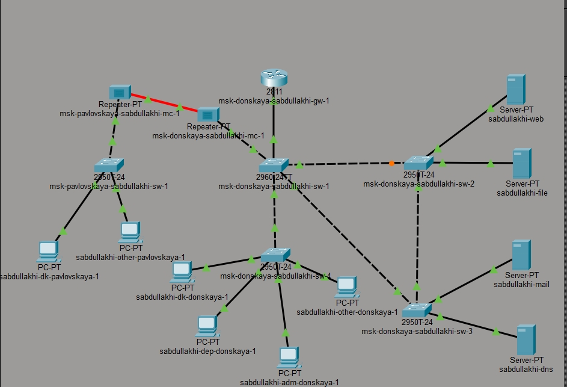{#fig:1}

##  Проверка прохождения ICMP-пакетов

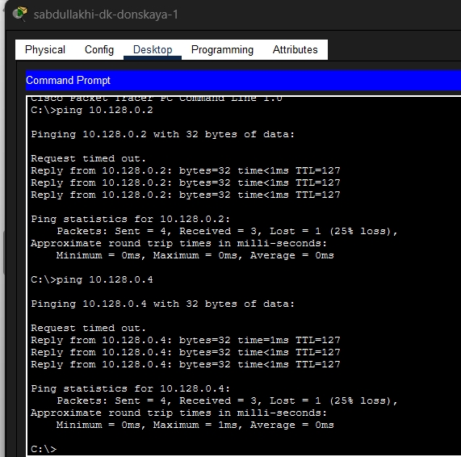

## движение ICMP-пакетов

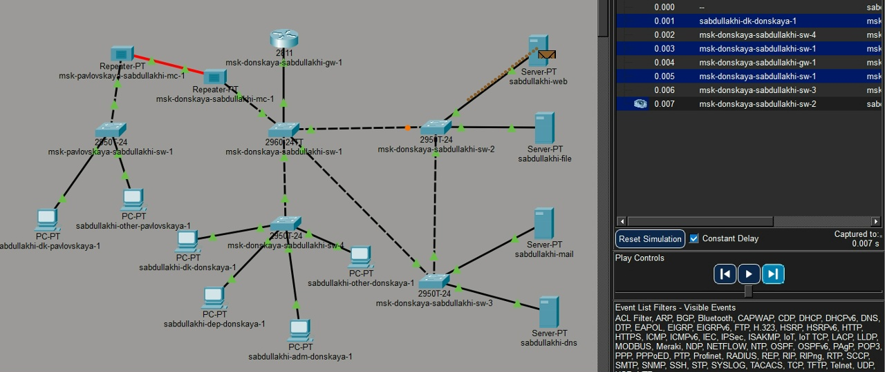

##

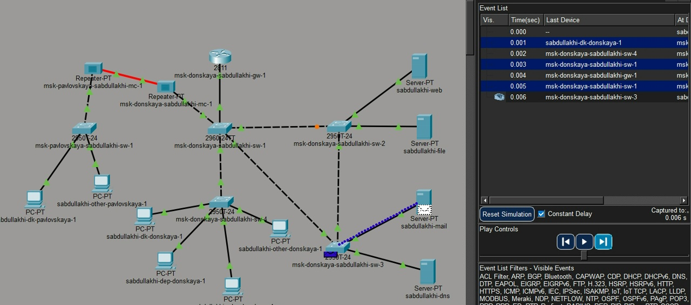

## Просмотр состояния протокола STP для VLAN 3

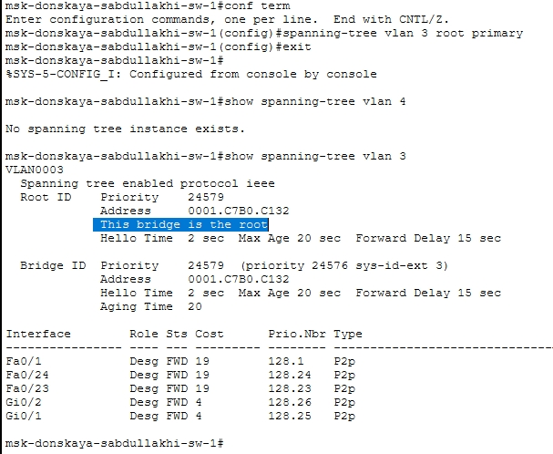

## Изменение маршрута ICMP-пакетов после смены корневого моста

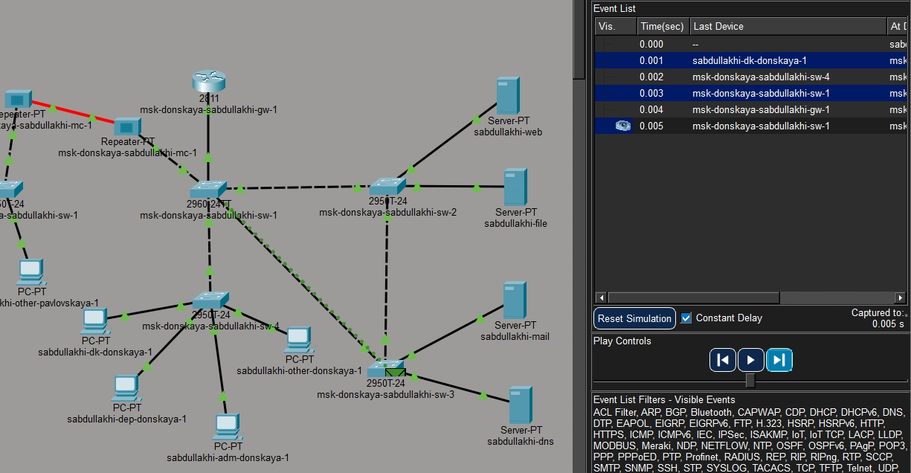

##

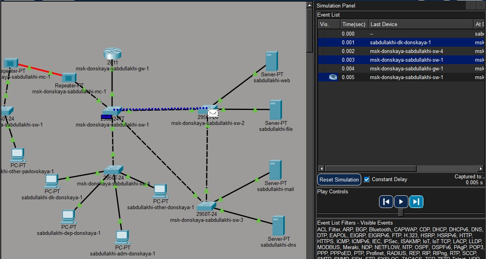

## Настройка режима PortFast на серверных портах

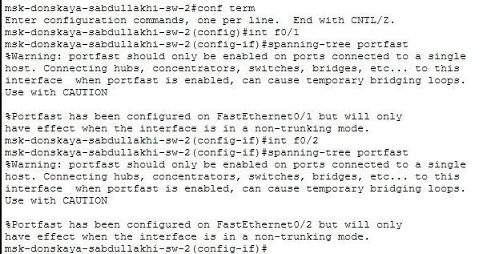

## Настройка PortFast на msk-donskaya-sabdullakhi-sw-3

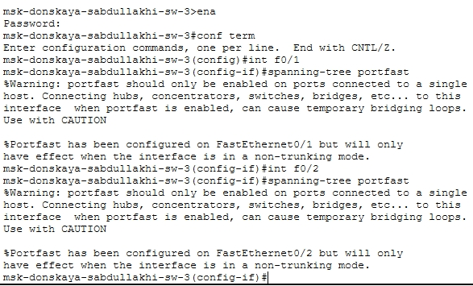

## Проверка отказоустойчивости классического STP

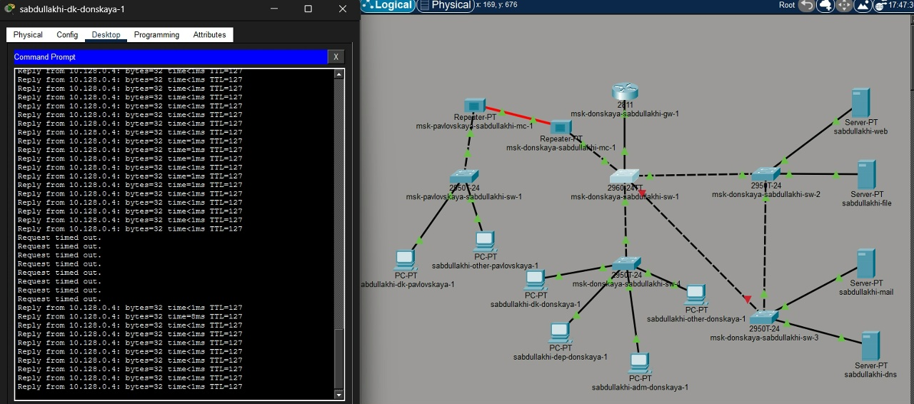

##  Перевод коммутаторов в режим Rapid PVST+

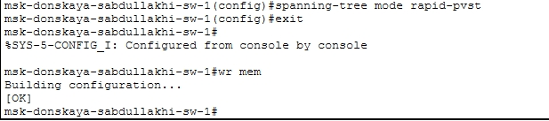{width=60%}

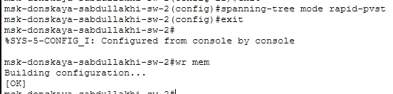{width=60%}

## Проверка отказоустойчивости Rapid PVST+

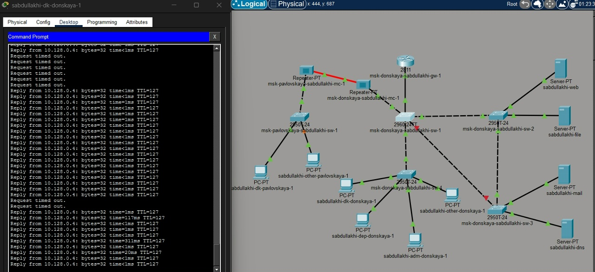

## Настройка EtherChannel на коммутаторе msk-donskaya-sabdullakhi-sw-1

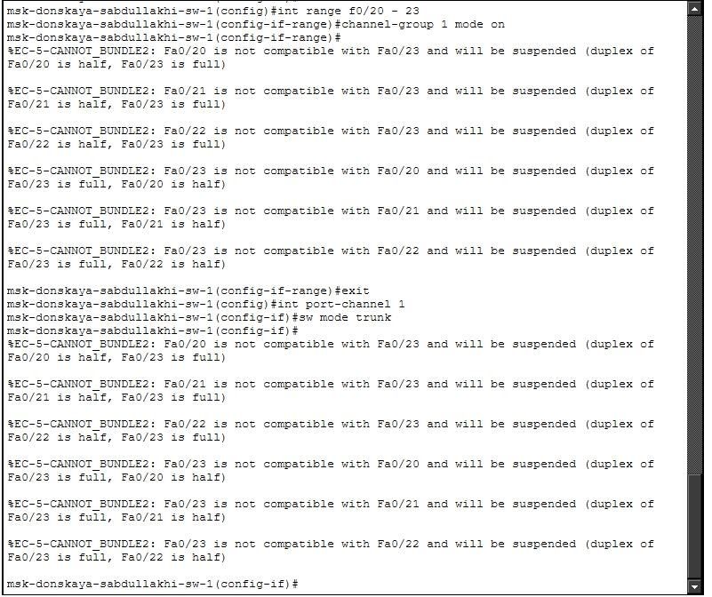

## Настройка EtherChannel на коммутаторе msk-donskaya-sabdullakhi-sw-4

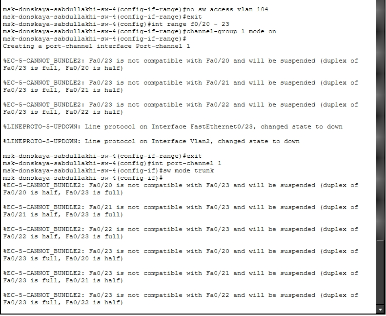

## Сформированное агрегированное соединение между коммутаторами

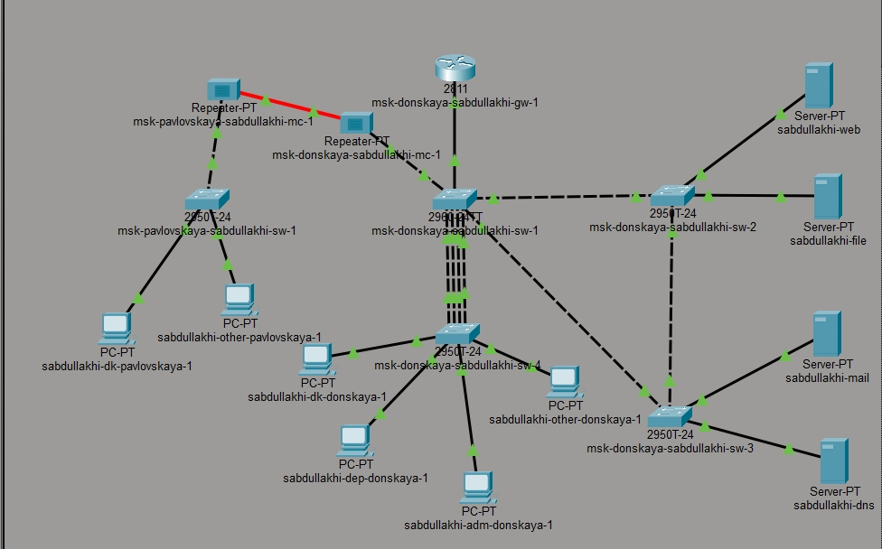

## Успешная проверка соединения после настройки EtherChannel

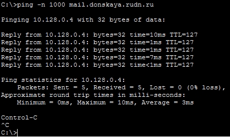

## Вывод

В ходе работы организовано резервное соединение между sw-1 и sw-3. Изучен протокол STP, проведена смена корневого коммутатора. На серверных портах настроен PortFast. Классический STP восстанавливается за 30–50 с, Rapid PVST+ — за 1–3 с. Настроен EtherChannel между sw-1 и sw-4. Построена отказоустойчивая сеть с быстрым восстановлением.

# Спасибо за внимание 
