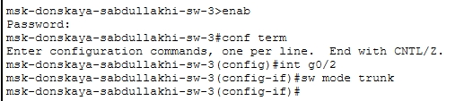
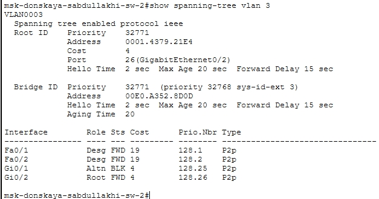
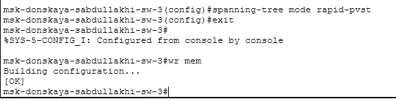
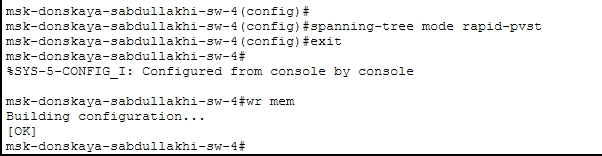
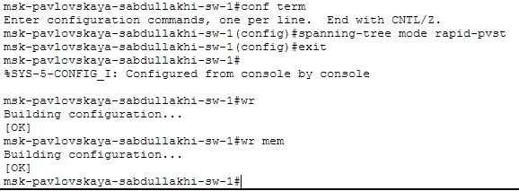

---
## Front matter
title: Отчёт по лабораторной работе №8
sub-title: Использование протокола STP. Агрегирование каналов
author: "Абдуллахи Шугофа"
## Generic otions
lang: ru-RU
toc-title: "Содержание"

## Bibliography
bibliography: bib/cite.bib
csl: pandoc/csl/gost-r-7-0-5-2008-numeric.csl

## Pdf output format
toc: true # Table of contents
toc-depth: 2
fontsize: 12pt
linestretch: 1.5
papersize: a
documentclass: scrreprt
## I18n polyglossia
polyglossia-lang:
  name: russian
  options:
	- spelling=modern
	- babelshorthands=true
polyglossia-otherlangs:
  name: english
## I18n babel
babel-lang: russian
babel-otherlangs: english
## Fonts
mainfont: IBM Plex Serif
romanfont: IBM Plex Serif
sansfont: IBM Plex Sans
monofont: IBM Plex Mono

mainfontoptions: Ligatures=Common,Ligatures=TeX,Scale=0.94
romanfontoptions: Ligatures=Common,Ligatures=TeX,Scale=0.94
sansfontoptions: Ligatures=Common,Ligatures=TeX,Scale=MatchLowercase,Scale=0.94
monofontoptions: Scale=MatchLowercase,Scale=0.94,FakeStretch=0.9
mathfontoptions:
## Biblatex
biblatex: true
biblio-style: "gost-numeric"
biblatexoptions:
  - parentracker=true
  - backend=biber
  - hyperref=auto
  - language=auto
  - autolang=other*
  - citestyle=gost-numeric
## Pandoc-crossref LaTeX customization
figureTitle: "Рис."
tableTitle: "Таблица"
listingTitle: "Листинг"
lofTitle: "Список иллюстраций"
lotTitle: "Список таблиц"
lolTitle: "Листинги"
## Misc options
indent: true
header-includes:
  - \usepackage{indentfirst}
  - \usepackage{float} # keep figures where there are in the text
  - \floatplacement{figure}{H} # keep figures where there are in the text
---

## 1.Цель работы

Изучение возможностей протокола STP и его модификаций по обеспечению отказоустойчивости сети, агрегированию интерфейсов и перераспределению нагрузки между ними.

## 2. Выполнение лабораторной работы

### 2.1. Изменение топологии и создание резервного соединения

В логической рабочей области Cisco Packet Tracer была собрана и подготовлена сеть, включающая маршрутизатор Cisco 2811 (`msk-donskaya-sabdullakhi-gw-1`), коммутаторы Cisco 2950/2960, повторители, серверы и оконечные устройства.

В ходе выполнения задания было организовано резервное соединение между коммутаторами. Соединение между коммутаторами `msk-donskaya-sabdullakhi-sw-1` и `msk-donskaya-sabdullakhi-sw-4`, ранее использовавшее интерфейсы Gig0/2 и Gig0/1, было заменено на соединение между `msk-donskaya-sabdullakhi-sw-1` (Gig0/2) и `msk-donskaya-sabdullakhi-sw-3` (Gig0/2) @fig:1.

{#fig:1}

На коммутаторе `msk-donskaya-sabdullakhi-sw-3` порт Gig0/2 был переведён в режим транка с помощью команды `switchport mode trunk`.

Дополнительно связь между коммутаторами `msk-donskaya-sabdullakhi-sw-1` и `msk-donskaya-sabdullakhi-sw-4` была организована через интерфейсы FastEthernet0/23 в транковом режиме.

###  2.2. Проверка прохождения ICMP-пакетов

После формирования резервного соединения была выполнена проверка прохождения трафика от оконечных устройств к серверам.

С оконечного устройства `sabdullakhi-dk-donskaya-1` была выполнена проверка доступности серверов с помощью команды `ping` до IP-адресов 10.128.0.2 (web) и 10.128.0.4 (mail). В результате пинга наблюдаются единичные потери пакетов (25% потерь), что связано с начальной работой протокола STP

В режиме симуляции Cisco Packet Tracer было прослежено движение ICMP-пакетов. Установлено, что на начальном этапе пакеты проходят к серверным узлам через коммутатор `msk-donskaya-sabdullakhi-sw-2`, что соответствует текущему состоянию spanning-tree.

### 2.3. Просмотр состояния протокола STP для VLAN 3

Для анализа работы протокола STP была выполнена команда `show spanning-tree vlan 3`.

На коммутаторе `msk-donskaya-sabdullakhi-sw-2` был выполнен вывод команды `show spanning-tree vlan 3`. Результат показывает, что данный коммутатор не является корневым, порт `Gig0/2` является Root Port и находится в состоянии Forwarding, а порт `Gig0/1` находится в состоянии Alternate Blocking.

###  2.4. Назначение корневого коммутатора STP для VLAN 3

Для управления топологией сети был назначен новый корневой коммутатор.
Коммутатор `msk-donskaya-sabdullakhi-sw-1` был назначен корневым для VLAN 3 с помощью команды `spanning-tree vlan 3 root primary`. После настройки строка `This bridge is the root` подтверждает, что коммутатор успешно стал корневым. Приоритет изменился с 32771 на 24579.

### 2.5. Изменение маршрута ICMP-пакетов после смены корневого моста

После смены корневого коммутатора протокол STP автоматически перестроил остовное дерево, и трафик изменил свой путь.

[Трафик от хоста `sabdullakhi-dk-donskaya-1` к серверу `mail` проходит через коммутаторы: `msk-donskaya-sabdullakhi-sw-4 → msk-donskaya-sabdullakhi-sw-1 → msk-donskaya-sabdullakhi-sw-3 → sabdullakhi-mail`.](images/9.jpg)

[Трафик от хоста `sabdullakhi-dk-donskaya-1` к серверу `web` проходит через коммутаторы: `msk-donskaya-sabdullakhi-sw-4 → msk-donskaya-sabdullakhi-sw-1 → msk-donskaya-sabdullakhi-sw-2 → sabdullakhi-web`.](images/8.jpg)

### 2.6. Настройка режима PortFast на серверных портах

Для ускорения перехода портов в рабочее состояние был настроен режим PortFast на портах, подключённых к серверам.
На коммутаторе `msk-donskaya-sabdullakhi-sw-2` режим PortFast был включён на интерфейсах `FastEthernet0/1` и `FastEthernet0/2` с помощью команды `spanning-tree portfast`. При включении PortFast системой выдаётся предупреждение о том, что данный режим следует использовать только на портах, подключённых к одному конечному устройству.

Аналогичная настройка была выполнена на коммутаторе `msk-donskaya-sabdullakhi-sw-3` на интерфейсах `FastEthernet0/1` и `FastEthernet0/2`

### 2.7. Проверка отказоустойчивости классического STP

Для исследования отказоустойчивости протокола STP и измерения времени восстановления соединения был проведён эксперимент с длительным ping.

С хоста `sabdullakhi-dk-donskaya-1` была запущена команда `ping -n 1000 mail.donskaya.rudn.ru`. Во время выполнения пинга один из интерфейсов межкоммутаторного соединения был переведён в состояние `shutdown`. В момент отключения наблюдаются потери пакетов (`Request timed out`). Через 30–50 секунд соединение восстанавливается.

Этот эксперимент подтверждает, что классический протокол STP обеспечивает отказоустойчивость, но требует значительного времени на сходимость (до 50 секунд).

### 2.8. Перевод коммутаторов в режим Rapid PVST+

Для сокращения времени восстановления сети все коммутаторы были переведены в режим Rapid PVST+.

На коммутаторе `msk-donskaya-sabdullakhi-sw-1` выполнена команда `spanning-tree mode rapid-pvst`.

На коммутаторе `msk-donskaya-sabdullakhi-sw-2` выполнена команда `spanning-tree mode rapid-pvst`.

На коммутаторе `mask-pavlovskaya-sabdullakhi-sw-1` выполнена команда `spanning-tree mode rapid-pvst`.

После применения настроек конфигурация была сохранена в энергонезависимую память устройства с помощью команды `wr mem`.

### 2.9. Проверка отказоустойчивости Rapid PVST+

После переключения всех коммутаторов на протокол Rapid PVST+ был проведён аналогичный эксперимент по проверке отказоустойчивости.

[С хоста `sabdullakhi-dk-donskaya-1` снова была запущена команда длительного пинга. В отличие от классического STP, восстановление соединения произошло значительно быстрее — за 1–3 секунды, потери пакетов минимальны.

Это подтверждает преимущество Rapid PVST+ перед классическим STP, особенно в сетях, чувствительных к задержкам.

###  2.10. Настройка EtherChannel на коммутаторе msk-donskaya-sabdullakhi-sw-1

Для увеличения пропускной способности и обеспечения отказоустойчивости было настроено агрегирование каналов между коммутаторами `sw-1` и `sw-4`.

На коммутаторе `msk-donskaya-sabdullakhi-sw-1` была выполнена настройка EtherChannel с использованием интерфейсов `FastEthernet0/20 – FastEthernet0/23`: объединение интерфейсов в канал (`channel-group 1 mode on`), создание логического интерфейса `port-channel 1`, перевод `port-channel` в транковый режим.

В процессе настройки были выявлены предупреждения о несовпадении параметров интерфейсов (duplex). На интерфейсах `Fa0/20`, `Fa0/21`, `Fa0/22` был установлен режим half-duplex, а на `Fa0/23` — full-duplex.

Проблема была устранена приведением параметров всех портов к одинаковым значениям с помощью команд `duplex full` и `speed 100`.

### 2.11. Настройка EtherChannel на коммутаторе msk-donskaya-sabdullakhi-sw-4

Аналогичная настройка EtherChannel была выполнена на коммутаторе `msk-donskaya-sabdullakhi-sw-4`.

На коммутаторе `msk-donskaya-sabdullakhi-sw-4` перед объединением интерфейсов был отключён access VLAN командой `no switchport access vlan 104`, затем интерфейсы были добавлены в `channel-group 1` и объединены в логический интерфейс `port-channel 1`, настроенный в транковом режиме.]

В результате между коммутаторами `msk-donskaya-sabdullakhi-sw-1` и `msk-donskaya-sabdullakhi-sw-4` было сформировано агрегированное соединение EtherChannel.

### 2.12. Успешная проверка соединения после настройки EtherChannel

После завершения настройки EtherChannel была выполнена проверка доступности серверов.

С хоста `sabdullakhi-dk-donskaya-1` была выполнена команда `ping -n 1000 mail.donskaya.rudn.ru`. Все пакеты были успешно доставлены без потерь (0% loss), что подтверждает корректную работу агрегированного канала.

##  3. Вывод

В ходе выполнения лабораторной работы были решены следующие задачи:

1. **Организовано резервное соединение** между коммутаторами `msk-donskaya-sabdullakhi-sw-1` и `msk-donskaya-sabdullakhi-sw-3` с настройкой транковых портов.

2. **Изучена работа протокола STP**: проанализирована таблица spanning-tree, определены роли и состояния портов, выполнен анализ вывода команды `show spanning-tree vlan 3`.

3. **Выполнена смена корневого коммутатора** с помощью команды `spanning-tree vlan 3 root primary`, что привело к изменению маршрутов трафика.

4. **Настроен режим PortFast** на портах, подключённых к серверам, что позволило ускорить переход этих портов в рабочее состояние.

5. **Проведено исследование отказоустойчивости**: классический STP обеспечивает отказоустойчивость, но требует 30–50 секунд на восстановление; Rapid PVST+ сокращает время восстановления до 1–3 секунд.

6. **Настроено агрегирование каналов (EtherChannel)** между коммутаторами `sw-1` и `sw-4` в статическом режиме (mode on), что позволило увеличить пропускную способность и обеспечить дополнительную отказоустойчивость.

В результате всех настроек была построена отказоустойчивая коммутируемая сеть с увеличенной пропускной способностью и быстрым восстановлением при отказах.

# Контрольные вопросы

**1. Какую информацию можно получить, воспользовавшись командой определения состояния протокола STP для VLAN?**  
Команда show spanning-tree vlan <номер VLAN> позволяет получить следующую информацию:  
– идентификатор корневого коммутатора (Root ID);  
– MAC-адрес корневого устройства;  
– приоритет (Priority);  
– стоимость пути до корня (Cost);  
– роли портов (Root, Designated, Alternate);  
– состояние портов (Forwarding, Blocking);  
– параметры таймеров (Hello Time, Max Age, Forward Delay).  

На корневом коммутаторе вывод содержит строку:  
This bridge is the root  

На некорневом устройстве указывается интерфейс, являющийся Root Port.  

**Пример:**  
Root ID Priority 24579  
This bridge is the root  

или  

Root ID Priority 32771  
Cost 23  
Port Gi0/1 (Root Port)  

**2. При помощи какой команды можно узнать режим работы STP (STP или Rapid PVST+)?**  
Для определения режима используется команда:  
show spanning-tree summary  

В выводе будет указано:  
– ieee — классический STP;  
– rapid-pvst — режим Rapid PVST+.  

**Пример:**  
Switch is in rapid-pvst mode  

**3. Для чего и в каких случаях нужно настраивать режим PortFast?**  
Режим PortFast используется для ускорения перехода порта в состояние Forwarding без прохождения состояний Listening и Learning.  

Применяется:  
– на портах, подключённых к конечным устройствам (ПК, серверы);  
– для уменьшения времени получения сетевого доступа;  
– для предотвращения задержек при загрузке устройств.  

Не используется на межкоммутаторных соединениях, так как может привести к петлям в сети.

**4. В чем состоит принцип работы агрегированного интерфейса? Для чего он используется?**  
Агрегированный интерфейс (EtherChannel) объединяет несколько физических каналов в один логический интерфейс (port-channel).  

Принцип работы:  
– несколько линий связи работают как один канал;  
– трафик распределяется между физическими интерфейсами;  
– отказ одного канала не приводит к потере соединения.  

Используется для:  
– увеличения пропускной способности;  
– повышения отказоустойчивости;  
– балансировки нагрузки.

**5. В чём отличия LACP, PAgP и статического агрегирования?**  
– LACP (Link Aggregation Control Protocol): стандарт IEEE 802.3ad, поддерживает активный/пассивный режим, используется на оборудовании разных производителей;  
– PAgP (Port Aggregation Protocol): проприетарный протокол Cisco, режимы desirable/auto;  
– статическое агрегирование (mode on): не использует протоколы, требует ручной настройки и одинаковых параметров на обоих концах.  

Основное отличие — наличие/отсутствие автоматического согласования параметров канала.

**6. При помощи каких команд можно узнать состояние EtherChannel?**  
Для проверки состояния агрегированного канала используются команды:  
– show etherchannel summary — общая информация о каналах;  
– show etherchannel port-channel — информация о логическом интерфейсе;  
– show running-config — просмотр конфигурации;  
– show interfaces port-channel 1 — состояние интерфейса.  

Эти команды позволяют определить активные порты, режим работы и состояние агрегированного соединения.
