---
## Front matter
lang: ru-RU
title: Администрирование локальных сетей
subtitle: Лабораторная работа № 10.  Настройка списков управления доступом (ACL) каналов
author:
  - Абдуллахи Шугофа
institute:
  - Российский университет дружбы народов, Москва, Россия
date: 18н Апреля 2026

## i18n babel
babel-lang: russian
babel-otherlangs: english

## Formatting pdf
toc: false
toc-title: Содержание
slide_level: 2
aspectratio: 169
section-titles: true
theme: metropolis
pdf-engine: xelatex

header-includes: |
  \metroset{progressbar=frametitle,sectionpage=progressbar,numbering=fraction}
  \usepackage{fontspec}
  \setmainfont{DejaVu Serif}
  \setsansfont{DejaVu Sans}
  \setmonofont{DejaVu Sans Mono}
---
 
## Цель работы

Освоить настройку прав доступа пользователей к ресурсам сети с использованием списков управления доступом (ACL) на маршрутизаторе Cisco. Научиться фильтровать трафик на основе протоколов, портов и IP-адресов, а также предоставлять расширенные привилегии администратору сети.

## Топология сети

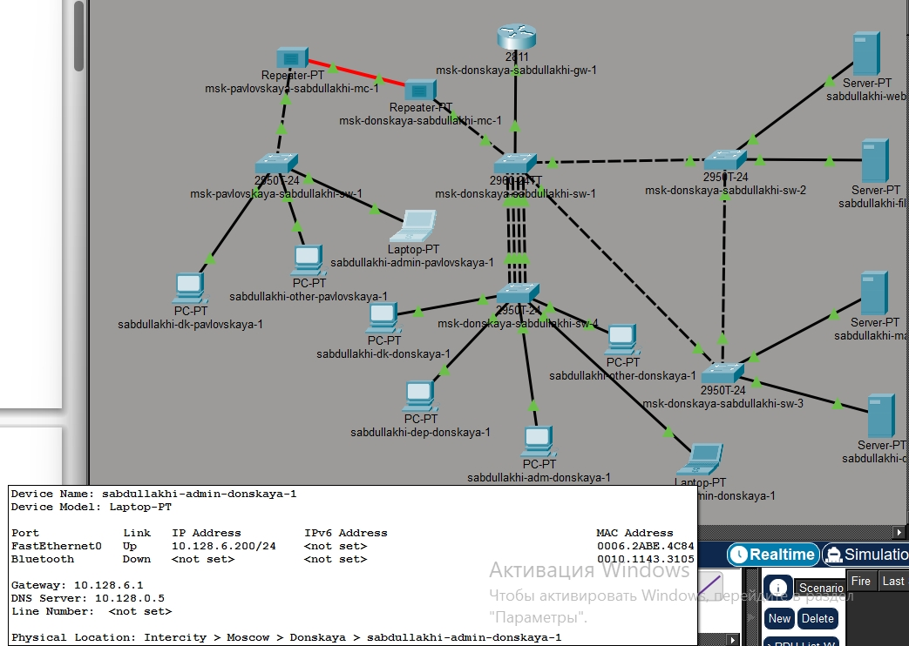{ width=70% }

## Настройка IP-адреса администратора

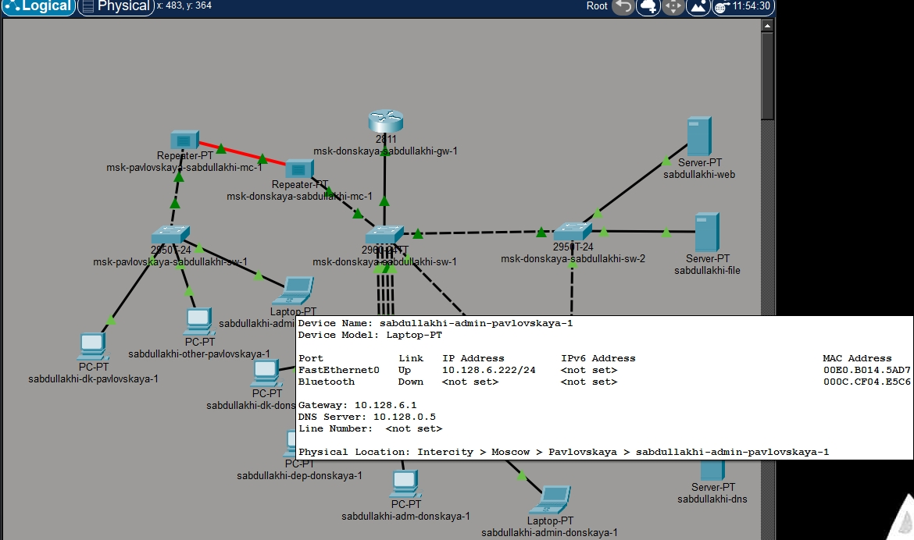{ width=70% }

## Создание ACL для web-доступа

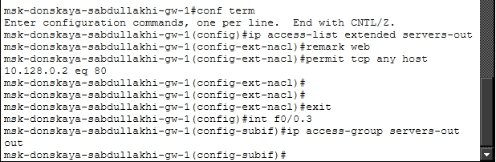{ width=70% }

## Применение ACL к интерфейсу

Список доступа `servers-out` был применён к интерфейсу **FastEthernet0/0.3** (субинтерфейс, ведущий к серверной ферме) для **исходящего трафика** (`out`). Это означает, что правила проверяются для пакетов, покидающих маршрутизатор через этот интерфейс.

## Проверка HTTP-доступа (успех)

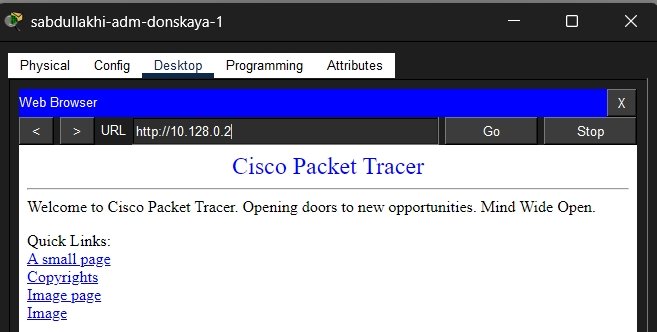{ width=70% }

## Проверка ping до сервера (неудача)

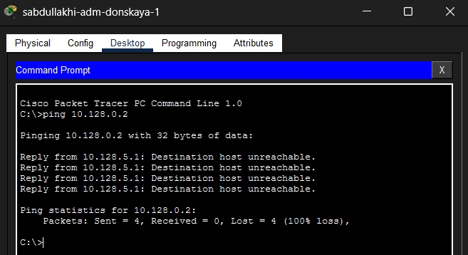{ width=70% }

## Добавление правил для администратора

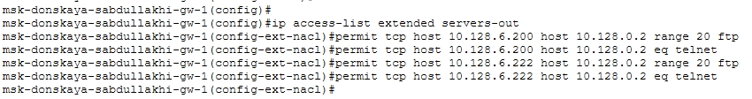{ width=70% }

##  Успешное FTP-подключение администратора

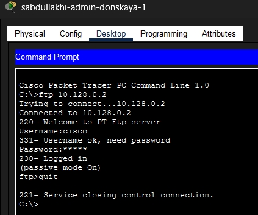{ width=10% }

##  Успешное FTP-подключение администратора

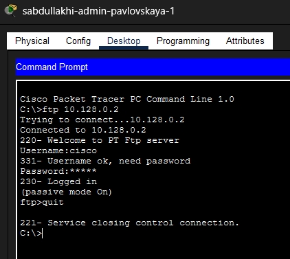{ width=70% }

## Запрет FTP-доступа для других пользователей

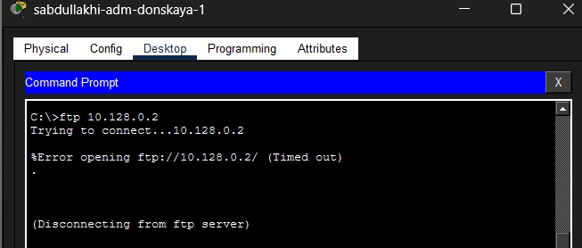{ width=70% }

## Настройка ACL для файлового сервера

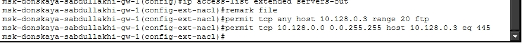{ width=100% }

## Проверка FTP-доступа к файловому серверу

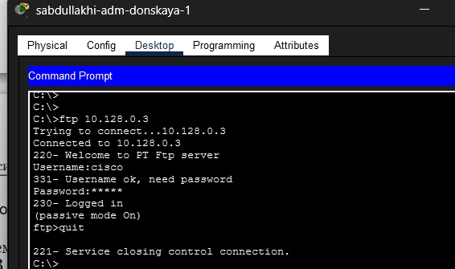{ width=70% }

## Настройка ACL для mail, DNS и ICMP

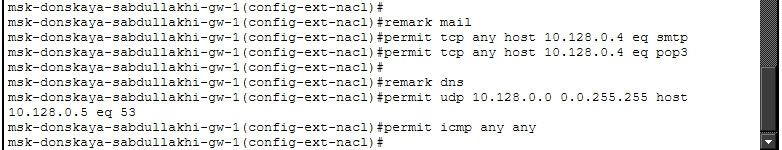{ width=100% }

## Проверка доступа к web-серверу по имени

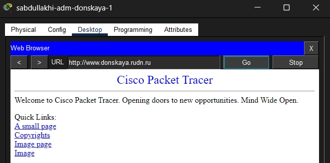{ width=70% }

## Проверка работы почтового сервера

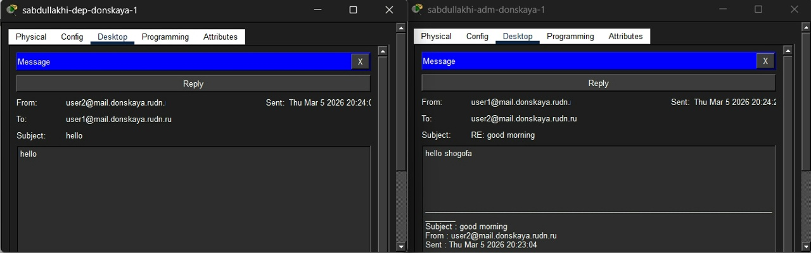{ width=70% }

## Проверка ICMP-доступа после изменения ACL

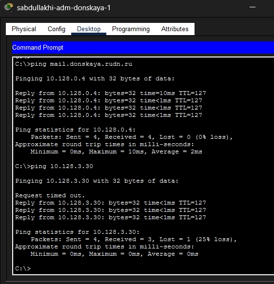

## Настройка доступа к сети управления (SSH)

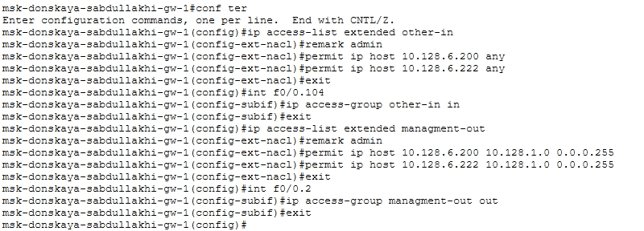

## Проверка SSH-доступа к маршрутизатору и коммутаторам

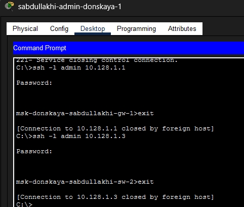{ width=90% }

## Проверка SSH-доступа к маршрутизатору и коммутаторам

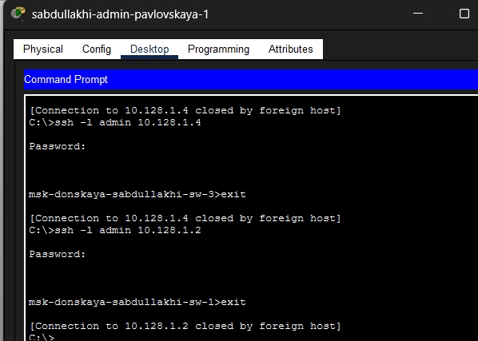{ width=90% }

## Просмотр итоговых списков доступа

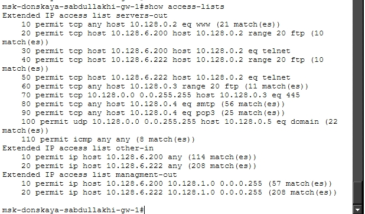{ width=70% }

## Вывод

В ходе работы настроены ACL на маршрутизаторе. Разрешён HTTP для всех, FTP и Telnet — только для администратора (10.128.6.200). Добавлены правила для файлового, почтового и DNS-серверов, а также разрешён ICMP (ping). Администратор получил доступ к сети управления по SSH. Все проверки успешны. Цель достигнута.

# Спасибо за внимание 
