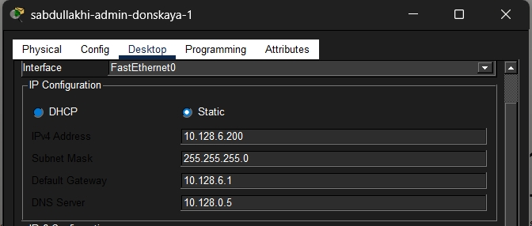

---
## Front matter
title: Отчёт по лабораторной работе №10
sub-title:  Настройка списков управления доступом (ACL)
author: "Абдуллахи Шугофа"
## Generic otions
lang: ru-RU
toc-title: "Содержание"

## Bibliography
bibliography: bib/cite.bib
csl: pandoc/csl/gost-r-7-0-5-2008-numeric.csl

## Pdf output format
toc: true # Table of contents
toc-depth: 2
fontsize: 12pt
linestretch: 1.5
papersize: a
documentclass: scrreprt
## I18n polyglossia
polyglossia-lang:
  name: russian
  options:
	- spelling=modern
	- babelshorthands=true
polyglossia-otherlangs:
  name: english
## I18n babel
babel-lang: russian
babel-otherlangs: english
## Fonts
mainfont: IBM Plex Serif
romanfont: IBM Plex Serif
sansfont: IBM Plex Sans
monofont: IBM Plex Mono

mainfontoptions: Ligatures=Common,Ligatures=TeX,Scale=0.94
romanfontoptions: Ligatures=Common,Ligatures=TeX,Scale=0.94
sansfontoptions: Ligatures=Common,Ligatures=TeX,Scale=MatchLowercase,Scale=0.94
monofontoptions: Scale=MatchLowercase,Scale=0.94,FakeStretch=0.9
mathfontoptions:
## Biblatex
biblatex: true
biblio-style: "gost-numeric"
biblatexoptions:
  - parentracker=true
  - backend=biber
  - hyperref=auto
  - language=auto
  - autolang=other*
  - citestyle=gost-numeric
## Pandoc-crossref LaTeX customization
figureTitle: "Рис."
tableTitle: "Таблица"
listingTitle: "Листинг"
lofTitle: "Список иллюстраций"
lotTitle: "Список таблиц"
lolTitle: "Листинги"
## Misc options
indent: true
header-includes:
  - \usepackage{indentfirst}
  - \usepackage{float} # keep figures where there are in the text
  - \floatplacement{figure}{H} # keep figures where there are in the text
---

## 1. Цель работы

Освоить настройку прав доступа пользователей к ресурсам сети с использованием списков управления доступом (ACL) на маршрутизаторе Cisco. Научиться фильтровать трафик на основе протоколов, портов и IP-адресов, а также предоставлять расширенные привилегии администратору сети.

## 2. Выполнение лабораторной работы

### 2.1 Топология сети

В логической рабочей области Cisco Packet Tracer была реализована сеть, включающая маршрутизатор Cisco 2811 (msk-donskaya-sabdullakhi-gw-1), несколько коммутаторов Cisco 2960, серверы (web, файловый, почтовый, DNS) и рабочие станции пользователей.

В рамках задания в сеть был дополнительно подключён ноутбук администратора **Laptop-PT (sabdullakhi-admin-donskaya-1)** к коммутатору `msk-donskaya-sabdullakhi-sw-4` в порт FastEthernet0/24. Это устройство будет иметь расширенные права доступа.


### 2.2 Настройка IP-адреса администратора

На ноутбуке администратора был настроен статический IP-адрес для работы в сети:
- **IP-адрес:** 10.128.6.200
- **Маска подсети:** 255.255.255.0
- **Шлюз по умолчанию:** 10.128.6.1
- **DNS-сервер:** 10.128.0.5




### 2.3 Создание ACL для web-доступа (с подробным объяснением)

На маршрутизаторе `msk-donskaya-sabdullakhi-gw-1` был создан **расширенный список доступа** с именем `servers-out`. Расширенный ACL позволяет фильтровать трафик не только по IP-адресу источника и назначения, но и по протоколу транспортного уровня (TCP/UDP) и номерам портов.

**Команда для создания правила:**
```
access-list 100 permit tcp any host 10.128.0.2 eq 80
```
**Пояснение:**
- `100` — номер ACL (100-199 означают расширенные IP-списки).
- `permit` — разрешающее действие.
- `tcp` — протокол транспортного уровня (для HTTP используется TCP).
- `any` — любой источник (все узлы сети).
- `host 10.128.0.2` — конкретный сервер назначения.
- `eq 80` — порт назначения 80 (стандартный порт HTTP).

**Результат:** Весь web-трафик к серверу 10.128.0.2 разрешён. Для идентификации правила добавлен комментарий `remark Web-server access`.


### 2.4 Применение ACL к интерфейсу

Список доступа `servers-out` был применён к интерфейсу **FastEthernet0/0.3** (субинтерфейс, ведущий к серверной ферме) для **исходящего трафика** (`out`). Это означает, что правила проверяются для пакетов, покидающих маршрутизатор через этот интерфейс.

### 2.5 Проверка HTTP-доступа (успех)

При обращении к серверу через браузер по адресу `http://10.128.0.2` соединение устанавливается успешно. Это подтверждает, что правило для TCP-порта 80 работает корректно.


### 2.6 Проверка ping до сервера (неудача)

Команда `ping 10.128.0.2` не проходит, так как ICMP-трафик не разрешён текущими правилами ACL (явного разрешения ICMP нет, а в конце каждого ACL действует неявный `deny all` — запрет всего остального).


### Добавление правил для администратора 

В список `servers-out` были добавлены новые строки, но теперь с указанием конкретного источника — IP-адреса администратора `10.128.6.200`. Это реализует политику **"разрешено только администратору"** для некоторых сервисов.

**Добавленные правила:**

```
permit tcp host 10.128.6.200 host 10.128.0.2 range 20 21
permit tcp host 10.128.6.200 host 10.128.0.2 eq telnet
```
**Пояснение:**
- `range 20 21` — разрешает доступ к диапазону портов 20-21 (FTP управление и данные).
- `eq telnet` — порт 23 (Telnet). Администратору разрешено удалённое управление сервером.


### 2.8 Успешное FTP-подключение администратора
С устройства администратора установлено соединение с FTP-сервером (логин `cisco`, пароль `cisco`). Подключение успешно, так как источник `10.128.6.200` подпадает под добавленные правила.


### 2.9 Запрет FTP-доступа для других пользователей

Попытка подключения к FTP-серверу с другого устройства (например, с IP-адресом 10.128.3.30) завершается тайм-аутом. Поскольку в ACL нет правила, разрешающего FTP с этого источника, срабатывает неявный запрет (`deny any any`).


### 2.10 Настройка ACL для файлового сервера

В список `servers-out` добавлены правила для файлового сервера `10.128.0.3`:
- Разрешён **SMB** (Windows-шары) через TCP-порт 445 для всей сети `10.128.0.0/16`.
- Разрешён **FTP** к файловому серверу для любых узлов.

**Команды:**
```
 permit tcp 10.128.0.0 0.0.255.255 host 10.128.0.3 eq 445
 permit tcp any host 10.128.0.3 range 20 21
```


### 2.11 Проверка FTP-доступа к файловому серверу

Администратор успешно подключается по FTP к узлу `10.128.0.3`.


### 2.12 Настройка ACL для mail, DNS и ICMP 

В начало списка `servers-out` добавлено правило для **ICMP**, чтобы разрешить `ping` для всех:
```
access-list 100 permit icmp any any
```


### .13 Проверка доступа к web-серверу по имени

После настройки DNS-сервера в браузере рабочего узла введён адрес `http://www.donskaya.rudn.ru`. Страница открылась успешно, что доказывает работу DNS и HTTP.


### 2.14 Проверка работы почтового сервера

Между пользователями выполнен обмен сообщениями (письмо с темой "hello" и ответ "RE: hello"). Это подтверждает корректную работу SMTP (отправка) и POP3 (получение).


### 2.15 Проверка ICMP-доступа после изменения ACL

Команда `ping` к `mail.donskaya.rudn.ru` и к узлу `10.128.3.30` выполняется успешно без потерь пакетов, так как правило `permit icmp any any` теперь разрешает эхо-запросы и ответы.


### 2.16 Настройка доступа к сети управления (SSH)

Создан ACL `management-out` для управления сетевым оборудованием (маршрутизаторы и коммутаторы в сети `10.128.1.0/24`):
```
ip host 10.128.6.200 10.128.1.0 0.0.0.255
```
**Пояснение:** Разрешён полный IP-трафик (любые протоколы) от администратора к сети управления. Затем ACL применён к интерфейсу `FastEthernet0/0.2` в направлении `out`.


### 2.17 Проверка SSH-доступа к маршрутизатору и коммутаторам

С ноутбука администратора выполнено успешное подключение по SSH к маршрутизатору `10.128.1.1` и коммутаторам `10.128.1.2`, `10.128.1.3`, `10.128.1.4` под учётной записью `admin`.


### .18 Просмотр итоговых списков доступа

Команда `show access-lists` отобразила все созданные ACL с номерами строк и счётчиками совпадений (`match count`), что полезно для отладки.


##  3. Вывод

В ходе выполнения данной лабораторной работы я на практике освоил ключевой механизм обеспечения сетевой безопасности — **списки контроля доступа (ACL)** на маршрутизаторе Cisco в среде Packet Tracer.

**Что было сделано и изучено:**
1.  **Создание расширенных ACL:** Научился фильтровать трафик не только по IP-адресам, но и по протоколам (TCP, UDP, ICMP) и номерам портов (HTTP=80, FTP=20-21, SMTP=25, POP3=110, DNS=53, SMB=445, Telnet=23).
2.  **Применение ACL к интерфейсам:** Закрепил разницу между направлениями `in` (входящий трафик на интерфейс) и `out` (исходящий трафик с интерфейса).
3.  **Политика минимальных привилегий:** Реализовал доступ к web-серверу для всех пользователей, но FTP и Telnet разрешил только администратору (10.128.6.200), подтвердив, что другие узлы получают отказ.
4.  **Важность порядка правил:** Убедился, что правило `permit icmp any any` необходимо размещать в начале списка, чтобы разрешить ping, иначе сработает неявный запрет.
5.  **Управление сетевым оборудованием:** Настроил отдельный ACL `management-out`, разрешающий администратору подключаться по SSH к устройствам в сети управления (10.128.1.0/24).

Все проверки (HTTP, FTP, почта, DNS, ping, SSH) подтвердили корректную работу настроенных ACL. Таким образом, цель работы достигнута: получены практические навыки конфигурирования фильтрации трафика для разграничения доступа пользователей к ресурсам сети.

## ## 4. Контрольные вопросы (с развёрнутыми ответами)

**1. Как задать действие правила для конкретного протокола?**
Действие задаётся в команде `access-list` указанием ключевого слова протокола. Например:
- `permit tcp ...` — для TCP.
- `permit udp ...` — для UDP.
- `permit icmp ...` — для ICMP.
- `permit ip ...` — для всех IP-протоколов.
Также можно использовать числовые обозначения протоколов из файла `/etc/protocols`.

**2. Как задать действие правила сразу для нескольких портов?**
Для указания диапазона портов используется ключевое слово `range`, за которым следуют начальный и конечный порты. Пример:
```
access-list 100 permit tcp any host 10.128.0.2 range 20 21
```
Это разрешит доступ к портам 20 (FTP-data) и 21 (FTP-control). Для отдельных несмежных портов нужно создавать отдельные правила.

**3. Как узнать номер правила в списке прав доступа?**
Номера строк (sequence numbers) отображаются командой `show access-lists`. Например:
```
R1# show access-lists
Extended IP access list 100
    10 permit tcp any host 10.128.0.2 eq 80 (5 matches)
    20 permit icmp any any (12 matches)
```
Здесь `10` и `20` — это номера правил, которые можно использовать для их удаления, вставки или перемещения.

**4. Каким образом можно изменить порядок применения правил в списке контроля доступа?**
Порядок правил важен, так как ACL обрабатываются сверху вниз до первого совпадения. Изменить порядок можно двумя способами:
1.  **С использованием номеров строк:** при добавлении правила указать номер, например `ip access-list extended 100` → `15 permit tcp host 10.128.6.200 any eq 22`. Правило с номером 15 встанет между правилами 10 и 20.
2.  **Полным пересозданием ACL:** удалить ACL командой `no access-list 100` и затем добавить правила заново в правильном порядке.
