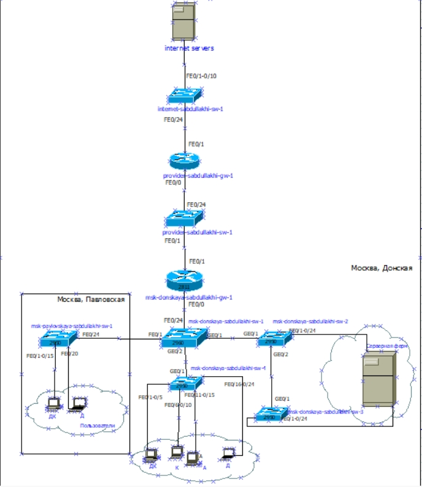
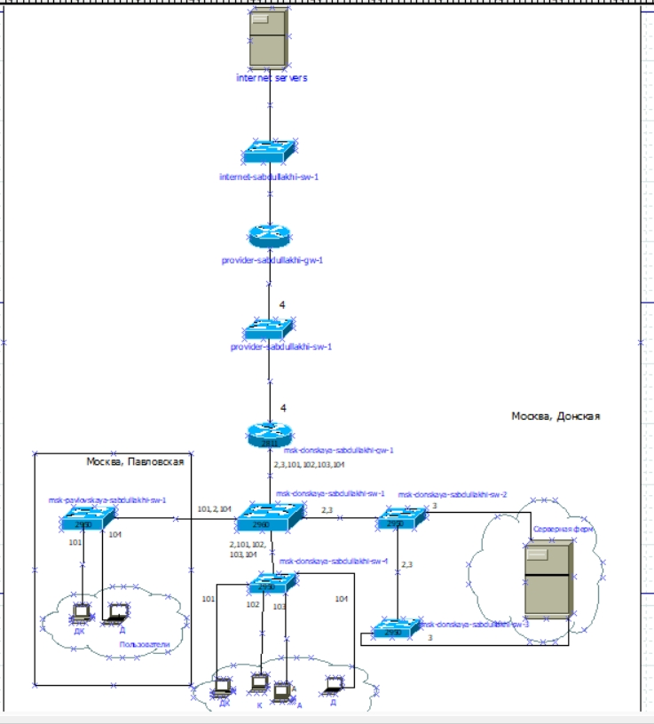
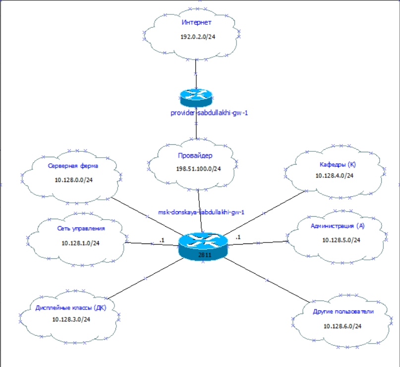
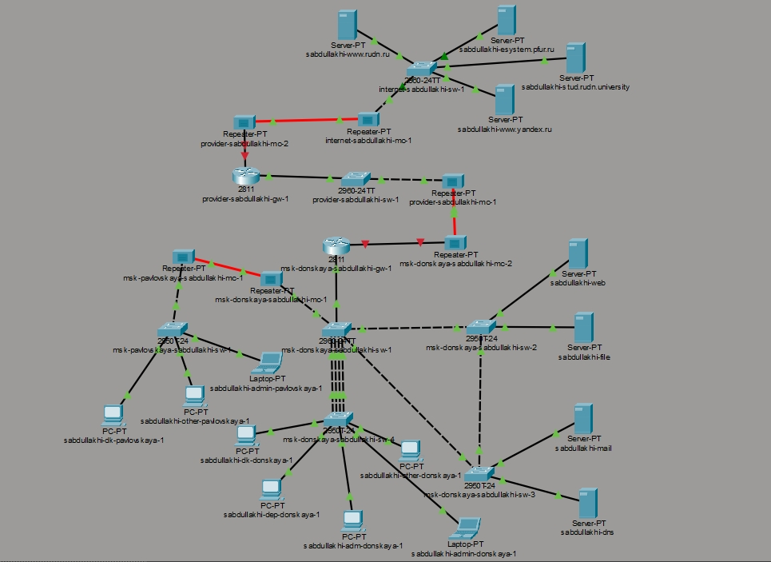
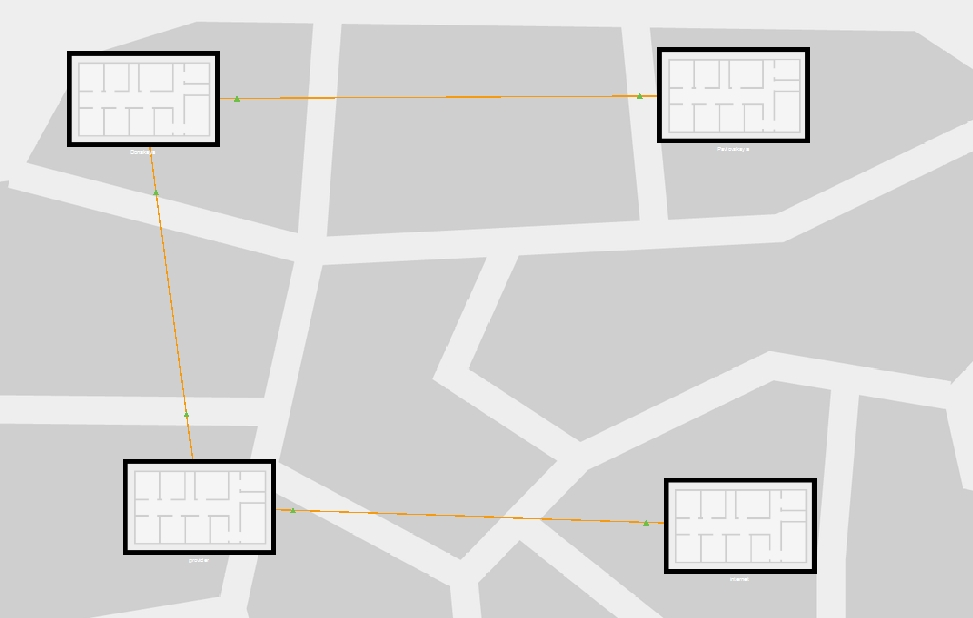
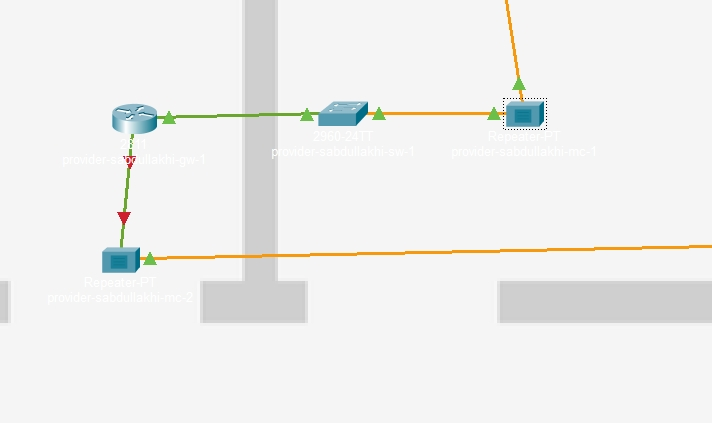
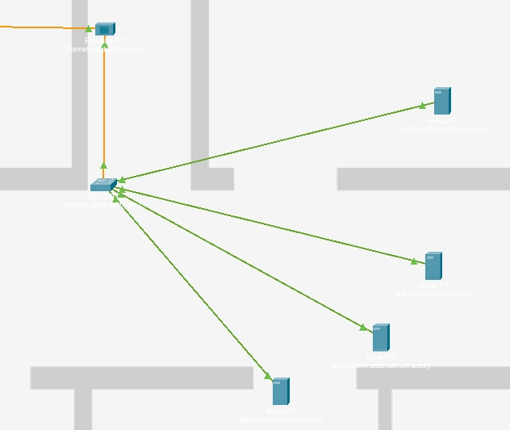
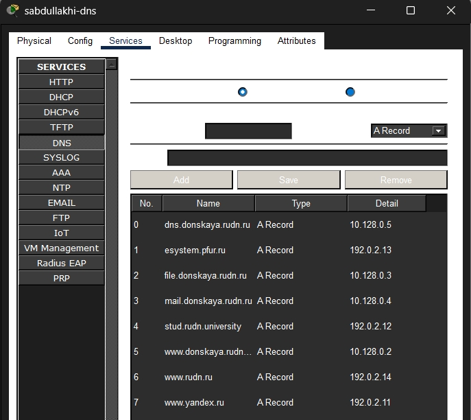
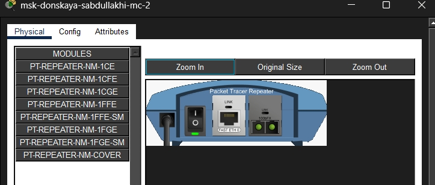

---
## Front matter
lang: ru-RU
title: Администрирование локальных сетей
subtitle: Лабораторная работа № 11.  Настройка NAT.Планирование
author:
  - Абдуллахи Шугофа
institute:
  - Российский университет дружбы народов, Москва, Россия
date: 24 Апреля 2026

## i18n babel
babel-lang: russian
babel-otherlangs: english

## Formatting pdf
toc: false
toc-title: Содержание
slide_level: 2
aspectratio: 169
section-titles: true
theme: metropolis
pdf-engine: xelatex

header-includes: |
  \metroset{progressbar=frametitle,sectionpage=progressbar,numbering=fraction}
  \usepackage{fontspec}
  \setmainfont{DejaVu Serif}
  \setsansfont{DejaVu Sans}
  \setmonofont{DejaVu Sans Mono}
---
 
## Цель работы

Провести подготовительные мероприятия по подключению локальной сети организации к Интернету, включая планирование адресного пространства, настройку VLAN, маршрутизацию и преобразование сетевых адресов (NAT). В ходе работы необходимо смоделировать сеть провайдера и модельную сеть Интернета, выполнить базовую настройку устройств и проверить взаимодействие между сегментами сети.

## Корректировка схемы L1 (физический уровень)  

{ width=70% }

## Корректировка схемы L2 (канальный уровень, VLAN)  

{ width=70% }

## Корректировка схемы L3 (сетевой уровень, IP-адресация)  

{ width=70% }

## Размещение оборудования в логической области 

{ width=70% }

## Физическая схема и здания  

{ width=70% }

## Настройка сети провайдера

{ width=70% }

## Настройка модельной сети Интернета  

{ width=70% }

## Настройка DNS-сервера Назначение IP-адресов серверам  

{ width=70% }

## Замена модулей на медиаконвертерах 

{ width=70% }

##  Вывод

В ходе лабораторной работы была спроектирована и настроена сеть, включающая локальную инфраструктуру организации, сеть провайдера и модельный Интернет в Cisco Packet Tracer. Выполнено планирование VLAN и IP-адресации, на DNS-сервере настроены записи для внутренних и внешних ресурсов. На медиаконвертерах заменены модули на PT-REPEATER-NM-1FFE и PT-REPEATER-NM-1CFE для согласования витой пары и оптоволокна. Создана основа для последующей настройки NAT на пограничном маршрутизаторе, что обеспечит выход устройств внутренней сети в Интернет с использованием публичных адресов. Все цели работы достигнуты.

# Спасибо за внимание 
