---
## Front matter
title: Отчёт по лабораторной работе №14
sub-title: Статическая маршрутизация в Интернете. Настройка
author: "Абдуллахи Шугофа"
## Generic otions
lang: ru-RU
toc-title: "Содержание"

## Bibliography
bibliography: bib/cite.bib
csl: pandoc/csl/gost-r-7-0-5-2008-numeric.csl

## Pdf output format
toc: true # Table of contents
toc-depth: 2
fontsize: 12pt
linestretch: 1.5
papersize: a
documentclass: scrreprt
## I18n polyglossia
polyglossia-lang:
  name: russian
  options:
	- spelling=modern
	- babelshorthands=true
polyglossia-otherlangs:
  name: english
## I18n babel
babel-lang: russian
babel-otherlangs: english
## Fonts
mainfont: IBM Plex Serif
romanfont: IBM Plex Serif
sansfont: IBM Plex Sans
monofont: IBM Plex Mono

mainfontoptions: Ligatures=Common,Ligatures=TeX,Scale=0.94
romanfontoptions: Ligatures=Common,Ligatures=TeX,Scale=0.94
sansfontoptions: Ligatures=Common,Ligatures=TeX,Scale=MatchLowercase,Scale=0.94
monofontoptions: Scale=MatchLowercase,Scale=0.94,FakeStretch=0.9
mathfontoptions:
## Biblatex
biblatex: true
biblio-style: "gost-numeric"
biblatexoptions:
  - parentracker=true
  - backend=biber
  - hyperref=auto
  - language=auto
  - autolang=other*
  - citestyle=gost-numeric
## Pandoc-crossref LaTeX customization
figureTitle: "Рис."
tableTitle: "Таблица"
listingTitle: "Листинг"
lofTitle: "Список иллюстраций"
lotTitle: "Список таблиц"
lolTitle: "Листинги"
## Misc options
indent: true
header-includes:
  - \usepackage{indentfirst}
  - \usepackage{float} # keep figures where there are in the text
  - \floatplacement{figure}{H} # keep figures where there are in the text
---

## 1. Цель работы
Настроить взаимодействие через сеть провайдера посредством статической маршрутизации локальной сети организации с сетью основного здания, расположенного в 42-м квартале в Москве, и сетью филиала, расположенного в г. Сочи.

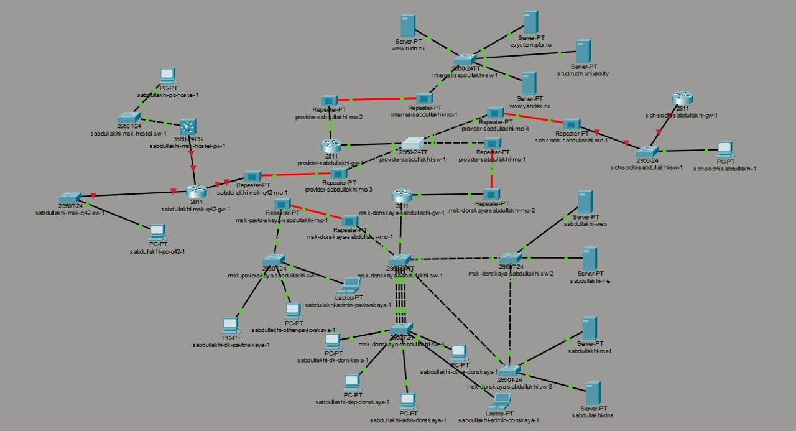

##  2. Ход выполнения работы

### 2.1. Настройка линка между площадками

#### 2.1.1. Настройка коммутатора provider-sw-1

На коммутаторе провайдера были созданы два VLAN: VLAN 5 с именем «q42» для связи с московской площадкой и VLAN 6 с именем «sochi» для связи с сочинским филиалом. Интерфейсы f0/3 и f0/4 были переведены в режим trunk для пропуска трафика нескольких VLAN. Также были активированы виртуальные интерфейсы VLAN 5 и VLAN 6.

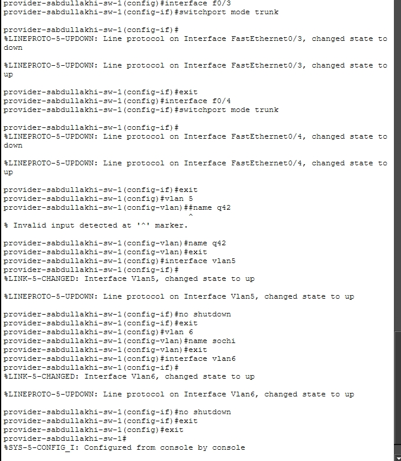

####  2.1.2. Настройка маршрутизатора msk-donskaya-gw-1

На маршрутизаторе msk-donskaya-gw-1 были созданы два суб-интерфейса. Суб-интерфейс f0/1.5 получил инкапсуляцию dot1Q для VLAN 5 и IP-адрес 10.128.255.1/30 с описанием «q42». Суб-интерфейс f0/1.6 получил инкапсуляцию dot1Q для VLAN 6 и IP-адрес 10.128.255.5/30 с описанием «sochi». Эти настройки обеспечивают связь маршрутизатора с обеими площадками через сеть провайдера.

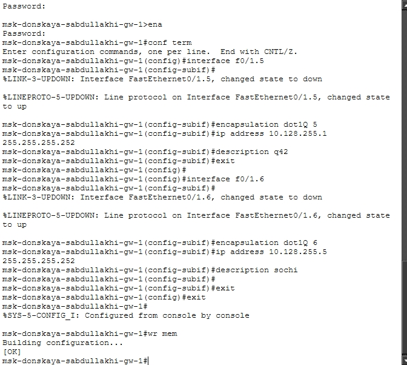

#### 2.1.3. Настройка маршрутизатора msk-q42-gw-1

На маршрутизаторе msk-q42-gw-1 был активирован интерфейс f0/1. На его суб-интерфейсе f0/1.5 настроена инкапсуляция dot1Q для VLAN 5 и назначен IP-адрес 10.128.255.2/30 с описанием «donskaya». Это обеспечивает соединение маршрутизатора 42-го квартала с провайдером.

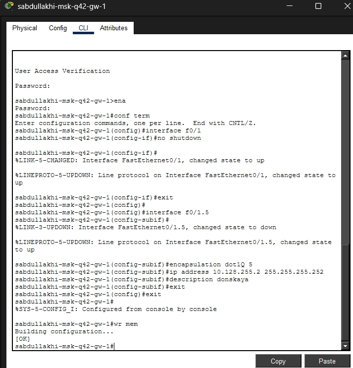

#### 2.1.4. Настройка коммутатора sch-sochi-sw-1

На коммутаторе sch-sochi-sw-1 был создан VLAN 6 с именем «sochi». Интерфейсы f0/23 и f0/24 переведены в режим trunk для передачи трафика VLAN 6. Виртуальный интерфейс VLAN 6 был активирован.

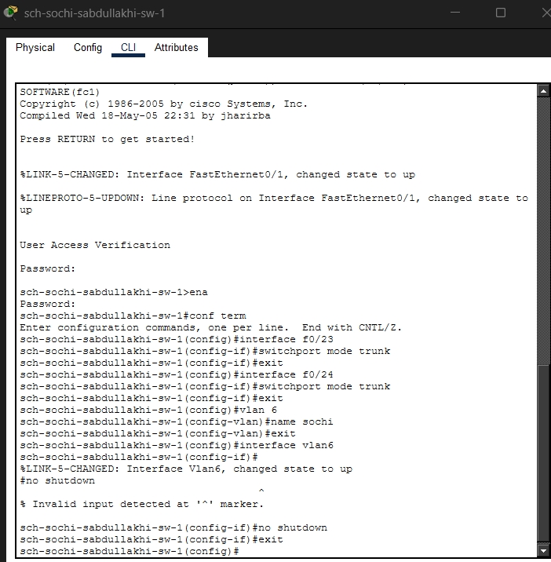

####  2.1.5. Настройка маршрутизатора sch-sochi-gw-1

На маршрутизаторе sch-sochi-gw-1 активирован интерфейс f0/0. На его суб-интерфейсе f0/0.6 настроена инкапсуляция dot1Q для VLAN 6 и назначен IP-адрес 10.128.255.6/30 с описанием «donskaya». Это обеспечивает связь сочинского маршрутизатора с провайдером.

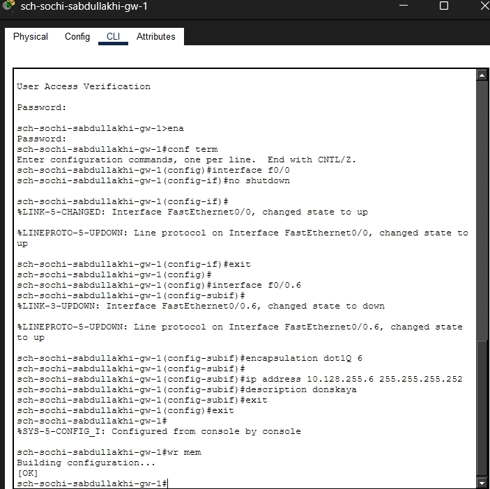

### 2.2. Настройка площадки 42-го квартала

#### 2.2.1. Настройка маршрутизатора msk-q42-gw-1

На маршрутизаторе msk-q42-gw-1 активирован интерфейс f0/0. На его суб-интерфейсе f0/0.201 настроена инкапсуляция dot1Q для VLAN 201 и назначен IP-адрес 10.129.0.1/24 с описанием «q42main» — это шлюз для основной сети 42-го квартала. Также активирован интерфейс f1/0. На его суб-интерфейсе f1/0.202 настроена инкапсуляция dot1Q для VLAN 202 и назначен IP-адрес 10.129.1.1/24 с описанием «q42management» — это шлюз для сети управления.

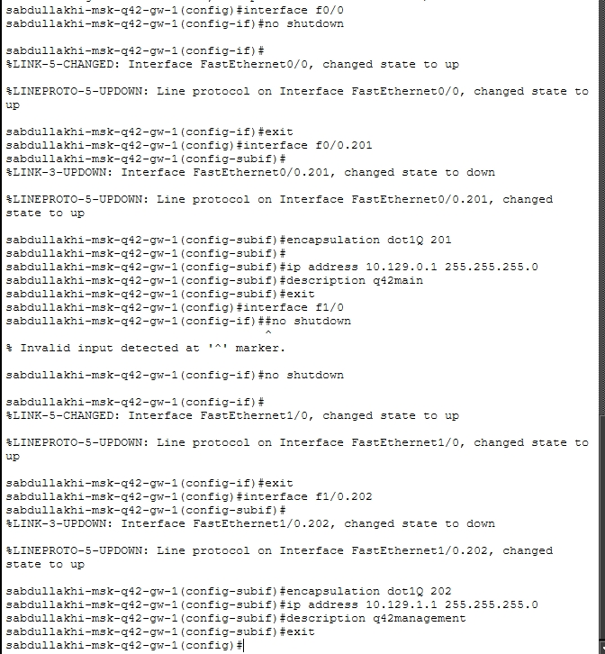

#### 2.2.2. Настройка коммутатора msk-q42-sw-1

На коммутаторе msk-q42-sw-1 интерфейс f0/24 переведён в режим trunk для связи с маршрутизатором. Интерфейс f0/1 настроен как access-порт и помещён в VLAN 201. Создан VLAN 201 с именем «q42main». Виртуальный интерфейс VLAN 201 активирован для обеспечения работы уровня 3.

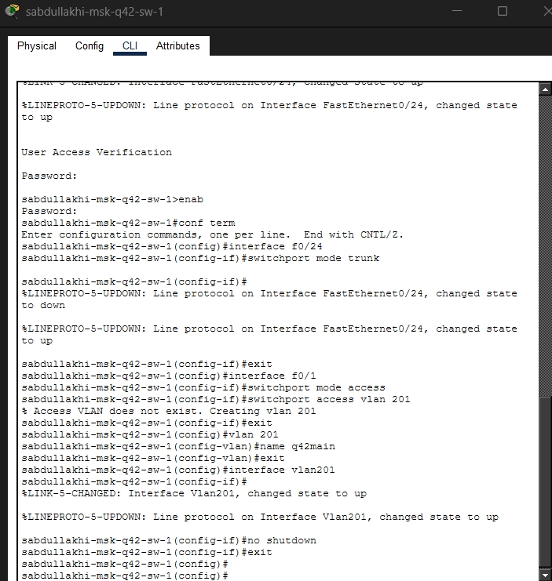

#### 2.2.3. Настройка маршрутизирующего коммутатора msk-hostel-gw-1

На маршрутизирующем коммутаторе msk-hostel-gw-1 интерфейс g0/1 переведён в режим trunk с инкапсуляцией dot1q. Интерфейс f0/1 также настроен как trunk. Созданы VLAN 202 с именем «q42-management» и VLAN 301 с именем «hostel-main». На виртуальном интерфейсе VLAN 202 назначен IP-адрес 10.129.1.2/24. На виртуальном интерфейсе VLAN 301 назначен IP-адрес 10.129.128.1/24. Оба виртуальных интерфейса активированы.

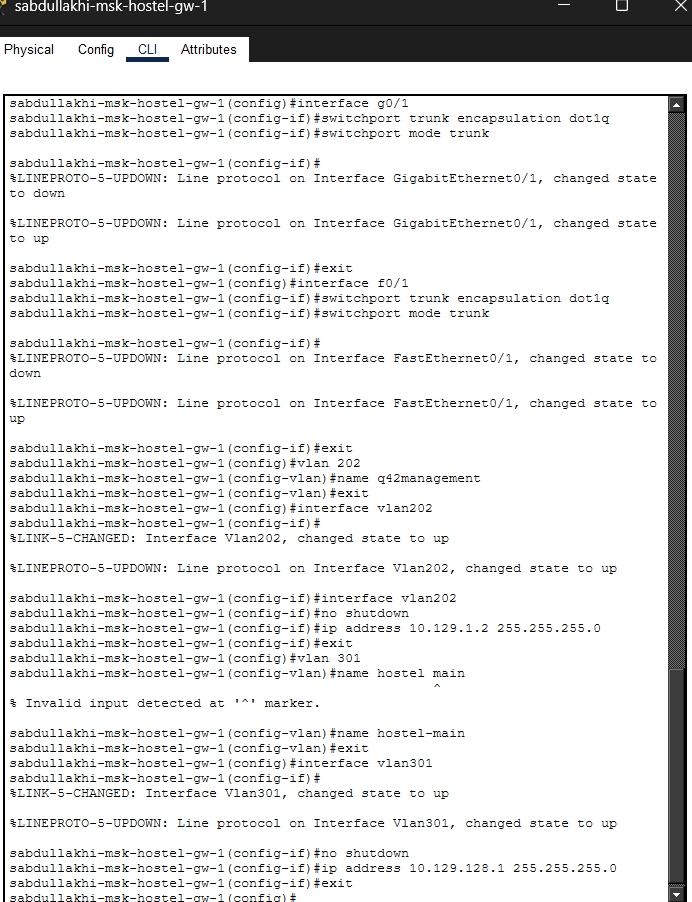

####  2.2.4. Настройка коммутатора msk-hostel-sw-1

На коммутаторе msk-hostel-sw-1 интерфейс g0/1 переведён в режим trunk. Интерфейс f0/1 настроен как access-порт и помещён в VLAN 301. Создан VLAN 301 с именем «hostel-main». Виртуальный интерфейс VLAN 301 активирован.

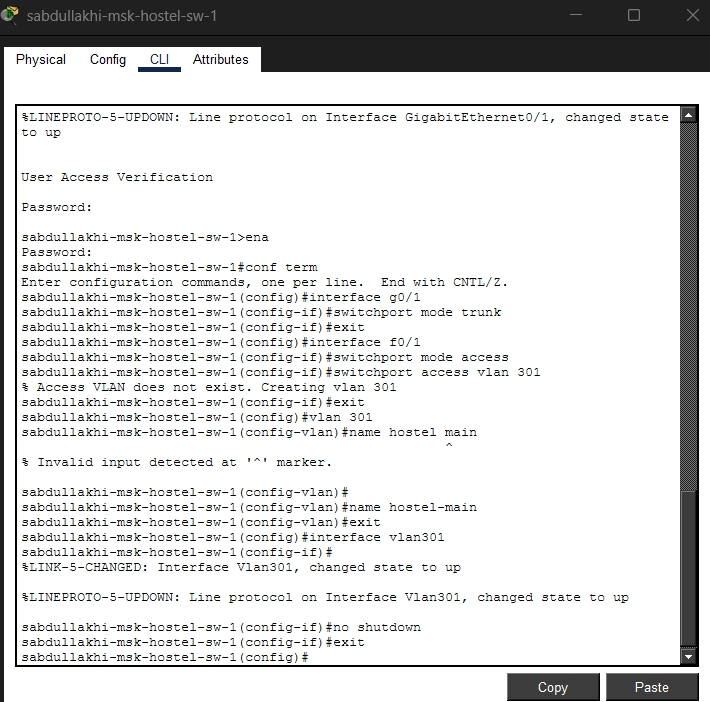

### 2.3. Настройка площадки в Сочи

#### 2.3.1. Настройка маршрутизатора sch-sochi-gw-1

На маршрутизаторе sch-sochi-gw-1 создан суб-интерфейс f0/0.401 с инкапсуляцией dot1Q для VLAN 401 и IP-адресом 10.130.0.1/24 с описанием «sochi-main» — это шлюз для основной сети филиала. Также создан суб-интерфейс f0/0.402 с инкапсуляцией dot1Q для VLAN 402 и IP-адресом 10.130.1.1/24 с описанием «sochi-management» — это шлюз для сети управления филиала.

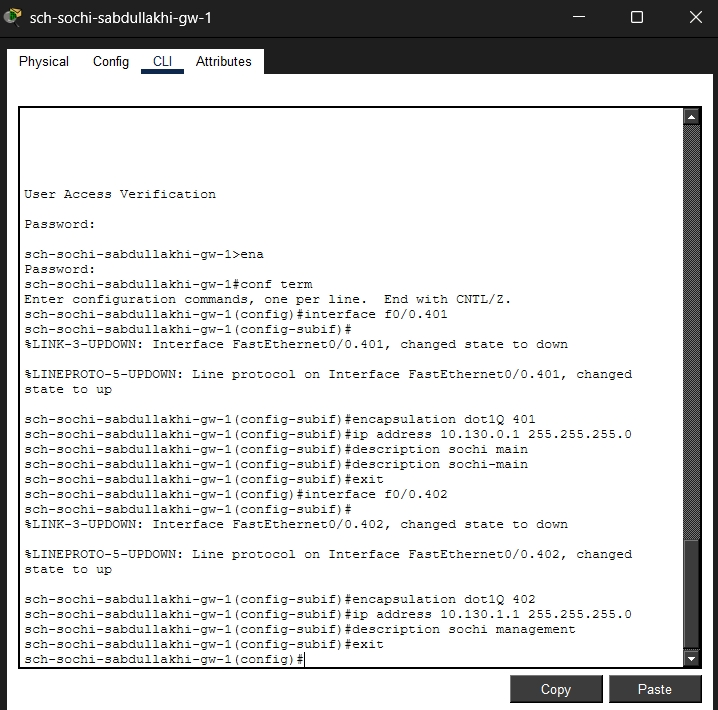

#### 2.3.2. Настройка коммутатора sch-sochi-sw-1

На коммутаторе sch-sochi-sw-1 интерфейс f0/1 настроен как access-порт и помещён в VLAN 401. Создан VLAN 401 с именем «sochi-main» (при создании было исправлено имя — убран пробел, так как система не допускает пробелов в именах VLAN). Виртуальный интерфейс VLAN 401 активирован.

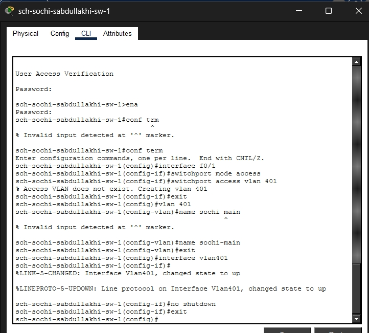

### 2.4. Настройка маршрутизации между площадками

#### 2.4.1. Настройка маршрутизатора msk-donskaya-gw-1

На центральном маршрутизаторе msk-donskaya-gw-1 добавлен статический маршрут до сети 10.129.0.0/16 (все сети Москвы) через шлюз 10.128.255.2. Также добавлен статический маршрут до сети 10.130.0.0/16 (все сети Сочи) через шлюз 10.128.255.6. Эти маршруты позволяют маршрутизатору направлять трафик в сторону московской и сочинской площадок.

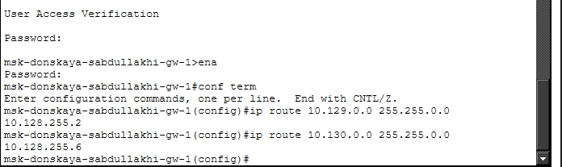

#### 2.4.2. Настройка маршрутизатора msk-q42-gw-1

На маршрутизаторе msk-q42-gw-1 добавлен маршрут по умолчанию (0.0.0.0/0) через шлюз 10.128.255.1. Это означает, что все пакеты, для которых нет конкретного маршрута, будут отправляться в сторону провайдера.

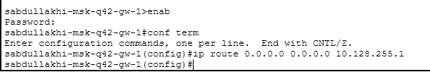

#### 2.4.3. Настройка маршрутизатора sch-sochi-gw-1

На маршрутизаторе sch-sochi-gw-1 добавлен маршрут по умолчанию (0.0.0.0/0) через шлюз 10.128.255.5. Это обеспечивает отправку всего неизвестного трафика в сторону провайдера и далее в Москву.

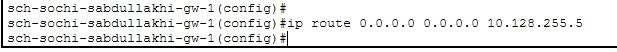

### 2.5. Настройка маршрутизации на 42-м квартале

#### 2.5.1. Настройка маршрутизатора msk-q42-gw-1

На маршрутизаторе msk-q42-gw-1 добавлен статический маршрут до сети 10.129.128.0/17 (подсеть общежития) через шлюз 10.129.1.2. Это позволяет направлять трафик от основной сети 42-го квартала к сети общежития.

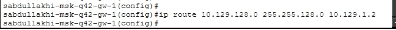

#### 2.5.2. Настройка маршрутизирующего коммутатора msk-hostel-gw-1

На маршрутизирующем коммутаторе msk-hostel-gw-1 включена IP-маршрутизация (ip routing), так как по умолчанию на коммутаторах она отключена. Добавлен маршрут по умолчанию через шлюз 10.129.1.1. Это обеспечивает отправку трафика из сети общежития в сторону основного маршрутизатора 42-го квартала.

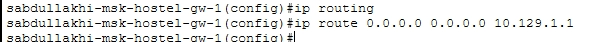

### 2.6. Настройка NAT на маршрутизаторе msk-donskaya-gw-1

На маршрутизаторе msk-donskaya-gw-1 настроен NAT для обеспечения доступа локальных устройств во внешние сети. На суб-интерфейсах f0/1.5 и f0/1.6 включена функция ip nat inside (внутренние интерфейсы). Создан расширенный access-лист с именем nat-inet, который разрешает трансляцию адресов для устройств: компьютера в 42-м квартале (10.129.0.200), компьютера в общежитии (10.129.128.200) и компьютера в Сочи (10.130.0.200). NAT работает в режиме overload, что позволяет нескольким устройствам использовать один внешний IP-адрес.

### 2.7. Назначение IP-адресов конечным устройствам

#### 2.7.1. Настройка ПК в 42-м квартале

Компьютеру sabdullakhi-pc-q42-1 назначен статический IP-адрес 10.129.0.200 с маской 255.255.255.0. В качестве шлюза по умолчанию указан адрес 10.129.0.1 (суб-интерфейс маршрутизатора msk-q42-gw-1). Адрес DNS-сервера — 10.128.0.5.

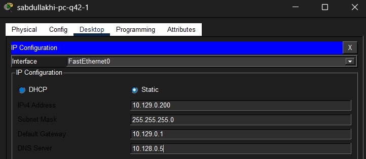

#### 2.7.2. Настройка ПК в общежитии

Компьютеру sabdullakhi-pc-hostel-1 назначен статический IP-адрес 10.129.128.200 с маской 255.255.255.0. Шлюз по умолчанию — 10.129.128.1 (виртуальный интерфейс коммутатора msk-hostel-gw-1). DNS-сервер — 10.128.0.5.

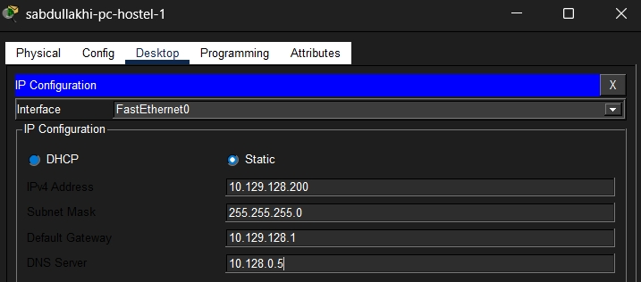

#### 2.7.3. Настройка ПК в Сочи

Компьютеру sch-sochi-sabdullakhi-1 назначен статический IP-адрес 10.130.0.200 с маской 255.255.255.0. Шлюз по умолчанию — 10.130.0.1 (суб-интерфейс маршрутизатора sch-sochi-gw-1). DNS-сервер — 10.128.0.5.

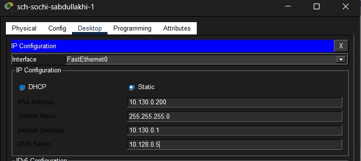

### 2.8. Проверка работоспособности

#### 2.8.1. Проверка связи между устройствами в Москве

Была выполнена проверка связи между компьютером в общежитии (10.129.128.200) и компьютером в 42-м квартале (10.129.0.200). Отправлено 4 эхо-запроса, получено 4 ответа. Потери пакетов составили 0%, минимальное время ответа — менее 1 мс, максимальное — 10 мс. Связь между подсетями внутри московской площадки работает корректно.

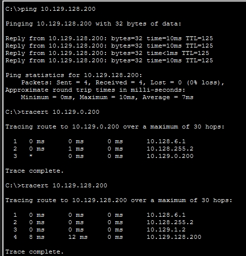

#### 2.8.2. Трассировка маршрута до компьютера в 42-м квартале

При трассировке маршрута до адреса 10.129.0.200 получен следующий путь: первый hop — 10.128.6.1, второй hop — 10.128.255.2, третий hop — непосредственно целевой компьютер 10.129.0.200. Трассировка завершена успешно.

#### 2.8.3. Трассировка маршрута до компьютера в общежитии

При трассировке маршрута до адреса 10.129.128.200 получен путь: первый hop — 10.128.6.1, второй hop — 10.128.255.2, третий hop — 10.129.1.2, четвёртый hop — целевой компьютер 10.129.128.200. Все узлы на пути отвечают, маршрутизация настроена корректно.

#### 2.8.4. Просмотр таблицы маршрутизации на msk-donskaya-gw-1

На маршрутизаторе msk-donskaya-gw-1 таблица маршрутизации содержит:
- Прямо подключённые сети (обозначены буквой C): 10.128.0.0/24, 10.128.1.0/24, 10.128.3.0/24, 10.128.4.0/24, 10.128.5.0/24, 10.128.6.0/24, 10.128.255.0/30, 10.128.255.4/30, а также сеть 198.51.100.0/28.
- Локальные маршруты к собственным интерфейсам (обозначены буквой L).
- Статические маршруты (обозначены буквой S) до сетей 10.129.0.0/16 и 10.130.0.0/16.
- Маршрут по умолчанию (S*) 0.0.0.0/0 через шлюз 198.51.100.1 для выхода во внешние сети.

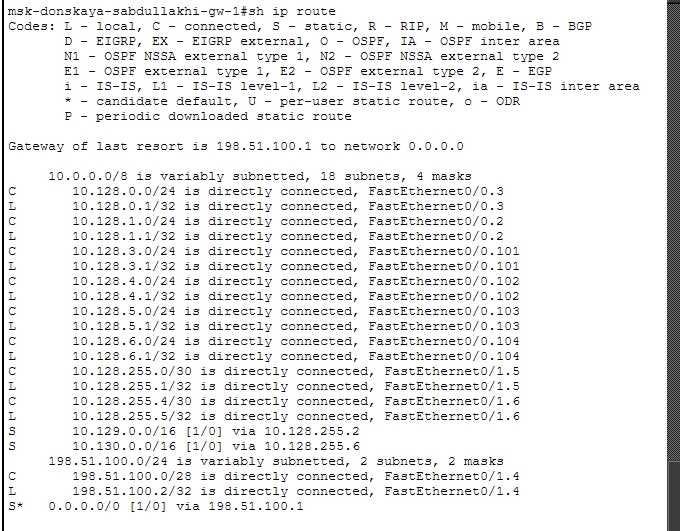

#### 2.8.5. Просмотр таблицы маршрутизации на msk-q42-gw-1

На маршрутизаторе msk-q42-gw-1 таблица маршрутизации содержит:
- Прямо подключённые сети: 10.128.255.0/30 (линк с провайдером), 10.129.0.0/24 (основная сеть), 10.129.1.0/24 (сеть управления).
- Локальные маршруты к собственным интерфейсам.
- Статический маршрут до сети 10.129.128.0/17 через шлюз 10.129.1.2.
- Маршрут по умолчанию через шлюз 10.128.255.1.

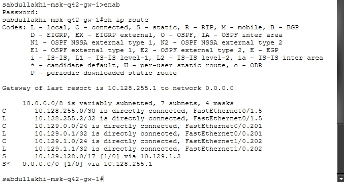

#### 2.8.6. Просмотр таблицы маршрутизации на msk-hostel-gw-1

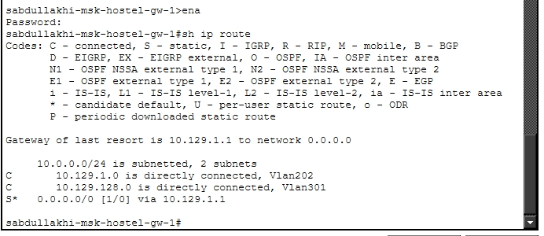

## 3. Вывод

В ходе выполнения лабораторной работы №14 были выполнены следующие задачи:

1. **Настроена связь между площадками.** На коммутаторе провайдера созданы VLAN 5 и 6, порты переведены в режим trunk. На всех маршрутизаторах созданы суб-интерфейсы с инкапсуляцией dot1Q и назначены IP-адреса из сети 10.128.255.0/30.

2. **Настроено оборудование в 42-м квартале Москвы.** Созданы VLAN 201 и 202, настроены соответствующие суб-интерфейсы на маршрутизаторе, коммутаторы переведены в режимы trunk и access. На маршрутизирующем коммутаторе общежития созданы VLAN 202 и 301, назначены IP-адреса на виртуальных интерфейсах.

3. **Настроено оборудование в филиале г. Сочи.** Создан VLAN 401, настроен access-порт для подключения компьютера, на маршрутизаторе созданы суб-интерфейсы для VLAN 401 и 402.

4. **Настроена статическая маршрутизация между территориями.** На центральном маршрутизаторе добавлены маршруты до сетей Москвы и Сочи. На периферийных маршрутизаторах добавлены маршруты по умолчанию.

5. **Настроена статическая маршрутизация внутри 42-го квартала.** Добавлен маршрут до сети общежития, на коммутаторе общежития включена IP-маршрутизация и добавлен маршрут по умолчанию.

6. **Настроен NAT** на центральном маршрутизаторе для обеспечения доступа локальных устройств.

7. **Выполнена проверка работоспособности.** Ping и tracert подтвердили корректную работу маршрутизации, таблицы маршрутизации содержат все необходимые записи.

**Все цели лабораторной работы достигнуты.** Связность между всеми площадками обеспечена с помощью статической маршрутизации.

## 4. Ответы на контрольные вопросы

**1. Приведите пример настройки статической маршрутизации между двумя портами организации.**

Примером может служить маршрут, добавленный на маршрутизаторе msk-donskaya-gw-1 до сети 10.129.0.0/16 через шлюз 10.128.255.2. Этот маршрут указывает, что все пакеты, предназначенные для сети Москвы, должны направляться на соседний маршрутизатор в 42-м квартале.

**2. Опишите процесс обращения устройства из одного VLAN к устройству из другого VLAN.**

Когда устройство из одной VLAN хочет обратиться к устройству из другой VLAN, оно отправляет пакет на свой шлюз по умолчанию (маршрутизатор или L3-коммутатор). Шлюз принимает пакет, смотрит в свою таблицу маршрутизации, определяет, через какой интерфейс и на какой следующий узел нужно отправить пакет. Затем маршрутизатор инкапсулирует пакет в новый кадр с новым MAC-адресом получателя и отправляет его в нужный VLAN.

**3. Как проверить работоспособность маршрута?**

Работоспособность маршрута проверяется с помощью команд ping (для проверки доступности конечного устройства) и tracert (для просмотра пути следования пакетов по маршрутизаторам). Успешное выполнение ping и правильный путь в tracert подтверждают корректность настройки маршрутов.

**4. Как посмотреть таблицу маршрутизации?**

Таблица маршрутизации просматривается с помощью команды show ip route. Эта команда отображает все известные маршруты: прямо подключённые сети (C), статические маршруты (S), маршруты по умолчанию (S*), а также локальные маршруты к интерфейсам (L).
