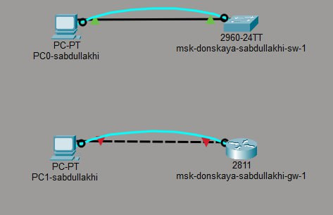
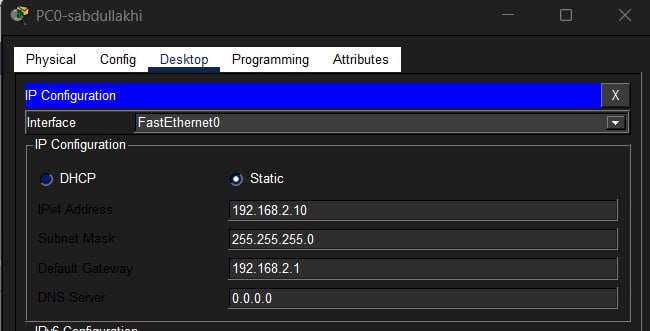
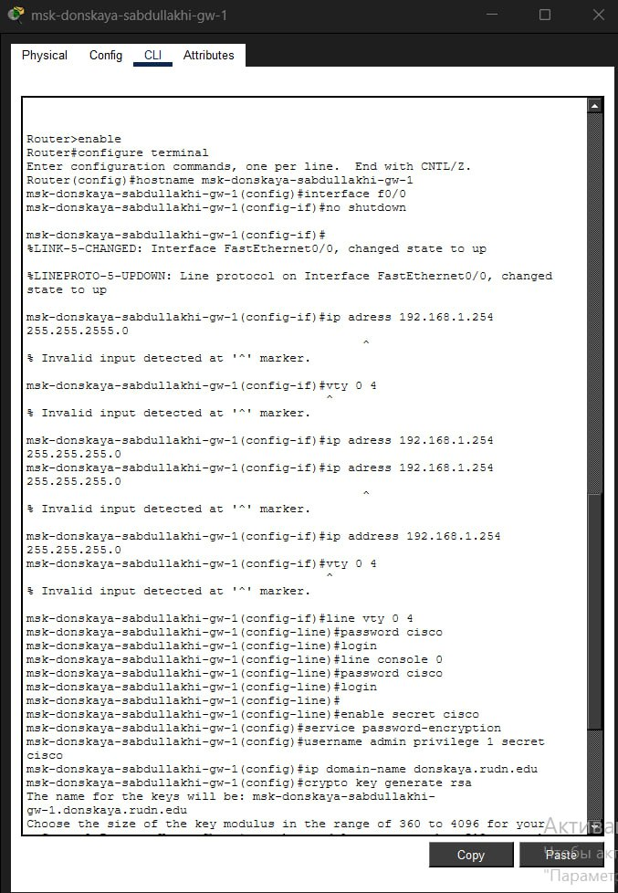
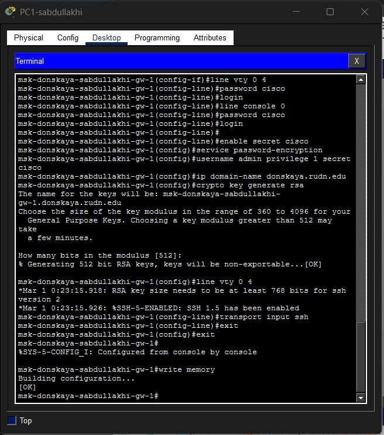
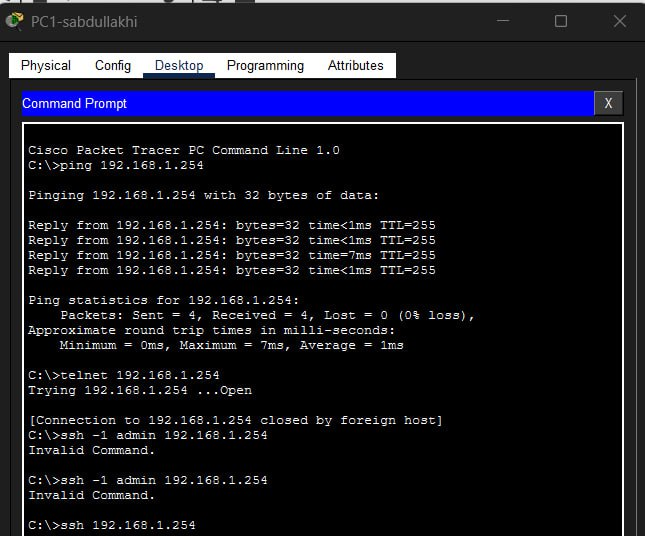
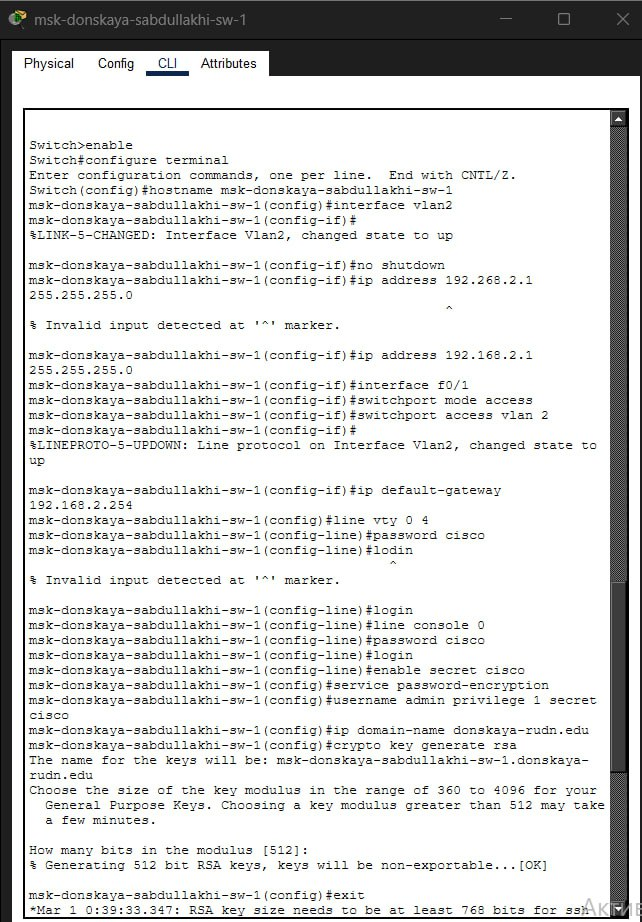
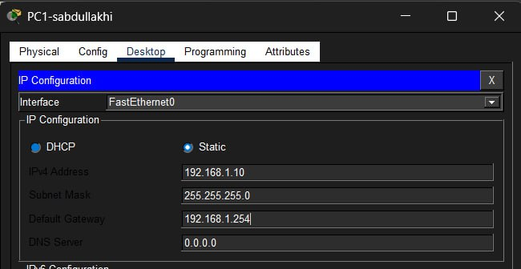
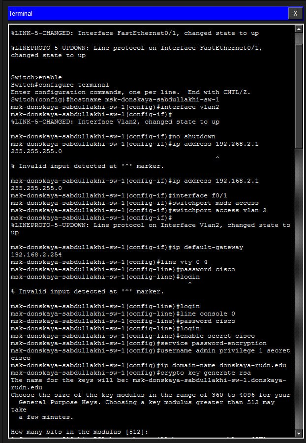
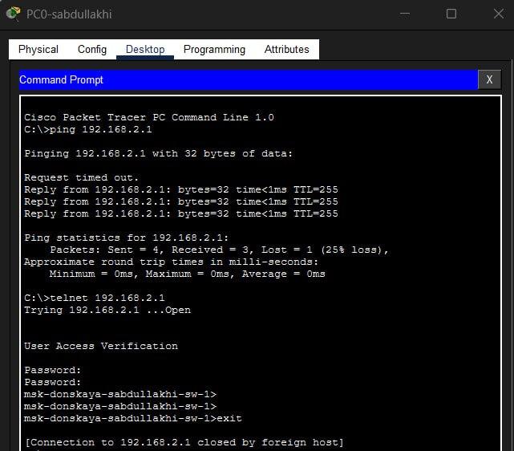

---
## Front matter
lang: ru-RU
title: Администрирование локальных сетей
subtitle: Лабораторная работа №2 посвящена предварительной настройке сетевого оборудования Cisco. 
author:
  - Абдуллахи Шугофа
institute:
  - Российский университет дружбы народов, Москва, Россия
date: 19 февраля 2026

## i18n babel
babel-lang: russian
babel-otherlangs: english

## Formatting pdf
toc: false
toc-title: Содержание
slide_level: 2
aspectratio: 169
section-titles: true
theme: metropolis
pdf-engine: xelatex

header-includes: |
  \metroset{progressbar=frametitle,sectionpage=progressbar,numbering=fraction}
  \usepackage{fontspec}
  \setmainfont{DejaVu Serif}
  \setsansfont{DejaVu Sans}
  \setmonofont{DejaVu Sans Mono}
---

##  Цели и задачи работы
Цель работы — изучить основы конфигурирования маршрутизатора и коммутатора, назначение IP-адресов и настройку удалённого доступа к оборудованию.

## Схема сети
На слайде представлена собранная топология сети, включающая маршрутизатор, коммутатор и два персональных компьютера, соединённые между собой.

{ #fig:001 width=60% }

##  Настройка PC0
На маршрутизаторе был настроен сетевой интерфейс, задан IP-адрес, включён порт и настроены параметры безопасности доступа.

{ #fig:002 width=60% }

## Настройка маршрутизатора через консоль
Настройка выполнялась через консольное подключение с компьютера, что позволяет выполнить первичную конфигурацию устройства.

{ #fig:004 width=60% }

## Проверка подключения к маршрутизатору
Была выполнена проверка соединения с помощью команды ping и выполнено удалённое подключение по SSH.

{ #fig:006 width=60% }
{ #fig:007 width=60% }

## Настройка коммутатора

На коммутаторе был создан интерфейс VLAN, назначен IP-адрес управления и настроены параметры доступа.

{ #fig:009 width=60% }

##  Настройка PC1
На компьютере PC1 был настроен IP-адрес для сети коммутатора, что обеспечило сетевое взаимодействие устройств.

{ #fig:003 width=60% }

## Настройка коммутатора через консоль

Первичная конфигурация коммутатора выполнялась через консольное подключение с персонального компьютера.

{ #fig:010 width=60% }

## Проверка подключения к коммутатору

Была проверена доступность коммутатора с помощью ping и выполнено подключение по SSH.

{ #fig:011 width=60% }

##  Вывод

В ходе лабораторной работы была собрана простая сеть и выполнена базовая настройка сетевых устройств Cisco.

Были назначены IP-адреса, настроены VLAN, пароли доступа и удалённое управление по SSH.

Проверка соединения показала корректную работу сети.
Таким образом, цель лабораторной работы была полностью достигнута.

# Спасибо за внимание 
