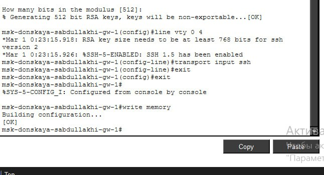
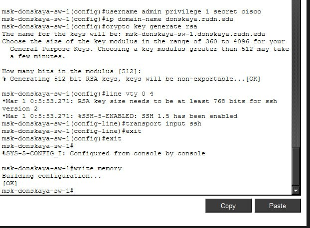

---
## Front matter
title: Отчёт по лабораторной работе №2
sub-title: Предварительная настройка оборудования Cisco
author: "Абдуллахи Шугофа"
## Generic otions
lang: ru-RU
toc-title: "Содержание"

## Bibliography
bibliography: bib/cite.bib
csl: pandoc/csl/gost-r-7-0-5-2008-numeric.csl

## Pdf output format
toc: true # Table of contents
toc-depth: 2
fontsize: 12pt
linestretch: 1.5
papersize: a
documentclass: scrreprt
## I18n polyglossia
polyglossia-lang:
  name: russian
  options:
	- spelling=modern
	- babelshorthands=true
polyglossia-otherlangs:
  name: english
## I18n babel
babel-lang: russian
babel-otherlangs: english
## Fonts
mainfont: IBM Plex Serif
romanfont: IBM Plex Serif
sansfont: IBM Plex Sans
monofont: IBM Plex Mono
mathfont: STIX Two Math
mainfontoptions: Ligatures=Common,Ligatures=TeX,Scale=0.94
romanfontoptions: Ligatures=Common,Ligatures=TeX,Scale=0.94
sansfontoptions: Ligatures=Common,Ligatures=TeX,Scale=MatchLowercase,Scale=0.94
monofontoptions: Scale=MatchLowercase,Scale=0.94,FakeStretch=0.9
mathfontoptions:
## Biblatex
biblatex: true
biblio-style: "gost-numeric"
biblatexoptions:
  - parentracker=true
  - backend=biber
  - hyperref=auto
  - language=auto
  - autolang=other*
  - citestyle=gost-numeric
## Pandoc-crossref LaTeX customization
figureTitle: "Рис."
tableTitle: "Таблица"
listingTitle: "Листинг"
lofTitle: "Список иллюстраций"
lotTitle: "Список таблиц"
lolTitle: "Листинги"
## Misc options
indent: true
header-includes:
  - \usepackage{indentfirst}
  - \usepackage{float} # keep figures where there are in the text
  - \floatplacement{figure}{H} # keep figures where there are in the text
---

## Цель работы
Целью данной лабораторной работы являлось получение практических навыков по первичной настройке сетевого оборудования Cisco в программной среде моделирования Cisco Packet Tracer.
В рамках работы необходимо было:
- собрать простую сетевую топологию;
- выполнить базовую конфигурацию маршрутизатора и коммутатора;
- назначить IP-адреса конечным устройствам;
- настроить параметры безопасности доступа;
- проверить корректность работы сети и удалённого подключения.
Практическое выполнение данной работы позволяет закрепить теоретические знания по организации локальных сетей и базовой конфигурации сетевых устройств Cisco.

#  2.Выполнение лабораторной работы
## 2.1 Построение топологии сети

В логической рабочей области Cisco Packet Tracer были размещены следующие устройства:
- маршрутизатор Cisco 2811 (msk-donskaya-sabdullakhi-gw-1);
- коммутатор Cisco 2960-24TT (msk-donskaya-sabdullakhi-sw-1);
- два персональных компьютера: PC0-sabdullakhi и PC1-sabdullakhi.
Соединения между устройствами выполнены следующим образом:
- PC0 подключён напрямую к маршрутизатору;
- PC1 подключён к коммутатору;
- каждое соединение выполнено с использованием соответствующего типа медного кабеля (Copper Straight-Through).
В результате была сформирована простая сеть, состоящая из двух подсетей, каждая из которых управляется своим сетевым устройством.

{ #fig:001 width=80% }

## 2.2 Настройка IP-адреса на PC0

На первом персональном компьютере (PC0) был вручную задан статический IP-адрес для взаимодействия с маршрутизатором.

Параметры настройки:
- IP-адрес: 192.168.1.10
- Маска подсети: 255.255.255.0
- Шлюз по умолчанию: 192.168.1.254
Настройка выполнялась через вкладку Desktop → IP Configuration.
Указание шлюза по умолчанию позволило компьютеру направлять трафик за пределы своей локальной сети через маршрутизатор.
 
{ #fig:002 width=80% }

{ #fig:003 width=80% }

## 2.3 Настройка маршрутизатора Cisco 2811

Далее была выполнена первичная конфигурация маршрутизатора через интерфейс командной строки (CLI).
На интерфейсе FastEthernet0/0:
- назначен IP-адрес 192.168.1.254;
- установлена маска 255.255.255.0;
- выполнена команда no shutdown для активации порта.
После настройки сетевого интерфейса были выполнены базовые параметры безопасности:
- задано имя устройства (hostname);
- установлен пароль привилегированного режима (enable secret);
- включено шифрование паролей (service password-encryption);
- настроены линии VTY для удалённого доступа;
- создан локальный пользователь admin с паролем;
- задано доменное имя;
- сгенерированы RSA-ключи;
- разрешён удалённый доступ по протоколу SSH;
- сохранена конфигурация в энергонезависимую память (write memory).
Настройка SSH является важным элементом безопасности, так как данный протокол обеспечивает шифрование передаваемых данных.

{ #fig:004 width=80% }

{ #fig:005 width=80% }

{ #fig:006 width=80% }

## 2.4 Проверка работы маршрутизатора

После завершения настройки была выполнена проверка сетевого соединения.
С ПК PC0 отправлена команда:
ping 192.168.1.254
Все пакеты были успешно доставлены, что подтверждает корректность настройки IP-адресов и активацию интерфейса маршрутизатора.
Далее проверена возможность удалённого доступа:
- при подключении по Telnet соединение устанавливалось, но завершалось;
- при подключении по SSH был успешно выполнен вход под пользователем admin и корректный выход из сеанса.
Это подтверждает правильность настройки удалённого защищённого доступа.

{ #fig:007 width=80% }

## 2.5 Настройка коммутатора Cisco 2960
Следующим этапом была выполнена настройка коммутатора.
Для организации управления был создан виртуальный интерфейс VLAN 2, которому назначен IP-адрес:
- 192.168.2.1
- Маска 255.255.255.0
Порт, к которому подключён ПК, был переведён в режим access и назначен в VLAN 2.
Дополнительно были настроены параметры безопасности:
- задано имя устройства;
- настроены линии console и VTY;
- установлен enable secret;
- включено шифрование паролей;
- создан пользователь admin;
- задано доменное имя;
- сгенерированы RSA-ключи;
- разрешён доступ по SSH;
- задан шлюз управления (ip default-gateway).
Настройка VLAN позволяет логически разделять сеть и организовывать управление коммутатором в отдельной подсети.

{ #fig:009 width=80% }

{ #fig:008 width=80% }

## 2.6 Настройка IP-адреса на PC1

На втором персональном компьютере (PC1) был задан статический IP-адрес для сети коммутатора.
Параметры:
- IP-адрес: 192.168.2.10
- Маска подсети: 255.255.255.0
- Шлюз по умолчанию: 192.168.2.1
Настройка также выполнялась через вкладку Desktop → IP Configuration.

{ #fig:010 width=80% }

## 2.7 Проверка работы коммутатора

Для проверки доступности коммутатора с ПК PC1 была выполнена команда:
ping 192.168.2.1
Первый пакет был потерян из-за выполнения ARP-запроса (определение MAC-адреса), последующие пакеты успешно получены.
Далее проверено удалённое подключение:
-  Telnet — соединение устанавливается и затем закрывается;
- SSH — выполнен успешный вход под пользователем admin и корректный выход из системы.
Это подтверждает правильность настройки VLAN, IP-адреса и параметров безопасности.

{ #fig:011 width=80% }

# 3. Вывод
В ходе выполнения лабораторной работы была собрана и настроена простая локальная сеть в среде Cisco Packet Tracer.
Была произведена базовая конфигурация маршрутизатора и коммутатора:
- назначены IP-адреса интерфейсам;
- активированы сетевые порты;
- настроены VLAN;
- реализованы механизмы защиты доступа;
- включена поддержка удалённого управления по SSH.
Проверка с использованием команды ping показала корректную работу сети и подтверждение сетевой связности между устройствами в пределах своих подсетей.
Успешное подключение по SSH свидетельствует о правильной настройке аутентификации и шифрования.
Таким образом, цель лабораторной работы достигнута, получены практические навыки первичной настройки оборудования Cisco и обеспечения базовой сетевой безопасности.

# 4. Контрольные вопросы

1. Укажите возможные способы подключения к сетевому оборудованию

К сетевому оборудованию можно подключаться несколькими способами в зависимости от условий работы и уровня доступа.
Основные способы подключения:
- Консольное подключение — локальное подключение через консольный кабель. Используется для первичной настройки устройства, когда сетевые параметры ещё не заданы. Это самый надёжный способ, так как он не зависит от сети.
- Telnet — удалённое подключение по сети. Позволяет управлять устройством на расстоянии, но данные передаются без шифрования, поэтому метод считается небезопасным.
- SSH — защищённое удалённое подключение. Передаваемая информация шифруется, что обеспечивает безопасность паролей и команд. На практике это основной способ удалённого администрирования.
Таким образом, для первичной настройки применяется консоль, а для удалённой работы предпочтительно использовать SSH.

2. Каким типом сетевого кабеля следует подключать оконечное оборудование пользователя к маршрутизатору и почему?

Для подключения компьютера к маршрутизатору используется прямой витопарный кабель (Copper Straight-Through), так как соединяются устройства разных типов — оконечное устройство (ПК) и сетевое оборудование (маршрутизатор).
Существует правило: разные устройства соединяются прямым кабелем, одинаковые — перекрёстным. Прямой кабель обеспечивает правильную передачу сигналов между интерфейсами устройств.

3. Каким типом сетевого кабеля следует подключать оконечное оборудование пользователя к коммутатору и почему?

Для подключения компьютера к коммутатору также используется прямой витопарный кабель (Copper Straight-Through), поскольку соединяются разные типы устройств: компьютер и коммутатор.
Порты коммутатора специально предназначены для подключения конечных устройств, поэтому прямой кабель является стандартным решением.

4. Каким типом сетевого кабеля следует подключать коммутатор к коммутатору и почему?

Для соединения коммутатора с коммутатором применяется перекрёстный кабель (Copper Cross-Over), так как соединяются однотипные устройства.
Перекрёстный кабель меняет местами линии передачи и приёма, что обеспечивает корректную работу соединения. В современных устройствах может использоваться автоматическое определение типа кабеля, но теоретически правильным считается перекрёстный.

5. Укажите возможные способы настройки доступа к сетевому оборудованию по паролю

Доступ по паролю можно настроить несколькими способами:
- пароль консольной линии (line console 0) — защита локального доступа;
- пароль удалённого доступа (line vty 0 4) — защита подключений по сети;
- пароль привилегированного режима (enable secret) — защита административных команд;
- создание локальных пользователей (username и password/secret) — индивидуальные учётные записи;
- включение шифрования паролей (service password-encryption).
Наиболее безопасным считается использование локальных пользователей и enable secret.

6. Укажите возможные способы настройки удалённого доступа к сетевому оборудованию. Какой из способов предпочтительнее и почему?

Удалённый доступ можно организовать с помощью:
- Telnet — простой протокол удалённого управления без шифрования;
- SSH — защищённый протокол с шифрованием данных;
- веб-доступа (HTTP/HTTPS) — управление через браузер, если поддерживается устройством.
Предпочтительным способом является SSH, так как он обеспечивает шифрование передаваемой информации, защиту паролей и более высокий уровень безопасности по сравнению с Telnet.

